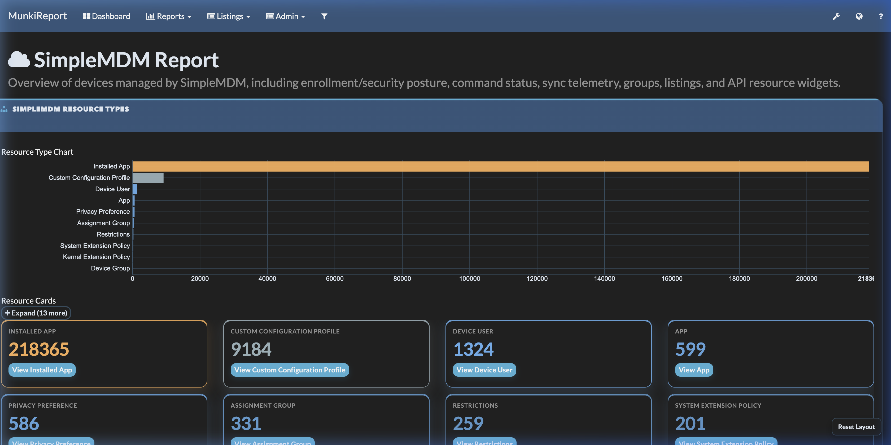
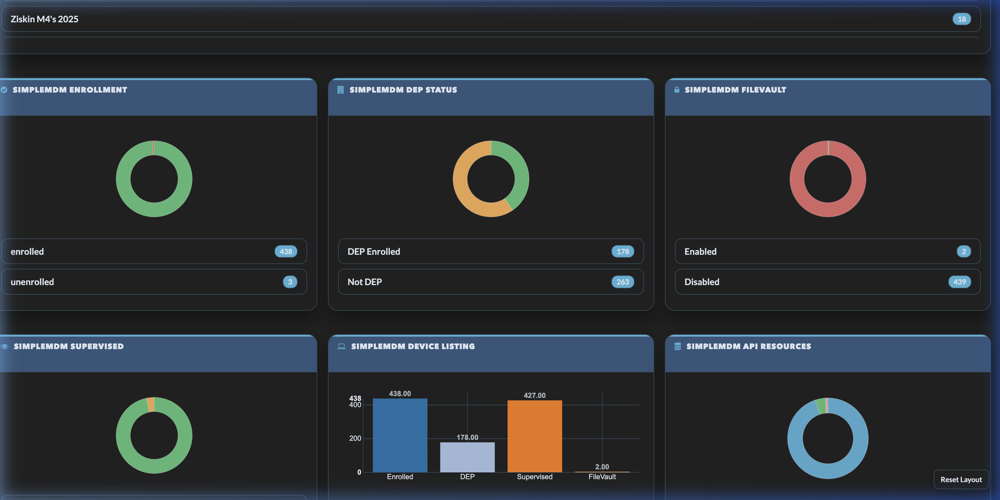
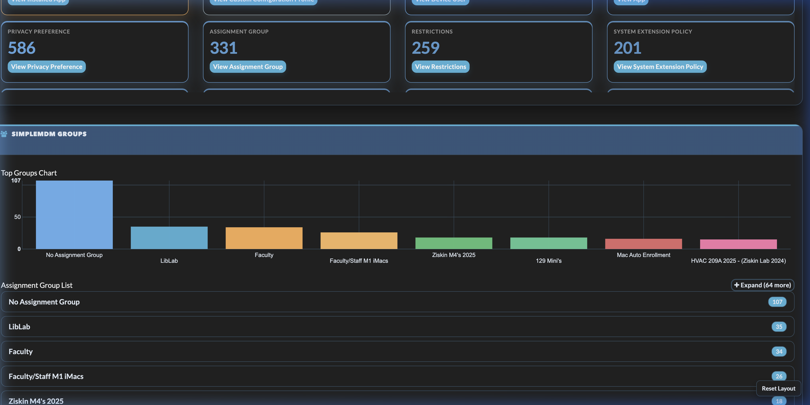
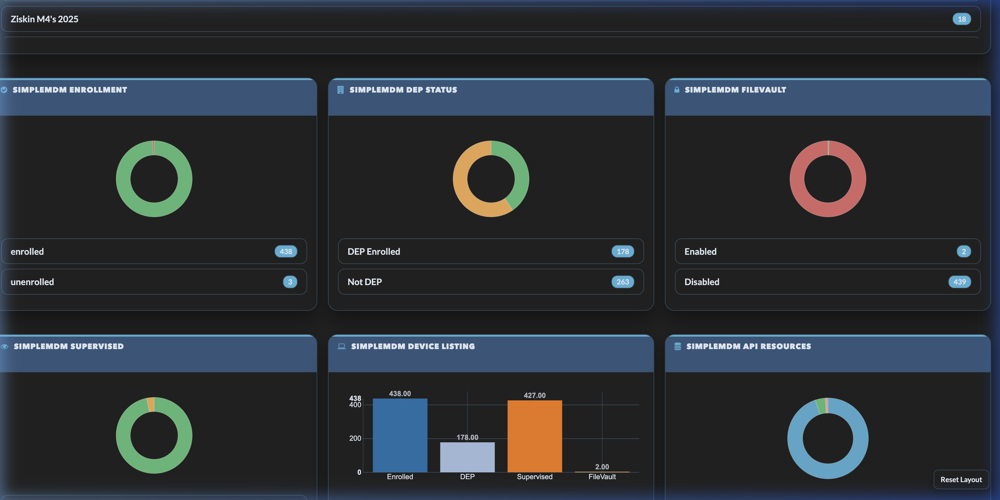
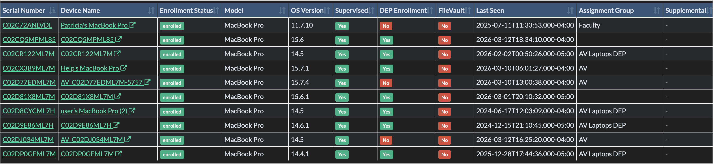
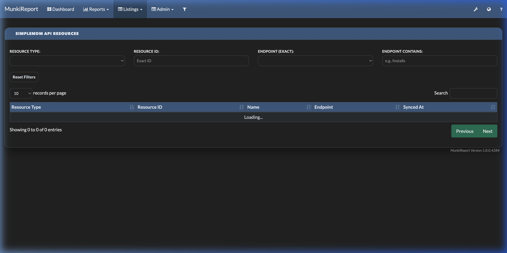
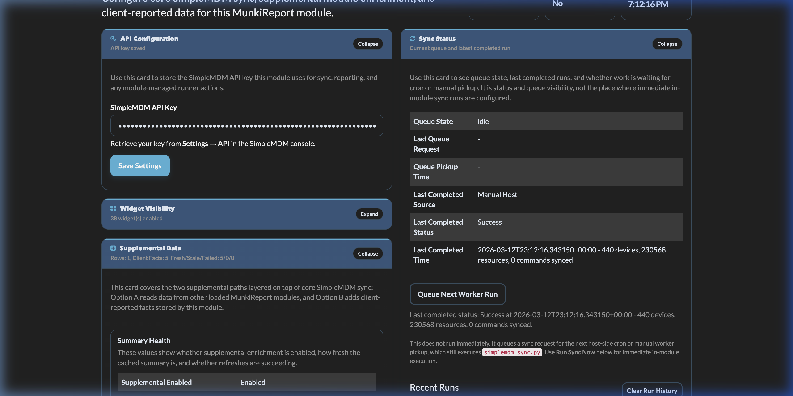
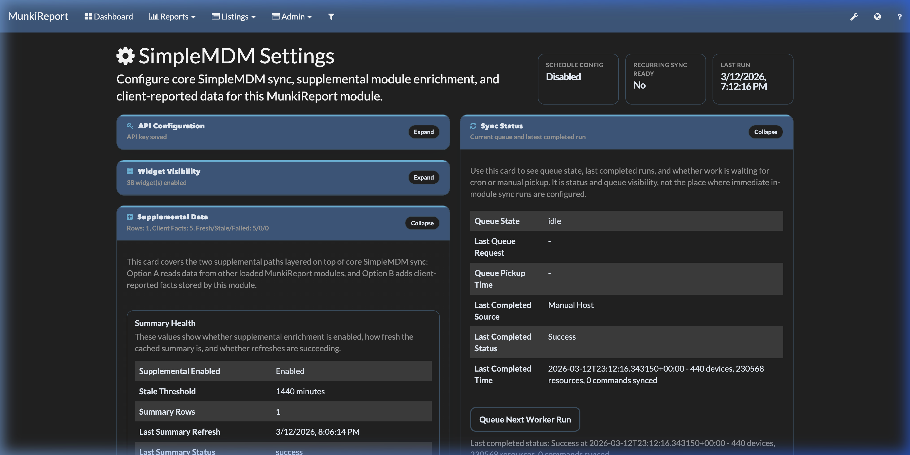
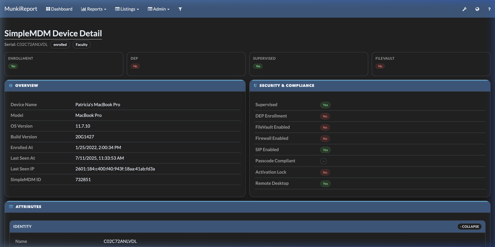
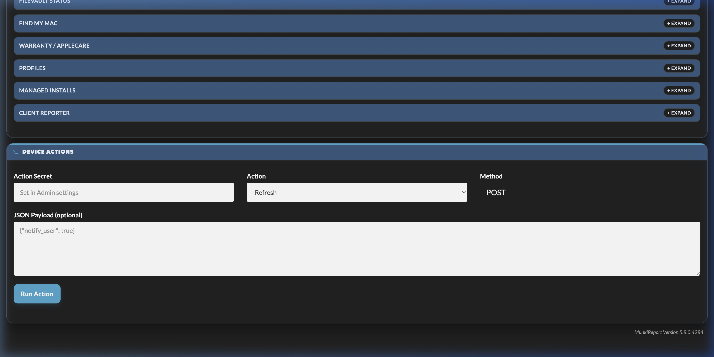

# SimpleMDM Module for MunkiReport

> [!IMPORTANT]
> **BETA STATUS**: This module is currently in beta. Features. Docs and database schemas may undergo significant changes before the final 2.0 release.

Module-only SimpleMDM integration for MunkiReport.

This module syncs devices and API resources from SimpleMDM server-side, stores them locally, and exposes listings, widgets, and per-device connected resource views.

> [!TIP]
> **Query this module with natural language:** the companion [SimpleMDM-MCP](https://github.com/hov172/SimpleMDM-MCP)
> server exposes your SimpleMDM fleet to Claude (or any MCP client) as 189 tools — and its five
> `get_munkireport_*` tools consume **this module's** `/module/simplemdm/…` routes to pull the
> MunkiReport-side data the SimpleMDM API doesn't expose. Install both and you can ask things like
> *"which Macs are out of compliance according to MunkiReport?"* in plain English. Point the MCP
> server's `MUNKIREPORT_BASE_URL` at this instance; its default `MUNKIREPORT_MODULE_PREFIX`
> (`/module/simplemdm`) already matches this module's routes.

## Preview

The SimpleMDM module provides a high-fidelity dashboard and granular inventory views.

### SimpleMDM Report
Top-level resource cards showing totals for Apps, Profiles, Device Users, and more.


### Enrollment & Security
Real-time visualization of enrollment status and security compliance posture.


### Group Distribution
Visual breakdown of device allocation across SimpleMDM assignment groups.


### Resource & Device Inventory
Comprehensive grids for device listing and API resource distribution.


## Key Points

- No MunkiReport core patch required.
- Sync auth and routing are handled inside this module.
- Supports API-key protected ingest routes and optional webhook secret protected route.
- Supports role + action-secret protected device API passthrough routes (`api_devices`).
- Supports documented SimpleMDM API resource sync for devices, apps, profiles, scripts, enrollments, assignment groups, device groups, and related supported child objects.
- Provides device-level connected resource mapping.
- Supports dashboard add/remove widgets for all SimpleMDM widgets, including per-resource-type widgets.
- All report widgets are modernized with chart/KPI dashboards (NVD3-based where applicable) and drill-down links.
- Widgets auto-adapt to layout density and active theme (including Bootswatch theme accent matching).
- Modern widget UI assets are loaded inline from `views/simplemdm_widget_modern_assets.php` (no separate module CSS/JS build step required).
- Optional delta-sync, command-status sync, and sync telemetry reporting are built into the sync script + module.
- Supplemental cross-module enrichment is available for supported local data sources, with per-device detail, client-tab summaries, listing filters, and summary-backed widgets.
- Option B client-reporter ingestion is available for a narrow allowlisted fact set, stored separately from authoritative SimpleMDM fields.
- Natural-language querying via the companion [SimpleMDM-MCP](https://github.com/hov172/SimpleMDM-MCP) server, whose `get_munkireport_*` MCP tools read this module's routes.

Developer docs:
- See `docs/DEVELOPER_GUIDE.md` for architecture, code map, flow charts, and extension workflows.
- Client reporter contract and Option B details: `docs/CLIENT_REPORTER_ADDON.md`
- Client reporter deployment guide: `docs/CLIENT_REPORTER_DEPLOYMENT.md`
- Security: `docs/SECURITY.md`
- Upgrade runbook: `docs/UPGRADE.md`
- API routes/auth reference: `docs/API_REFERENCE.md`
- Testing and QA: `docs/TESTING.md`

## Connect SimpleMDM-MCP (natural-language queries)

With this module installed, the companion [SimpleMDM-MCP](https://github.com/hov172/SimpleMDM-MCP)
server can query it from Claude (or any MCP client):

1. Install and sync this module (Quick Start above).
2. In the MCP server's environment, set `MUNKIREPORT_BASE_URL=https://your-munkireport.example.com`
   — its default `MUNKIREPORT_MODULE_PREFIX` (`/module/simplemdm`) already matches this module's routes.
3. Authenticate: as of 2026-07-08 every read route the MCP calls accepts the sync token
   header, so the simplest setup is `MUNKIREPORT_AUTH_HEADER_NAME=X-SIMPLEMDM-API-KEY` with
   `MUNKIREPORT_AUTH_HEADER_VALUE` set to the same SimpleMDM API key the module stores — no
   browser session needed. `MUNKIREPORT_COOKIE` (a session cookie) still works as an
   alternative and is required for the two admin actions (`request_sync`,
   `refresh_supplemental_summary`).
4. Test from the MCP side with `get_munkireport_sync_health`. An expired session shows up
   there as a JSON parse error (MunkiReport returns `Authenticate first.` as HTTP 200 text).

The MCP tools map to these routes (16 tools as of SimpleMDM-MCP v0.33.0, unchanged in v0.34.0):

- **Alerts**: `get_events[/serial]?limit&type` — the 13 built-in alert/regression events plus
  custom rules (route added 2026-07-07 for the MCP's `get_munkireport_alerts` tool).
- **Module's own SimpleMDM-synced data**: `get_sync_telemetry`, `get_compliance_stats`,
  `get_device_resources/{serial}`, `get_command_status_stats`, `get_dashboard_trend?days=N`,
  `get_runner_status`.
- **Option A cross-module data** (aggregated from other installed MunkiReport modules):
  `get_supplemental_overview_stats`, `get_supplemental_applecare_stats`,
  `get_supplemental_data/{serial}`, `get_supplemental_status`.
- **Option B client facts**: `get_client_facts/{serial}`.
- **MCP findings channel**: `ingest_mcp_findings` (sync-token POST — the MCP pushes its
  computed findings: CVE exposure, audit deltas, stale/compliance detections) and
  `get_mcp_findings[/serial]?severity&source&limit` (read-back + the MCP Findings widget).
  As of SimpleMDM-MCP v0.34.0, pushes are no longer only human-triggered: the MCP's
  findings auto-publish middleware (opt-in, off by default) automatically pushes
  compliance/health-check results, allowlisted inventory results, action-tool failures, and
  fleet-audit findings — each under its own source namespace (`mcp_auto_<tool>`,
  `mcp_auto_action_<tool>`, `sofa_audit`) so `replace: true` auto-resolve stays scoped
  per tool. See the MCP repo's `docs/findings-middleware.md` and this module's
  `docs/API_REFERENCE.md` §11 for the source conventions and the action-failure shape.
  Findings now persist across pushes with lifecycle status and occurrence history instead of being
  wiped on every push; a complete scan auto-resolves previously-active findings (open, acknowledged, in_progress) that no longer
  appear, and resolved findings reopen if they recur. See the [CHANGELOG](CHANGELOG.md) for the
  full field list and new query parameters.
  Findings can also be transitioned manually via four admin action routes (`acknowledge_mcp_finding`, `resolve_mcp_finding`, `ignore_mcp_finding`, `suppress_mcp_finding`), independent of the automatic ingest lifecycle — see the CHANGELOG and `docs/API_REFERENCE.md` for the request/response shape.

Ingest, read, and admin-action behavior for MCP findings can be tuned via five admin settings (`mcp_findings_enabled`, `mcp_findings_metadata_max_bytes`, `mcp_findings_auto_resolve`, `mcp_findings_event_enabled`, `mcp_findings_event_warning_threshold`) — see the "MCP Findings Settings" panel in the module's admin UI, or `docs/API_REFERENCE.md` for the full effect of each. The last two settings gate an optional, deduplicated fleet findings summary event (PRD section 13): off by default, so existing installs' Events UI does not change without opt-in; when enabled, it writes under module key `simplemdm_mcp_findings_summary`, anchored to the worst-affected device.

Three analytics routes — `get_mcp_finding_stats` (count breakdowns), `export_mcp_findings` (CSV/JSON export), and `get_mcp_scan_status` (per-source last-scan summary) — also accept the same sync token auth, enabling analytics dashboards and bulk exports via the same headless auth mechanism.

- **Actions** (write-gated on the MCP side): `request_sync`, `refresh_supplemental_summary[/serial]`.

Note: as of 2026-07-11, twenty read-only routes accept the sync token header
(`X-SIMPLEMDM-API-KEY`) as an alternative to a MunkiReport session, so headless clients
(SimpleMDM-MCP, ReportSimpleMDM) can read module data without a browser session: the ten
dashboard routes (`get_sync_telemetry`, `get_compliance_stats`, `get_command_status_stats`,
`get_assignment_group_stats`, `get_resource_type_stats`, `get_os_security_stats`,
`get_supplemental_status`, `get_supplemental_overview_stats`, `get_supplemental_applecare_stats`,
`get_device_resources/{serial}`) plus `get_events`, `get_dashboard_trend`,
`get_supplemental_data/{serial}`, `get_client_facts/{serial}`, `get_runner_status`,
`get_mcp_findings`, `get_mcp_finding_stats`, `export_mcp_findings`, `get_mcp_scan_status`,
and `get_mcp_finding_timeline`. The token-protected sync/ingest routes (including
`ingest_mcp_findings` for the MCP findings push) also pass the core module filter when
called directly with a valid token. Only the two actions (`request_sync`,
`refresh_supplemental_summary`) still require an **admin (global)** MunkiReport session.
Anyone holding the SimpleMDM API key can read all twenty routes — including per-device
client facts — so treat the key accordingly and use HTTPS.

## Connect ReportSimpleMDM

[ReportSimpleMDM](https://github.com/hov172/ReportSimpleMDM) is a native macOS/iOS SwiftUI
client for SimpleMDM. It works standalone against the SimpleMDM API, and can optionally
connect to this module to enrich its dashboards and device detail with module-backed data
(compliance, sync health, command status, assignment groups, OS/security stats, supplemental
sources, and per-device resource connections).

Requirements:

- ReportSimpleMDM 1.6.1 Build 7 or later (earlier builds request route paths this module
  does not serve).
- This module at commit `f8dd079` or later (earlier module versions require a browser
  session for the dashboard read routes).
- The SimpleMDM API key saved in the module's admin settings (`Settings -> SimpleMDM` in
  MunkiReport). The app authenticates with the same key, so both sides must hold the same
  value.

Steps in the app:

1. Open `Settings > Server & API`.
2. Set `Backend Mode` to `SimpleMDM + MunkiReport Module`.
3. Enter your `SimpleMDM API Key` (the same key the module's sync worker uses).
4. Set `MunkiReport Base URL` to the MunkiReport site root.
   Rewrite-enabled routing: `https://munkireport.example.com`
   Non-rewrite routing: `https://munkireport.example.com/index.php?`
5. Leave `Module Path Prefix` at `/module/simplemdm`.
6. Leave `Auth Header Name` at its default `X-SIMPLEMDM-API-KEY` with `Auth Header Value`
   blank — the app substitutes its SimpleMDM API key automatically, so no auth
   configuration is needed. (On builds before 1.6.1 Build 7 the default may not populate;
   type the header name in manually. Alternative for module versions older than `f8dd079`:
   paste a logged-in MunkiReport session cookie into `Cookie Header`.)
7. Save, then let the dashboard refresh. `Settings` should show `Module Data: Available`,
   and the app dashboard gains a "MunkiReport Insights" section grouping the module-only
   widgets (Sync Health, Compliance, Supplemental Overview, AppleCare Coverage). Widgets
   that can use either source (OS Versions, Assignment Groups, Resource Types) show a
   "via MunkiReport" caption when module data is feeding them.

The app reads the token-readable module routes it needs for dashboards and device detail;
it never calls write or admin routes. Use HTTPS so the key is not sent in the clear.

Verify from the command line with the same header the app sends:

```bash
# rewrite-enabled routing
curl -H "X-SIMPLEMDM-API-KEY: <api_key>" \
  "https://munkireport.example.com/module/simplemdm/get_sync_telemetry"

# non-rewrite routing
curl -H "X-SIMPLEMDM-API-KEY: <api_key>" \
  "https://munkireport.example.com/index.php?/module/simplemdm/get_sync_telemetry"
```

Expected result is JSON. Troubleshooting:

- `Authenticate first.` as plain text (HTTP 200) — the key does not match the module's
  stored `api_key`, or the module predates `f8dd079`. In the app this surfaces as decode
  errors or empty module dashboards.
- HTTP 403 `Module controller filter` — the module predates `f8dd079` (MunkiReport core is
  session-gating the route before the module can accept the token).
- HTTP 404 — check the base URL form (`index.php?` vs rewrite) and the module path prefix.

## Supplemental Data

This module now has three distinct data paths:

- Core SimpleMDM sync
  - server-side sync from the external SimpleMDM service into this MunkiReport module
- Option A supplemental module enrichment
  - read-only enrichment from other loaded MunkiReport modules
- Option B client reporter ingestion
  - client-reported facts posted directly into this module

Use this distinction when documenting or debugging the module:

- core sync is the authoritative source for native SimpleMDM inventory and resource data
- Option A is for filling gaps with other MunkiReport module data
- Option B is for narrow local-device facts that are not already available through core sync or Option A

Option A and Option B can be enabled at the same time.

Normal combined model:

- core sync provides the primary SimpleMDM inventory and resource state
- Option A adds cross-module context from other loaded MunkiReport modules
- Option B adds narrow endpoint-reported facts that no existing module already owns

Recommended trust order:

- core sync remains authoritative for native SimpleMDM fields
- Option A remains authoritative for facts already owned by another module
- Option B should be limited to local-device facts that are not already collected elsewhere

Avoid posting the same operational fact through both Option A and Option B unless you are explicitly using that difference for drift detection.

Option A supplemental enrichment is implemented for supported local sources detected by database schema.

Current built-in sources:

- `filevault_status`
- `findmymac`
- `profile`
- `warranty` as the AppleCare/lifecycle source
- `managedinstalls`

Generic auto-discovery:

- the module also scans other loaded MunkiReport modules
- it inspects module PHP files for candidate table names
- it verifies table existence and a supported join key such as `serial_number`
- usable modules are exposed as generic supplemental sources unless a richer built-in mapping already exists

Current coverage:

- standalone device page supplemental sections
- client tab supplemental summary
- supplemental summary cache table
- admin detection and manual summary refresh
- listing badges and supplemental filters
- summary-backed widgets for supplemental overview and AppleCare lifecycle

The source registry is allowlisted by default and can be extended with `supplemental_registry_json` in the SimpleMDM admin page.

Best use cases for Option A:

- warranty, lifecycle, security, and software state already collected by other modules
- fleet filters and summary widgets based on non-SimpleMDM data
- richer device investigations without creating a new client-side collector

Examples:

- use `warranty` to show AppleCare lifecycle details
- use `filevault_status` to compare local FileVault state against MDM expectations
- use `profile` to show installed profile context beside native SimpleMDM data
- use `managedinstalls` to add software/deployment context to the device page

Option B client-reporter facts are stored separately from SimpleMDM API data.

Current allowlisted facts:

- `mdm_profile_present`
- `console_user`
- `uptime_seconds`
- `munki_last_run_result`
- `local_filevault_enabled`

Current-value and history tables:

- `simplemdm_client_fact`
- `simplemdm_client_fact_history`

Ingest route:

- `POST /module/simplemdm/index?op=ingest_client_facts`
- auth header: `X-SIMPLEMDM-CLIENT-SECRET`
- posts client-reported facts into this MunkiReport SimpleMDM module, not into the external SimpleMDM service
- optional hardening can also require:
  - `X-SIMPLEMDM-CLIENT-TIMESTAMP`
  - `X-SIMPLEMDM-CLIENT-NONCE`
  - `X-SIMPLEMDM-CLIENT-SIGNATURE`
  - `X-SIMPLEMDM-CLIENT-TOKEN`

Best use cases for Option B:

- facts that come from the endpoint itself rather than from the SimpleMDM API
- facts that no other loaded MunkiReport module already owns
- lightweight local checks where building a separate full module would be excessive

Examples:

- current console user
- local uptime
- local FileVault state
- local health/drift facts from a custom script or extension

How Option B is typically used from a Mac:

1. enable `Client Reporter Ingestion` in `Admin -> SimpleMDM Settings`
2. set `Client Reporter Secret`
3. keep the allowlist narrow
4. deploy a local script, LaunchDaemon, Munki postflight, or other management job on the Mac
5. collect local facts
6. `POST` them to `/module/simplemdm/index?op=ingest_client_facts`
7. review them in the `Client Reporter` supplemental section on the device page or client tab
8. use the admin `Client Reporter Requirements` panel to confirm the current required headers and network expectations before rollout

Included examples:

- basic shared-secret shell reporter:
  - [scripts/simplemdm_client_reporter_example.sh](scripts/simplemdm_client_reporter_example.sh)
- hardened Python reporter with HMAC, nonce, and device token headers:
  - [scripts/simplemdm_client_reporter_hardened.py](scripts/simplemdm_client_reporter_hardened.py)
- installer helper for client deployment:
  - [scripts/install_client_reporter.sh](scripts/install_client_reporter.sh)
- example `launchd` agent plist:
  - [scripts/com.googlecode.munkireport-simplemdm-client-reporter.plist.example](scripts/com.googlecode.munkireport-simplemdm-client-reporter.plist.example)
- example Munki postflight wrapper:
  - [scripts/postflight_simplemdm_client_reporter_example.sh](scripts/postflight_simplemdm_client_reporter_example.sh)
- backend Option A validation helper:
  - [scripts/option_a_backend_check.php](scripts/option_a_backend_check.php)

Minimal example:

```bash
SERIAL="$(system_profiler SPHardwareDataType | awk -F': ' '/Serial Number/ {print $2; exit}')"
CONSOLE_USER="$(stat -f %Su /dev/console)"
UPTIME_SECONDS="$(python3 - <<'PY'
import subprocess
import time

out = subprocess.check_output(["sysctl", "-n", "kern.boottime"], text=True)
sec = int(out.split("sec = ")[1].split(",")[0])
print(int(time.time()) - sec)
PY
)"

curl -X POST "https://YOUR_MUNKIREPORT/index.php?/module/simplemdm/index?op=ingest_client_facts" \
  -H "Content-Type: application/json" \
  -H "X-SIMPLEMDM-CLIENT-SECRET: YOUR_CLIENT_SECRET" \
  -d "{
    \"serial_number\": \"${SERIAL}\",
    \"source\": \"client_reporter\",
    \"facts\": {
      \"console_user\": \"${CONSOLE_USER}\",
      \"uptime_seconds\": ${UPTIME_SECONDS}
    }
  }"
```

Operational guidance:

- use Option B for small, explicit facts rather than large inventories
- prefer one authoritative source for each fact
- if another MunkiReport module already provides the same fact, use Option A instead of duplicating it through Option B
- if you intentionally collect overlapping facts for drift detection, label that operationally so admins know why values may differ
- the original shared-secret flow still works by default
- optional hardening can now add HMAC signing, replay protection, per-device tokens, and trusted-proxy/IP restrictions without changing the supplemental data model
- if you want a ready-to-run starting point, use the included example scripts instead of copying the inline curl example directly

## Table of Contents

- [Key Points](#key-points)
- [Connect SimpleMDM-MCP (natural-language queries)](#connect-simplemdm-mcp-natural-language-queries)
- [Connect ReportSimpleMDM](#connect-reportsimplemdm)
- [Developer Guide](docs/DEVELOPER_GUIDE.md)
- [Client Reporter Add-On](docs/CLIENT_REPORTER_ADDON.md)
- [Client Reporter Deployment Guide](docs/CLIENT_REPORTER_DEPLOYMENT.md)
- [Security Guide](docs/SECURITY.md)
- [Upgrade Guide](docs/UPGRADE.md)
- [API Reference](docs/API_REFERENCE.md)
- [Testing Guide](docs/TESTING.md)
- [Changelog](CHANGELOG.md)
- [Quick Start (5 Minutes)](#quick-start-5-minutes)
- [Prerequisites](#prerequisites)
- [Hosted / VM Module Install](#hosted--vm-module-install)
- [Docker Module Install](#docker-module-install)
- [What This Module Does](#what-this-module-does)
- [Architecture](#architecture)
- [Features](#features)
- [Installation](#installation)
- [Configuration](#configuration)
- [Connect New Features (End-to-End)](#connect-new-features-end-to-end)
- [Sync Script](#sync-script)
- [Widgets](#widgets)
- [Device Detail Page Breakdown](#device-detail-page-breakdown)
- [Validation Checklist](#validation-checklist)
- [Troubleshooting](#troubleshooting)
- [Files Added/Updated by This Module](#files-addedupdated-by-this-module)
- [License](#license)

## Quick Start (5 Minutes)

1. Install and migrate (from MunkiReport repo root):
   - Copy or clone this module to `local/modules/simplemdm`
   - Add `simplemdm` to `MODULES`
   - Run `php please migrate` or `docker compose exec munkireport php please migrate`
2. Configure API/auth:
   - Open `Admin -> SimpleMDM Settings`
   - Save `api_key`
   - (Recommended) set `webhook_secret` and `action_api_secret`
3. Configure sync behavior (recommended defaults):
   - Enable `enable_scheduled_sync`
   - Set `sync_interval_minutes` to `15`
   - Enable `sync_delta_enabled`
   - Enable `sync_device_subresources_enabled`
   - Set `device_subresource_limit` to `100` (test) or `0` (all devices)
4. Configure the admin workflow in `Admin -> SimpleMDM Settings`:
   - Use `Sync Status -> Queue Next Worker Run` to queue the next worker pickup
   - Use `In-Module Sync And Schedule -> Run Sync Now` for an immediate one-time sync when module-side execution is available
   - Use `Schedule` with preset `Every 15 Minutes` (recommended) or choose `Custom`
   - Use `Enable Scheduled Sync` to turn on scheduled reconciliation
   - Optional: enable in-module script execution if you want the module to install/remove cron for you
5. Add schedule runner (cron):
   - `* * * * * /usr/bin/python3 <ABSOLUTE_MR_ROOT>/local/modules/simplemdm/scripts/simplemdm_sync.py --api-key 'YOUR_SIMPLEMDM_API_KEY' --munkireport-url 'https://mr' --respect-schedule --max-parent-resources 25 >> /var/log/simplemdm_sync.log 2>&1`
   - Or use the admin UI `Enable Scheduled Sync` button when in-module script execution is enabled
   - Or print/install the entry manually with `local/modules/simplemdm/scripts/install_cron.sh --munkireport-url 'https://mr' --api-key 'YOUR_SIMPLEMDM_API_KEY' [--install]`
   - Scheduled sync always runs `simplemdm_sync.py`; cron is just the launcher
6. Verify:
   - `reports/simplemdm` renders widgets
   - `show/listing/simplemdm/simplemdm` has devices
   - `module/simplemdm/device/{serial}` shows attributes, connected resources, subresources, and actions
   - `module/simplemdm/findings` opens the MCP findings browser (filters, pagination, bulk actions, export)

## Prerequisites

This README assumes MunkiReport is already installed and running.

Use the MunkiReport core project for base application setup:
- MunkiReport repo: `https://github.com/munkireport/munkireport-php`
- Start with the MunkiReport core README in that repo for hosted or Docker installation details before applying this module.

This module README covers only:
- installing `simplemdm` into `local/modules`
- enabling the module
- running module migrations
- configuring SimpleMDM settings
- setting up the host-side sync runner and cron

## Sync Workflow

There are two supported ways to operate the sync workflow:

1. In-module workflow
   - Use `Sync Status -> Queue Next Worker Run` to queue the next worker pickup.
   - Use `In-Module Sync And Schedule -> Run Sync Now` for an immediate one-off run when module-side execution is available.
   - Use `Schedule` plus `Enable Scheduled Sync` / `Disable Scheduled Sync` for recurring runs.
   - If `Allow in-module script execution for global admins` is enabled, the module can install/remove the cron job for you.

2. Manual host-side workflow
   - Download the module or scripts from the admin UI.
   - Run `simplemdm_sync.py` directly for one-off syncs.
   - Install/remove the cron job manually with `install_cron.sh` / `remove_cron.sh`, or by editing crontab yourself.

Important:
- `simplemdm_sync.py` is the worker that performs the sync.
- cron is the scheduler that launches `simplemdm_sync.py` repeatedly.
- `Sync Status -> Queue Next Worker Run` is queue-based and still depends on a worker pickup.
- `In-Module Sync And Schedule -> Run Sync Now` is immediate and does not require cron, but it does require module-side Python.
- recurring scheduled sync still requires cron somewhere on the host.
- the admin page updates itself without a full browser refresh; active sync states poll faster than idle states
- `Schedule Config` shows whether the module schedule is enabled in settings.
- `Recurring Sync Ready` shows whether recurring sync is actually ready to run, including cron being installed.

### Script Permissions

The shell helper scripts in this repo are tracked as executable:
- `scripts/install_cron.sh`
- `scripts/remove_cron.sh`

In normal use:
- if you clone with Git on macOS/Linux, the execute bit should be preserved automatically
- if that working tree is bind-mounted into Docker, the scripts should remain executable there too

You may still need `chmod +x` if:
- you downloaded the module as a zip instead of cloning with Git
- your extraction or copy tool dropped Unix file modes
- your Docker mount is coming from a filesystem that did not preserve the execute bit

If needed:

```bash
chmod +x local/modules/simplemdm/scripts/install_cron.sh
chmod +x local/modules/simplemdm/scripts/remove_cron.sh
```

## Runner URL Detection

The `Runner MunkiReport URL` field is auto-populated by the module.

Detection workflow:

1. Prefer MunkiReport's configured canonical URL from `WEBHOST` and `SUBDIRECTORY`.
2. If that configured URL is blank, placeholder-like, or clearly mismatched for local development, fall back to the current browser request URL.
3. The value can still be overridden manually in `Admin -> SimpleMDM Settings`.

Practical examples:

- Hosted / production:
  - If `WEBHOST=https://reports.company.com`, the field will use that value.
- Docker local:
  - If `WEBHOST` is still a template value such as `https://munkireport.domain.com`, and you are browsing at `http://localhost`, the module will fall back to the current local request URL.
- Reverse proxy / subdirectory:
  - The field is correct when `WEBHOST` and `SUBDIRECTORY` are configured correctly for the public app URL.

Best practice:
- In production, keep `WEBHOST` set to the real public URL.
- In local Docker, either set `WEBHOST=http://localhost` or let the module fall back to the current browser URL.

## Docker And Python Runtime

The admin page distinguishes between:

- in-module execution
  - the module runs `simplemdm_sync.py` itself
  - requires Python to exist in the MunkiReport runtime environment
- manual / outside-module execution
  - you run `simplemdm_sync.py` from the host
  - uses the host Python installation

For Docker deployments:

- If the `munkireport` app container includes Python, in-module execution can work.
- If the container does not include Python, the admin page will report that module-side execution is unavailable.
- In that case, use the `Manual / Outside-Module Access` workflow from the host.
- If you want the module to inspect or manage cron inside the container too, the runtime also needs the `cron` package (which provides the `crontab` command on Debian-based images).

Recommended Docker image additions for in-module sync:

```Dockerfile
RUN apt-get update && \
    apt-get install --no-install-recommends -y \
    python3 \
    cron && \
    apt-get clean && \
    rm -rf /var/lib/apt/lists/*
```

After updating the image, rebuild and recreate the container:

```bash
docker compose build
docker compose up -d --force-recreate
```

If you do not want to add `python3` and `cron` to the container, keep using the host/manual runner workflow instead.

If you prefer not to edit the main MunkiReport `Dockerfile`, this module also ships a companion image definition at `local/modules/simplemdm/Dockerfile.munkireport-simplemdm`.
It is meant to be used from the full MunkiReport repo root as an alternate app Dockerfile. It is not a standalone Dockerfile for the module repo by itself.
It mirrors the upstream image and adds `python3` plus `cron` for SimpleMDM in-module sync.

Use it from the MunkiReport repo root with either approach below:

1. One-off build with `docker build`:

```bash
docker build \
  -f local/modules/simplemdm/Dockerfile.munkireport-simplemdm \
  -t munkireport-php-munkireport:simplemdm \
  .
docker compose up -d --force-recreate
```

2. Or point your compose service at the alternate Dockerfile:

```yaml
services:
  munkireport:
    build:
      context: .
      dockerfile: local/modules/simplemdm/Dockerfile.munkireport-simplemdm
```

Then rebuild and recreate:

```bash
docker compose build
docker compose up -d --force-recreate
```

After the container starts, run migrations at runtime:

```bash
docker compose exec munkireport php please migrate
```

Important:
- build context must be the full MunkiReport app root
- do not run `docker build` from `local/modules/simplemdm` by itself
- the companion Dockerfile adds runtime packages only; it does not run DB migrations during image build

### Docker Build Warnings

When building the companion Dockerfile, Docker may report non-fatal build-check warnings such as:

- `LegacyKeyValueFormat`
- `SecretsUsedInArgOrEnv`

These warnings are inherited from the upstream-style MunkiReport Dockerfile conventions that this companion file mirrors. They do not block the build and they do not prevent SimpleMDM from working.

What they mean:

- `LegacyKeyValueFormat`: Docker recommends modern `ENV key=value` syntax instead of the older `ENV key value` format.
- `SecretsUsedInArgOrEnv`: Docker warns when an `ARG` or `ENV` name looks sensitive. In this companion file, that warning is triggered by names such as `AUTH_METHODS`, but the current value is not being used as a secret for the SimpleMDM workflow.

How to resolve them:

- Update legacy `ENV` lines to `ENV KEY=value` format in the Dockerfile if you want a cleaner build output.
- Avoid putting real secrets in `ARG` or `ENV`; use Docker build secrets for sensitive values instead.

Reference:

- Docker build checks overview: https://docs.docker.com/build/checks/
- `LegacyKeyValueFormat`: https://docs.docker.com/reference/build-checks/legacy-key-value-format/
- `SecretsUsedInArgOrEnv`: https://docs.docker.com/reference/build-checks/secrets-used-in-arg-or-env/

Recurring scheduled sync still depends on cron:

- If module execution is available, the module can install/remove cron for you.
- If module execution is unavailable, install cron manually on the host and run `simplemdm_sync.py` there.

Additional requirements for this module:
- a working MunkiReport instance
- a valid SimpleMDM API key
- `python3` on the host that will run `simplemdm_sync.py`

## Hosted / VM Python And Cron Runtime

For non-Docker MunkiReport installs, the SimpleMDM module expects these host-level requirements:

- `python3` installed on the same server that will run `simplemdm_sync.py`
- `cron` / `crontab` available if you want scheduled sync
- PHP local command execution available if you want the module UI to run sync or inspect cron directly

Recommended checks on the MunkiReport server:

```bash
php -v
python3 --version
crontab -l
```

If `crontab -l` returns "no crontab for <user>", that is acceptable and just means no cron entry is installed yet.
If `python3` is missing, install it with your system package manager before using in-module sync or scheduled sync.
If `crontab` is missing, install your platform's cron package before using scheduled sync.

Typical examples:

```bash
# Debian / Ubuntu
sudo apt-get update
sudo apt-get install -y python3 cron

# RHEL / Rocky / AlmaLinux
sudo dnf install -y python3 cronie

# macOS host/manual runner
python3 --version
crontab -l
```

If you do not want the module to execute sync inside MunkiReport, you can still use the host/manual workflow:

- run `simplemdm_sync.py` directly with `python3`
- install cron outside the module with `install_cron.sh --munkireport-url 'https://your-munkireport' --api-key 'YOUR_SIMPLEMDM_API_KEY' --install`
- use `Sync Status -> Queue Next Worker Run` only as a queue/request signal for the next host-side worker pickup

### Hosted / VM Module Install

Run these commands from the MunkiReport repo root.

1. Check prerequisites:

```bash
php -v
python3 --version
```

2. Install the module:

```bash
mkdir -p local/modules
[ -d local/modules/simplemdm/.git ] || git clone https://github.com/hov172/SimpleMDM-MunkiReport local/modules/simplemdm
```

3. Enable `simplemdm` in your MunkiReport config.
   - Ensure `MODULES` contains `simplemdm`

If MunkiReport reads modules from `.env`, update the `MODULES=` line there.

Example:

```env
MODULES="munkireport,managedinstalls,disk_report,simplemdm"
```

Example command to replace an existing `MODULES=` line:

```bash
perl -i.bak -pe 's/^MODULES=.*/MODULES="munkireport,managedinstalls,disk_report,simplemdm"/' .env
```

If `.env` does not already contain `MODULES=`, append it:

```bash
grep -q '^MODULES=' .env || echo 'MODULES="munkireport,managedinstalls,disk_report,simplemdm"' >> .env
```

4. Run migrations:

```bash
php please migrate
```

Do not delete or rename files in `local/modules/simplemdm/migrations/`.
They are required for fresh installs and upgrades, and shipped migrations should be treated as immutable once deployed.

5. Configure the module in the UI:
   - Open `Admin -> SimpleMDM Settings`
   - Save `api_key`
   - Optional but recommended: set `webhook_secret`, `action_api_secret`, and sync toggles

6. Run a manual sync test:

```bash
python3 local/modules/simplemdm/scripts/simplemdm_sync.py \
  --api-key 'YOUR_SIMPLEMDM_API_KEY' \
  --munkireport-url 'http://127.0.0.1' \
  --verbose
```

7. Install the schedule runner on the host:

```bash
local/modules/simplemdm/scripts/install_cron.sh --munkireport-url 'http://127.0.0.1' --api-key 'YOUR_SIMPLEMDM_API_KEY'
local/modules/simplemdm/scripts/install_cron.sh --munkireport-url 'http://127.0.0.1' --api-key 'YOUR_SIMPLEMDM_API_KEY' --install
local/modules/simplemdm/scripts/install_cron.sh --remove
```

Cron is not installed automatically when you clone the module. You must either add the crontab entry yourself or run the helper with `--install`.
The `Sync Status` panel `Queue Next Worker Run` button queues work for the next worker pickup.
The `In-Module Sync And Schedule` panel `Run Sync Now` button performs an immediate run when in-module execution is available.

### Docker Module Install

This section assumes your MunkiReport Docker stack already works and `docker compose ps` shows a running `munkireport` service.

Run these commands from the MunkiReport repo root on the host.

1. Check prerequisites:

```bash
docker compose ps
python3 --version
```

2. Install the module:

```bash
mkdir -p local/modules
[ -d local/modules/simplemdm/.git ] || git clone https://github.com/hov172/SimpleMDM-MunkiReport local/modules/simplemdm
```

3. Enable `simplemdm` in your MunkiReport runtime config.
   - Ensure the resolved `MODULES` list includes `simplemdm`

If your Docker setup reads modules from `.env`, update the `MODULES=` line:

```bash
perl -i.bak -pe 's/^MODULES=.*/MODULES="munkireport,managedinstalls,disk_report,simplemdm"/' .env
grep -q '^MODULES=' .env || echo 'MODULES="munkireport,managedinstalls,disk_report,simplemdm"' >> .env
```

If your `docker-compose.yml` hardcodes modules instead of reading `.env`, update that line directly.

Example:

```yaml
- MODULES=munkireport,managedinstalls,disk_report,simplemdm
```

Verify:

```bash
docker compose config | grep -n MODULES
```

4. Run migrations inside the app container:

```bash
docker compose exec munkireport php please migrate
```

5. Configure the module in the UI:
   - Open `Admin -> SimpleMDM Settings`
   - Save `api_key`
   - Optional but recommended: set `webhook_secret`, `action_api_secret`, and sync toggles

6. Run a manual sync from the host:

```bash
python3 local/modules/simplemdm/scripts/simplemdm_sync.py \
  --api-key 'YOUR_SIMPLEMDM_API_KEY' \
  --munkireport-url 'http://localhost:8888' \
  --verbose
```

7. Install the schedule runner on the host:

```bash
local/modules/simplemdm/scripts/install_cron.sh --munkireport-url 'http://localhost:8888' --api-key 'YOUR_SIMPLEMDM_API_KEY'
local/modules/simplemdm/scripts/install_cron.sh --munkireport-url 'http://localhost:8888' --api-key 'YOUR_SIMPLEMDM_API_KEY' --install
local/modules/simplemdm/scripts/install_cron.sh --remove
```

Cron is not installed automatically when you clone the module. The helper updates the current user's crontab only when you run it with `--install`.
The `Sync Status` panel `Queue Next Worker Run` button queues work for the next worker pickup.
The `In-Module Sync And Schedule` panel `Run Sync Now` button performs an immediate run when in-module execution is available.

### Common Validation Checklist

1. `Admin -> SimpleMDM Settings` is visible in top nav under Admin.
2. `last_sync_status` changes to `success` after manual sync.
3. Device listing and resource listing are not empty.
4. `reports/simplemdm` renders widgets without auth or API errors.

### Troubleshooting First Run

1. `git clone ... local/modules/simplemdm` fails with "destination path already exists":
   - Cause: module folder already present.
   - Fix:

```bash
cd local/modules/simplemdm
git pull
```

2. `python3: command not found`:
   - Cause: Python 3 is missing or not in PATH.
   - Fix: install Python 3 and verify:

```bash
python3 --version
```

3. Manual sync fails with connection/refused/404 errors:
   - Cause: wrong `--munkireport-url` or MunkiReport not running.
   - Fix:
     - Hosted/VM: verify your actual URL and use that in `--munkireport-url`.
     - Docker example in this doc: use `http://localhost:8888`.
     - Confirm app is reachable in browser before rerunning sync.

4. `Sync Status -> Queue Next Worker Run` stays queued:
   - Cause: no cron entry exists, cron is not running, or the queued request has not reached the next cron pickup yet.
   - Fix:

```bash
crontab -l
python3 local/modules/simplemdm/scripts/simplemdm_sync.py --api-key 'YOUR_SIMPLEMDM_API_KEY' --munkireport-url 'http://localhost:8888' --respect-schedule --force-run --verbose
```

   - If the queue state remains `queued` longer than the current sync interval, verify cron is installed with `local/modules/simplemdm/scripts/install_cron.sh --munkireport-url '<url>' --api-key 'YOUR_SIMPLEMDM_API_KEY' --install`.
   - If you want an immediate one-off run from the UI, use the `In-Module Sync And Schedule` panel instead and ensure Python is available in the MunkiReport runtime.

5. Sync fails with unauthorized/forbidden:
   - Cause: invalid SimpleMDM API key or auth mismatch.
   - Fix:
     - Save a valid API key in `Admin -> SimpleMDM Settings`.
     - Re-run sync with `--api-key 'YOUR_SIMPLEMDM_API_KEY'` for explicit test.
     - If MunkiReport API token auth is enabled in your environment, pass `--munkireport-token`.

6. `Admin -> SimpleMDM Settings` is missing:
   - Cause: module not enabled or metadata not reloaded.
   - Fix:
     - Confirm `.env` (or compose env) `MODULES` contains `simplemdm`.
     - Run migrations again: `php please migrate`.
     - Restart app/web container, then refresh browser.

6. Docker migration command fails (`docker compose exec munkireport php please migrate`):
   - Cause: service not started or different compose service name.
   - Fix:

```bash
docker compose ps
docker compose up -d --build
```

   - Then rerun migration using your actual service name if not `munkireport`.

7. `install_cron.sh` or `remove_cron.sh` fails with `Permission denied` or `bad interpreter`:
   - Cause: the execute bit was lost on the shell script.
   - Fix:

```bash
chmod +x local/modules/simplemdm/scripts/install_cron.sh
chmod +x local/modules/simplemdm/scripts/remove_cron.sh
```

   - If you are using Docker with a bind-mounted repo, fix the permissions on the host checkout and retry.

8. Cron runs but no new data appears:
   - Cause: bad absolute path, environment mismatch, or schedule gate settings.
   - Fix:
     - Ensure cron command uses a real absolute path to `simplemdm_sync.py`.
     - Test the same command manually in terminal first.
     - If using `--respect-schedule`, confirm schedule toggles in `Admin -> SimpleMDM Settings` are enabled as expected.

## What This Module Does

SimpleMDM module is used to:

- Pull SimpleMDM device inventory into MunkiReport for centralized visibility.
- Pull supported SimpleMDM resource objects (apps, profiles, scripts, enrollments, assignment groups, device groups, and related supported child objects) for reporting.
- Show connected resources per device so admins can see which profiles/apps/assignment groups are tied to endpoints.
- Show synced per-device subresource tables (installed apps, users, profiles) on device detail pages.
- Provide a device action runner UI on device detail pages with action-secret enforcement.
- Provide dashboard widgets for enrollment, DEP, supervision, FileVault, resource mix, command status, compliance, and sync health.
- Track historical trends with snapshots and per-device history for change over time.
- Ingest webhooks for near-real-time updates and maintain event audit records.
- Normalize relationship data for deeper analysis and filtering.

Typical use cases:

- Fleet posture dashboard for security/compliance and OS baseline tracking.
- Operational monitoring of command execution outcomes and sync reliability.
- Helpdesk and engineering troubleshooting for “what is assigned to this device?” questions.
- Reporting on configuration policy spread (profiles, restrictions, apps) across the fleet.

## Architecture

- Sync script: `local/modules/simplemdm/scripts/simplemdm_sync.py`
- Module endpoints (module-only):
  - `/index.php?/module/simplemdm/index?op=ingest`
  - `/index.php?/module/simplemdm/index?op=ingest_resources`
  - `/index.php?/module/simplemdm/index?op=ingest_commands`
  - `/index.php?/module/simplemdm/index?op=webhook`
  - `/index.php?/module/simplemdm/index?op=update_sync_status`
  - `/index.php?/module/simplemdm/get_dashboard_trend`
  - `/index.php?/module/simplemdm/get_os_security_stats`
  - `/index.php?/module/simplemdm/get_command_status_stats`
  - `/index.php?/module/simplemdm/get_compliance_stats`
  - `/index.php?/module/simplemdm/get_sync_telemetry`
  - `/index.php?/module/simplemdm/get_resource_type_stats`
  - `/index.php?/module/simplemdm/get_resource_type_count/{type}`
- Tables:
  - `simplemdm` (device records)
  - `simplemdm_config` (settings + sync status)
  - `simplemdm_resource` (non-device API resources)
  - `simplemdm_dashboard_snapshot` (historical dashboard metrics)
  - `simplemdm_command` (command status history)
  - `simplemdm_webhook_event` (raw webhook events)
  - `simplemdm_relationship_edge` (normalized relationship edges)
  - `simplemdm_device_history` (daily per-device state snapshots)

## Features

- Device listing: `show/listing/simplemdm/simplemdm`
  - URL filter support: `status`, `dep`, `supervised`, `filevault`, `group`, `os`
  - On-page filter controls: status/DEP/supervised/FileVault/group/OS with apply/reset actions.
- API resources listing: `show/listing/simplemdm/simplemdm_resources`
  - Filter by resource type, resource ID, endpoint exact match, or endpoint contains match.
- SimpleMDM report: `reports/simplemdm`
- Admin page: `module/simplemdm/admin`
  - Appears in top navigation under `Admin -> SimpleMDM Settings` (module `admin_pages` registration).
- Client tab + standalone device view:
  - Client tab: `#tab_simplemdm-tab`
  - Standalone: `module/simplemdm/device/{serial}`
  - `simplemdm_device` is a standalone page view (not a dashboard widget).
- Connected Resources on device pages:
  - Shows linked apps/groups/profiles/resources.
  - Links into filtered API resources listing.
- MCP findings browser: `module/simplemdm/findings`
  - Filters (status, severity, category, source, `finding_type`), pagination (50/page), CSV/JSON export carrying the active filters, and deep-link support (`?status=&severity=&category=&finding_type=&source=`) from the dashboard widget.
  - Global-admin only: multi-select bulk Acknowledge/Resolve/Ignore/Suppress.





UI modernization scope:
- Module pages now use the same modern theme tokens/components as SimpleMDM widgets:
  - `module/simplemdm/admin`
  - `show/listing/simplemdm/simplemdm`
  - `show/listing/simplemdm/simplemdm_resources`
  - `module/simplemdm/device/{serial}`
  - `#tab_simplemdm-tab`
- Interactive widget grid behavior applies to:
  - Dashboard pages that contain SimpleMDM widgets
  - `show/report/simplemdm/simplemdm`
- Interactive widget grid behavior does not apply to listing/admin/device pages.

## Installation

1. Place module in local modules:

```bash
cp -R simplemdm /path/to/munkireport/local/modules/simplemdm
```

2. Enable module in MunkiReport `.env`:

```env
MODULES="...,simplemdm,..."
```

3. Run migrations:

```bash
php /path/to/munkireport/please migrate
```

## Configuration

1. Open `Admin -> SimpleMDM Settings`.
2. Enter SimpleMDM API key and save.
3. Optional: toggle SimpleMDM widgets on/off in the same admin page (applies on dashboard/report pages where those widgets are present).
4. Optional: in Advanced Sync & Compliance, set:
   - `webhook_secret`
   - `action_api_secret`
   - `compliance_min_os`
   - `enable_scheduled_sync`
   - `sync_interval_minutes`
   - `sync_delta_enabled`
   - `sync_commands_enabled`
   - `sync_device_subresources_enabled`
   - `device_subresource_limit`




### Settings Reference

Use this section as the plain-language guide to every setting shown in `Admin -> SimpleMDM Settings`.

#### API Configuration

- `SimpleMDM API Key`
  - Meaning: the module's primary credential for reading data from the SimpleMDM API and authenticating ingest/update calls back into MunkiReport.
  - Use case: required for any real sync, whether host/manual, queued, scheduled, or in-module.
  - When to change it: when rotating the API key in SimpleMDM, moving to a different tenant, or fixing auth failures.

#### Sync Status

- `Sync Status -> Queue Next Worker Run`
  - Meaning: queues a sync request for the next worker pickup.
  - Use case: use this when you want the normal worker path to process the next run, for example when cron or a host-side runner is already in place.
  - Important: this does not execute Python from the web request.

- `Queue State`
  - Meaning: current worker state (`idle`, `queued`, `running`).
  - Use case: tells you whether work is waiting or already executing.

- `Last Queue Request`
  - Meaning: when the queue-based `Sync Status -> Queue Next Worker Run` path most recently created a request.
  - Use case: helps determine whether a queued run is waiting too long for cron/manual pickup.

- `Queue Pickup Time`
  - Meaning: when the worker claimed the current queued request.
  - Use case: helps distinguish “queued but not picked up yet” from “queue request is currently running.”

- `Last Completed Source`
  - Meaning: where the most recent completed sync came from.
  - Use case: distinguishes `Scheduled`, `Queued Admin Request`, and `Immediate (In-Module)` runs.
  - Important: this does not change when a new queue request is created; it changes only after that run is actually picked up and completed.

- `Last Completed Status`
  - Meaning: outcome of the most recently completed sync.
  - Use case: confirms whether the last run ended in success or failure.

- `Last Completed Time`
  - Meaning: timestamp plus summary of the most recently completed sync.
  - Use case: quick confirmation that new data was actually ingested.

- `Recent Runs`
  - Meaning: recent queued, running, successful, failed, or skipped sync rows from the module run-history table.
  - Use case: quick troubleshooting without querying the database or log files.
  - Important: this is sourced from `simplemdm_sync_run`, not inferred from the latest config values.

- `Clear Run History`
  - Meaning: removes recorded sync run history and resets the last-completed sync cards.
  - Use case: clear old test runs or reset the admin view before validating a fresh sync workflow.
  - Important: this is blocked while a sync is queued or running.

#### Widget Visibility

- `Widget Visibility`
  - Meaning: per-widget on/off control for the SimpleMDM report/dashboard widgets.
  - Use case: hide widgets your team does not use, simplify the report page, or reduce visual noise for operators.
  - When to change it: when customizing the dashboard/report experience for a team.
  - Current behavior: all widgets registered in `provides.yml`, including `simplemdm_mcp_findings` (`MCP Findings`) and `simplemdm_group_apps` (`Assignment Group Apps`), appear in this list and save as `widget_<id>` config keys.

#### Advanced Sync & Compliance

- `Webhook Secret`
  - Meaning: shared secret for `module/simplemdm/index?op=webhook`.
  - Use case: secure event-driven webhook updates from SimpleMDM.
  - When to use it: when you want near-real-time updates between scheduled syncs.

- `Action API Secret`
  - Meaning: shared secret required for mutating `api_devices` actions.
  - Use case: protects device actions such as restart, lock, wipe, or refresh.
  - When to use it: always set this before allowing operators to use device actions.

- `Compliance Minimum OS`
  - Meaning: minimum OS version used by compliance calculations.
  - Use case: define your fleet's baseline target for the compliance widgets.
  - Example: `14.4` or `15.1.2`

- `Enable Delta Sync Mode`
  - Meaning: tells the worker to attempt cursor-based syncs where the API supports it.
  - Use case: reduce runtime and API load on large tenants.
  - When to use it: recommended once the initial full sync is stable.

- `Enable Command Status Sync`
  - Meaning: includes SimpleMDM command records in sync runs when supported by the tenant/API.
  - Use case: populate command-related widgets and troubleshooting views.
  - When to use it: when command status visibility matters operationally.

- `Enable Scheduled Sync`
  - Meaning: turns on the module-side schedule intent used by `--respect-schedule`.
  - Use case: recurring syncs on a timer rather than only manual runs.
  - Important: this does not install cron by itself unless module-side execution is enabled and you use the schedule actions.

- `Scheduled Sync Interval (minutes)`
  - Meaning: cadence used by the worker when respecting module schedule state.
  - Use case: define how often the worker should run, such as every 15 minutes.
  - When to change it: when balancing freshness vs API/runtime cost.

- `Enable Deep Per-Device Subresource Sync`
  - Meaning: fetches device-level child data such as profiles, installed apps, and users.
  - Use case: richer device detail pages and more complete troubleshooting context.
  - Tradeoff: increases API volume and sync time.

- `Per-Device Deep Sync Limit`
  - Meaning: caps how many devices participate in deep per-device subresource sync.
  - Use case: safer testing or lower API usage on large environments.
  - `0` means no limit.

#### In-Module Sync And Schedule

- `Preset`
  - Meaning: quick schedule presets that populate the cron expression field.
  - Use case: easier scheduling for common intervals without typing cron manually.

- `Schedule`
  - Meaning: cron expression used for recurring runs.
  - Use case: custom schedule control when presets are not enough.

- `Runner MunkiReport URL`
  - Meaning: the base URL the Python worker posts data back into.
  - Use case: required for both host/manual and in-module runs.
  - When to change it: when the auto-detected value is wrong for your environment.

- `Configured Python Path`
  - Meaning: the Python binary path the runner should use.
  - Use case: host/manual cron installs and in-module command construction.
  - Important: this is not the same as proving Python is actually available inside the MunkiReport runtime.

- `Cron Log Path`
  - Meaning: output file path for cron-based sync runs.
  - Use case: troubleshooting recurring runs.
  - When to change it: when your container/server uses a different writable log location.

- `Max Parent Resources`
  - Meaning: limit for deep parent-child resource traversal such as `apps/{id}/installs`.
  - Use case: reduce runtime/API load during testing or on very large tenants.
  - `0` means unlimited.

- `Allow In-Module Script Execution For Global Admins`
  - Meaning: allows the module UI to execute approved runner actions directly from the app runtime.
  - Use case: immediate in-module sync and module-managed cron install/remove.
  - Important: this still requires Python to exist in the MunkiReport runtime.

- `Schedule Config`
  - Meaning: whether scheduled sync is enabled in module settings.
  - Use case: tells you if the module schedule is on or off.
  - Important: enabled config alone does not guarantee recurring runs will actually happen.

- `Recurring Sync Ready`
  - Meaning: whether recurring sync is operationally ready, including cron being installed.
  - Use case: the “real readiness” indicator for scheduled sync.
  - Important: this is the stronger status signal than `Schedule Config`.

- `Last Run`
  - Meaning: the most recent completed sync time, regardless of whether it was immediate, queued, or scheduled.
  - Use case: confirms when the module last finished syncing anything successfully or unsuccessfully.

- `Last Run Source`
  - Meaning: where the most recent completed sync came from.
  - Values you may see:
    - `Immediate (In-Module)`
    - `Queued Admin Request`
    - `Scheduled`
  - Use case: distinguishes manual operator-triggered runs from recurring worker runs.

- `Next Expected Run`
  - Meaning: the next calculated recurring run time based on the saved schedule.
  - Use case: operator confirmation that the configured schedule makes sense.

- `Run Sync Now` in the schedule panel
  - Meaning: executes `simplemdm_sync.py` immediately from the module runtime.
  - Use case: instant one-off sync when Python is available inside MunkiReport.

- `Enable Scheduled Sync`
  - Meaning: saves schedule settings and, when module execution is available, installs the cron entry.
  - Use case: fully activate recurring sync from the UI.

- `Disable Scheduled Sync`
  - Meaning: disables schedule intent and, when module execution is available, removes the cron entry.
  - Use case: stop future recurring runs from the module-managed path.

- `Save Schedule Settings`
  - Meaning: saves runner/schedule configuration without running or installing anything.
  - Use case: prepare settings first, then execute or enable later.

#### Manual / Outside-Module Access

- `Download Module Bundle`
  - Meaning: download the module as a zip archive.
  - Use case: move the module to another MunkiReport environment or keep an offline copy.

- `Download`
  - Meaning: download an individual script.
  - Use case: host-side/manual setup or inspection.

- `Copy External Command`
  - Meaning: copies the recommended host/manual command for the selected script action.
  - Use case: operators who prefer running the worker or cron helper outside the module.

- `Run In Module`
  - Meaning: executes the approved action from the MunkiReport runtime.
  - Use case: immediate testing or module-managed helper actions when runtime prerequisites are met.

- `Script Output`
  - Meaning: stdout/stderr/result output from module-run actions.
  - Use case: troubleshooting action failures without leaving the UI.

Current admin scope:
- Admin currently manages API/auth, widget visibility, advanced sync/compliance settings, in-module runner settings, and manual download/access workflows.
- Admin exposes two sync paths:
  - `Sync Status -> Queue Next Worker Run` queues a run for the next worker pickup.
  - `In-Module Sync And Schedule -> Run Sync Now` performs an immediate run when in-module execution is enabled and Python is available in the MunkiReport runtime.
- Layout ordering, full-width spans, and expand/collapse behavior are module-driven defaults (not separate admin toggles).
- If the Admin menu item does not appear after module updates, refresh/restart MunkiReport so module `provides.yml` metadata is reloaded.

### Advanced Setting Behavior

- `webhook_secret`
  - Shared secret used by the webhook ingest route.
  - If set, webhook senders should include `X-SIMPLEMDM-WEBHOOK-SECRET: <secret>`.
- `action_api_secret`
  - Shared secret required for mutating device passthrough calls (`POST/PATCH/DELETE/PUT`).
  - Pass via header: `X-SIMPLEMDM-ACTION-SECRET: <secret>`.
- `compliance_min_os`
  - Minimum OS baseline used by compliance calculations.
  - Format should be dotted versions, for example `14.4` or `15.1.2`.
- `enable_scheduled_sync`
  - Master enable/disable for schedule-gated sync runs.
  - A queued `Sync Now` request can still be picked up by cron even when scheduled sync is otherwise disabled.
- `sync_interval_minutes`
  - Schedule cadence in minutes (minimum `1`).
- `sync_delta_enabled`
  - Enables cursor/delta attempt in the sync script.
  - If endpoint does not support delta parameters, script falls back to full for that scope.
- `sync_commands_enabled`
  - Enables command status sync during regular sync runs.
  - Can still be overridden manually by running script with `--sync-commands`.
- `sync_device_subresources_enabled`
  - Enables per-device deep subresource sync (`profiles`, `installed_apps`, `users`) during regular sync runs.
- `device_subresource_limit`
  - Caps per-device deep subresource sync scope (`0` means all devices).

Security behavior:
- `api_key` is only returned by `get_config` for global admins.
- Non-global callers receive `api_key_set` only.
- `webhook_secret` is not returned to non-global callers; only `webhook_secret_set` flag is exposed.
- `action_api_secret` is not returned to non-global callers; only `action_api_secret_set` flag is exposed.

## Connect New Features (End-to-End)

### 1) API Sync Connection

1. In SimpleMDM, generate or copy an API key with read access to devices and resources.
2. In MunkiReport `Admin -> SimpleMDM Settings`, save the API key.
3. Run one manual sync:

```bash
python3 /path/to/munkireport/local/modules/simplemdm/scripts/simplemdm_sync.py \
  --api-key 'YOUR_SIMPLEMDM_API_KEY' \
  --munkireport-url 'https://your-munkireport' \
  --verbose
```

4. Verify status in admin page:
   - `last_sync_status` should become `success`.
   - `last_sync_time` should update.
   - `Sync Status -> Queue Next Worker Run` changes queue state to `queued`/`running`; cron or a manual script invocation still executes the import.
   - `In-Module Sync And Schedule -> Run Sync Now` runs immediately when module execution prerequisites are met.
5. Verify data exists:
   - Device listing: `show/listing/simplemdm/simplemdm`
   - Resource listing: `show/listing/simplemdm/simplemdm_resources`

### 2) Webhook Connection

1. Set `webhook_secret` in module advanced settings.
2. In SimpleMDM webhook configuration, set target URL:
   - `https://<your-munkireport>/index.php?/module/simplemdm/index?op=webhook`
3. Configure webhook request header:
   - `X-SIMPLEMDM-WEBHOOK-SECRET: <same secret>`
4. Send a test event from SimpleMDM.
5. Confirm events are being stored (via module data/API checks) and widget data updates after next dashboard refresh.

Fallback auth option:
- Instead of webhook secret, webhook sender may use `X-SIMPLEMDM-API-KEY` matching stored module API key.

#### Webhook Connection (Detailed: how/why/when + examples)

When to use webhook ingestion:
- Use webhooks when you want near-real-time updates between scheduled sync runs.
- Use webhooks for operational responsiveness (recent enrollment/status/command-related events).
- Keep scheduled sync enabled even with webhooks. Webhooks are additive and best-effort, not a complete replacement for full reconciliation.

Why use hybrid mode (recommended):
- Webhook path is event-driven and low-latency.
- Scheduled sync is authoritative and reconciles any missed/partial events.
- Combined model gives both fast updates and data correctness at scale.

How webhook auth works in this module:
- Route: `POST /index.php?/module/simplemdm/index?op=webhook`
- Request is accepted if either condition is true:
  - `X-SIMPLEMDM-WEBHOOK-SECRET` matches `webhook_secret` in module settings, or
  - `X-SIMPLEMDM-API-KEY` matches stored module API key.
- If neither is valid:
  - HTTP `401`
  - body: `{"status":"error","message":"Unauthorized"}`

Payload requirements:
- Body must be valid JSON object.
- If JSON parse fails:
  - HTTP `400`
  - body: `{"status":"error","message":"Invalid JSON data"}`

Event persistence behavior:
- Every accepted webhook is stored in `simplemdm_webhook_event` with:
  - `event_id` (from `id`/`event_id`/`uuid`, or fallback `anonymous:{sha1(payload)}`)
  - `event_type` (from `type`/`event_type`/`event` when present)
  - `status=received`
  - `received_at`, `source_ip`, and raw `payload_json`
- Idempotency behavior:
  - Duplicate webhook events with same event id update existing row via `updateOrCreate`.
  - Events without ID use payload hash fallback identity.

Best-effort upsert behavior:
- Device partial upsert attempts when payload includes `data.attributes` and at least one of:
  - `serial_number`
  - `device_name`
  - `status`
- Command upsert attempts when:
  - event type contains `command` (case-insensitive), or
  - payload includes `command_uuid`
- Webhook endpoint still returns success even if optional parsing/upsert of secondary records fails internally.

What webhook does not guarantee:
- Full resource catalog refresh (`simplemdm_resource`) for all endpoints/types.
- Complete command history backfill by itself.
- Full consistency after long outages or dropped webhook deliveries.
- Use scheduled sync for these guarantees.

Recommended production pattern:
1. Enable and secure webhook (`webhook_secret`).
2. Keep cron runner with `--respect-schedule`.
3. Enable delta sync for regular cadence (`sync_delta_enabled=1`).
4. Optionally enable command/deep subresource sync depending on reporting goals.
5. Periodically run a full reconciliation window (off-hours) for large fleets.

End-to-end examples:

Example A: Test webhook with secret header
```bash
curl -X POST "https://<your-munkireport>/index.php?/module/simplemdm/index?op=webhook" \
  -H "Content-Type: application/json" \
  -H "X-SIMPLEMDM-WEBHOOK-SECRET: <your_webhook_secret>" \
  -d '{
    "id":"evt_test_001",
    "type":"device.updated",
    "data":{
      "id":"121",
      "attributes":{
        "serial_number":"C07YP14PJYW0",
        "device_name":"Design Lab Mini 2018",
        "status":"enrolled",
        "os_version":"15.7.2",
        "is_supervised":true,
        "is_dep_enrollment":true,
        "filevault_enabled":true
      },
      "relationships":{}
    }
  }'
```
Expected result:
- HTTP `200`
- body: `{"status":"success"}`
- Event row appears/updates in `simplemdm_webhook_event`.
- Device row may update if attributes are mappable.

Example B: Test webhook with API key fallback auth
```bash
curl -X POST "https://<your-munkireport>/index.php?/module/simplemdm/index?op=webhook" \
  -H "Content-Type: application/json" \
  -H "X-SIMPLEMDM-API-KEY: <your_simplemdm_api_key>" \
  -d '{
    "event_id":"evt_test_002",
    "event_type":"command.completed",
    "data":{
      "command_uuid":"cmd-12345",
      "device_id":"121",
      "status":"completed",
      "command_type":"restart"
    }
  }'
```
Expected result:
- HTTP `200`
- Command upsert attempted into `simplemdm_command`.

Example C: Invalid auth (expected failure)
```bash
curl -X POST "https://<your-munkireport>/index.php?/module/simplemdm/index?op=webhook" \
  -H "Content-Type: application/json" \
  -d '{"id":"evt_bad_auth","type":"device.updated","data":{}}'
```
Expected result:
- HTTP `401`
- body contains `Unauthorized`.

Example D: Invalid JSON (expected failure)
```bash
curl -X POST "https://<your-munkireport>/index.php?/module/simplemdm/index?op=webhook" \
  -H "Content-Type: application/json" \
  -H "X-SIMPLEMDM-WEBHOOK-SECRET: <your_webhook_secret>" \
  -d 'not-json'
```
Expected result:
- HTTP `400`
- body contains `Invalid JSON data`.

Verification checklist (webhook path):
1. Send test event and confirm HTTP `200`.
2. Confirm row in `simplemdm_webhook_event` for event id (or payload hash id).
3. For device update payloads, confirm `simplemdm` row changes on matching serial/device.
4. For command payloads, confirm `simplemdm_command` records update.
5. Refresh report widgets to confirm visible telemetry changes where applicable.
6. Run scheduled sync afterward to reconcile non-webhook coverage.

### 3) Delta Sync Connection

1. Enable `sync_delta_enabled` in admin advanced settings.
2. Keep regular scheduled sync running.
3. Script reads `last_sync_cursor` from module config, attempts delta, then writes updated cursor.
4. If unsupported by endpoint, script automatically runs full for that scope and records telemetry.

### 4) Command Status Connection

1. Enable `sync_commands_enabled` in admin advanced settings.
2. Run sync or scheduled sync.
3. Optionally cap API load with `--commands-limit`.
4. Add `simplemdm_command_status` widget to dashboard.
5. Command fetch strategy:
   - Primary: `GET /api/v1/commands` (tenant-wide).
   - Fallback: `GET /api/v1/devices/{device_id}/commands` (per-device) when tenant-wide endpoint is unavailable.
6. Validate by opening:
   - `module/simplemdm/get_command_status_stats`

### 5) Compliance + Sync Health Connection

1. Set `compliance_min_os` to your baseline (example: `14.6`).
2. Add these widgets:
   - `simplemdm_compliance`
   - `simplemdm_sync_health`
3. Validate endpoints:
   - `module/simplemdm/get_compliance_stats`
   - `module/simplemdm/get_sync_telemetry`

### 6) Device Action Passthrough Connection

1. In admin advanced settings, set `action_api_secret`.
2. Open a device detail page (`module/simplemdm/device/{serial}`).
3. In `Device Actions`, enter the same secret and run a safe action first (recommended: `refresh`).
4. Confirm success response in action output panel.
5. For API-only usage, send header:
   - `X-SIMPLEMDM-ACTION-SECRET: <action_api_secret>`
   - to `module/simplemdm/api_devices/...` for mutating methods.

## Sync Script

### Run manually

```bash
python3 /path/to/munkireport/local/modules/simplemdm/scripts/simplemdm_sync.py \
  --api-key 'YOUR_SIMPLEMDM_API_KEY' \
  --munkireport-url 'https://your-munkireport'
```

### Useful options

- `--verbose`: debug logging
- `--dry-run`: fetch only, no submit
- `--max-parent-resources N`: limit deep nested sync per parent endpoint (0 = all)
- `--delta`: attempt delta sync with last cursor
- `--last-sync-cursor`: override cursor used for delta sync
- `--sync-commands`: fetch/submit command status records
- `--commands-limit N`: cap command fetch count
- `--sync-device-subresources`: fetch `devices/{id}/profiles`, `devices/{id}/installed_apps`, and `devices/{id}/users`
- `--device-subresource-limit N`: cap deep per-device subresource fetch (0 = all)
- `--sync-app-id ID`: targeted sync for one app resource
- `--include-app-installs`: with `--sync-app-id`, also fetch `apps/{id}/installs`
- `--app-installs-only`: with `--sync-app-id`, skip `apps/{id}` and fetch only `apps/{id}/installs`
- `--respect-schedule`: honor admin schedule controls (`enable_scheduled_sync` + `sync_interval_minutes`)
- `--force-run`: bypass `--respect-schedule` gate and run immediately
- `--sync-interval-minutes N`: override schedule interval for this run (`0` uses admin config value)

### Supported API scope

The sync script is intentionally aligned to documented SimpleMDM GET endpoints.

Current top-level collection sync includes:
- `devices`
- `device_groups`
- `assignment_groups`
- `profiles`
- `apps`
- `custom_attributes`
- `scripts`
- `enrollments`

Current supported child collection sync includes:
- `apps/{id}/installs`
- `apps/{id}/managed_configs`
- optional per-device subresources:
  - `devices/{id}/profiles`
  - `devices/{id}/installed_apps`
  - `devices/{id}/users`
    - `devices/{id}/users` is fetched only for supported macOS devices that are currently `enrolled`
    - the worker skips `users` for unsupported platforms and unenrolled devices so expected upstream `422` responses do not inflate API error telemetry

Automatic reconciliation behavior:
- During normal sync, the module now backfills missing `app` records referenced by `assignment_group -> relationships.apps` even if those IDs were not returned in the top-level `apps` collection.
- This keeps assignment-group app reporting stable across future syncs without requiring per-device deep sync.

Undocumented or unsupported collection probes are intentionally excluded so sync telemetry reflects real API failures instead of expected 404s.

### Auto-config behavior

For host/manual runs, pass `--api-key` explicitly or set `SIMPLEMDM_API_KEY`.
If `--api-key` is omitted, auto-discovery from `get_config` should be treated as a best-effort fallback only and may fail unless the request is already authenticated.

Sync mode decisions:
- Manual `--delta` enables delta mode even if admin toggle is off.
- If admin toggle `sync_delta_enabled=1`, script uses delta mode for scheduled/default runs.
- Manual `--sync-commands` enables commands even if admin toggle is off.
- If admin toggle `sync_commands_enabled=1`, script includes commands for scheduled/default runs.
- Command sync uses the tenant-wide `/commands` collection when that endpoint is available. If SimpleMDM does not expose `/commands` for your tenant/API version, the module skips command sync cleanly instead of probing per-device command routes.
- Manual `--sync-device-subresources` enables per-device subresource sync even if admin toggle is off.
- If admin toggle `sync_device_subresources_enabled=1`, script includes per-device subresources for scheduled/default runs.
- If `device_subresource_limit` is set in admin config, script applies it unless CLI overrides it.
- `--respect-schedule` only runs when admin schedule is enabled and due by interval.
- `--force-run` overrides schedule gating.
- Scheduling enable/disable is controlled by `enable_scheduled_sync`; interval controls cadence when enabled.

Telemetry written back on sync status updates:
- API request count
- API error count
- recent API error detail summary when real API errors occurred
- Rate-limit hit count
- Last sync scope (`full` or `delta`)
- Delta cursor used/new cursor
- Whether command sync ran

Run history safety:
- `simplemdm_sync_run` rows stuck in `running` for more than 2 hours are auto-marked `failed`
- this prevents old interrupted runs from blocking or confusing later sync status

Example (faster test run):

```bash
python3 .../simplemdm_sync.py --api-key 'KEY' --munkireport-url 'https://mr' --max-parent-resources 25 --verbose
```

Example with delta + commands:

```bash
python3 .../simplemdm_sync.py --api-key 'KEY' --munkireport-url 'https://mr' --delta --sync-commands --commands-limit 250
```

Example with per-device subresources:

```bash
python3 .../simplemdm_sync.py --api-key 'KEY' --munkireport-url 'https://mr' --sync-device-subresources --device-subresource-limit 200
```

### Scheduling

Recommended: run cron every minute with `--respect-schedule`, then control cadence from Admin settings:
- `enable_scheduled_sync`
- `sync_interval_minutes`

Example cron:

```cron
* * * * * /usr/bin/python3 /path/to/.../simplemdm_sync.py --api-key 'YOUR_SIMPLEMDM_API_KEY' --munkireport-url 'https://mr' --respect-schedule --max-parent-resources 25 >> /var/log/simplemdm_sync.log 2>&1
```

Optional production additions:
- Keep the schedule-gated runner above as your default.
- Add explicit off-schedule deep jobs only if you want separate heavy windows (for example command backfill or larger per-device subresource sweeps).

## Widgets

### Core SimpleMDM widgets

- `simplemdm_enrollment`
- `simplemdm_dep`
- `simplemdm_filevault`
- `simplemdm_supervised`
- `simplemdm_group`
- `simplemdm_resource_types`
- `simplemdm_device_listing`
- `simplemdm_devices_table` (dashboard mini-table of devices with links to detail pages)
- `simplemdm_resources_listing`
- `simplemdm_trend` (historical trend line from sync snapshots)
- `simplemdm_os_security` (stacked enrollment/supervision/FileVault by OS)
- `simplemdm_group_top` (top assignment groups bar chart)
- `simplemdm_resource_mix` (resource type donut)
- `simplemdm_command_status` (command state distribution)
- `simplemdm_compliance` (compliant vs noncompliant + reasons)
- `simplemdm_sync_health` (latest sync telemetry + scope/delta/rate-limit stats)
- `simplemdm_group_apps` (full-width assignment-group to assigned-app mapping with expandable per-group app lists)
- `simplemdm_mcp_severity` (MCP findings by severity donut)
- `simplemdm_mcp_source` (MCP findings by source donut, top 8 + other)
- `simplemdm_mcp_critical` (open danger-severity MCP findings list)
- `simplemdm_mcp_timeline` (30-day MCP findings New/Resolved line chart)
- `simplemdm_mcp_top_devices` (ranked per-device MCP findings risk list)

Widget purpose note:
- `simplemdm_group` = full groups widget (top chart + expandable assignment group list + drilldown links)
- `simplemdm_group_top` = compact top-groups summary widget
- `simplemdm_group_apps` = full-width assignment-group app widget backed by synced `assignment_group` relationships and local `app` metadata

### Per-resource-type widgets (individually add/remove)

- `simplemdm_rt_installed_app`
- `simplemdm_rt_app`
- `simplemdm_rt_assignment_group`
- `simplemdm_rt_custom_configuration_profile`
- `simplemdm_rt_device_group`
- `simplemdm_rt_enrollment`
- `simplemdm_rt_script`
- `simplemdm_rt_restrictions`
- `simplemdm_rt_privacy_preference`
- `simplemdm_rt_software_update_policyformac_os`
- `simplemdm_rt_home_screen_layout`
- `simplemdm_rt_lock_screen_message`
- `simplemdm_rt_managed_software_updates`
- `simplemdm_rt_notification_settings`
- `simplemdm_rt_disk_management_settings`
- `simplemdm_rt_gatekeeper_policy`
- `simplemdm_rt_kernel_extension_policy`
- `simplemdm_rt_login_window`
- `simplemdm_rt_system_extension_policy`
- `simplemdm_rt_wallpaper`

You can add/remove via Widget Gallery and dashboard layout controls.

### Detailed Widget Breakdown

Widget data conventions:
- Most widget counters/charts are built from module tables (`simplemdm`, `simplemdm_resource`, `simplemdm_command`, `simplemdm_dashboard_snapshot`) populated by sync/webhook ingest.
- Widgets load data via JSON endpoints under `/module/simplemdm/*`.
- Most chart/list widgets provide drill-down links into:
  - device listing: `show/listing/simplemdm/simplemdm`
  - resource listing: `show/listing/simplemdm/simplemdm_resources`
- Empty-state behavior: widgets show `No data`/fallback text when endpoint returns no rows.

Core widget reference:

`simplemdm_enrollment`
- Purpose: enrolled vs unenrolled fleet snapshot.
- Endpoint: `GET /module/simplemdm/get_enrollment_stats`.
- Visual: donut chart + total count + ratio.
- Drill-down: listing filter for enrollment state.

`simplemdm_dep`
- Purpose: DEP-enrolled vs not-DEP distribution.
- Endpoint: `GET /module/simplemdm/get_dep_stats`.
- Visual: donut + total + percentage.
- Drill-down: listing filter by DEP state.

`simplemdm_filevault`
- Purpose: FileVault enabled vs disabled posture.
- Endpoint: `GET /module/simplemdm/get_filevault_stats`.
- Visual: donut + count + share.
- Drill-down: listing filter by FileVault state.

`simplemdm_supervised`
- Purpose: supervised vs unsupervised coverage.
- Endpoint: `GET /module/simplemdm/get_supervised_stats`.
- Visual: donut + count + share.
- Drill-down: listing filter by supervision state.

## MunkiReport Events

The module also emits current per-device MunkiReport events for a narrow set of actionable SimpleMDM conditions.
These are current-state alerts, not a full history stream.

Event module keys emitted by this module:
- `simplemdm_action`
- `simplemdm_action_failure`
- `simplemdm_command`
- `simplemdm_enrollment`
- `simplemdm_dep`
- `simplemdm_filevault`
- `simplemdm_supervision`
- `simplemdm_firewall`
- `simplemdm_sip`
- `simplemdm_passcode`
- `simplemdm_activation_lock`
- `simplemdm_stale`
- `simplemdm_recovery_lock`

Current event triggers:
- accepted mutating device actions from `api_devices`
- failed mutating device actions from `api_devices`
- command status transitions into failed/error-style states
- recovery lock command status transitions into failed/error-style states
- device status transitions from `enrolled` to a non-enrolled state
- `is_dep_enrollment` transitions from `1` to non-`1`
- `filevault_enabled` transitions from `1` to non-`1`
- `is_supervised` transitions from `1` to non-`1`
- `firewall_enabled` transitions from `1` to non-`1`
- `sip_enabled` transitions from `1` to non-`1`
- `passcode_compliant` transitions from `1` to non-`1`
- `activation_lock_enabled` transitions from `1` to non-`1`
- `last_seen_at` transitions from fresh to stale based on `event_stale_threshold_hours` (default `168`)

Current event clear behavior:
- `simplemdm_action_failure` clears on a later accepted mutating admin action
- `simplemdm_command` clears when a later non-failed status is ingested
- `simplemdm_recovery_lock` clears when a later non-failed recovery lock status is ingested
- `simplemdm_enrollment` clears when the device returns to `enrolled`
- `simplemdm_dep` clears when ADE/DEP returns to enabled
- `simplemdm_filevault` clears when FileVault returns to enabled
- `simplemdm_supervision` clears when supervision returns to enabled
- `simplemdm_firewall` clears when firewall returns to enabled
- `simplemdm_sip` clears when SIP returns to enabled
- `simplemdm_passcode` clears when passcode compliance returns to compliant
- `simplemdm_activation_lock` clears when activation lock returns to enabled
- `simplemdm_stale` clears when `last_seen_at` returns within threshold

UI visibility note:
- event rows are stored in the host `event` table
- for those events to appear in the MunkiReport Events widget/listing, the device must also have normal host rows in `machine` and `reportdata`
- this is a host-app listing constraint, not a SimpleMDM module-specific filter

Event Settings in Admin:
- built-in events can now be enabled or disabled individually from the `Event Settings` card
- the built-in stale event uses `event_stale_threshold_hours`
- custom events can be created in the UI without editing PHP, but they are intentionally constrained to supported fields and trigger types
- custom rules are stored in `custom_event_rules_json` and each rule emits its own `simplemdm_<suffix>` event key
- custom event `Source Field` values come from the module's synced device data, which is refreshed from full SimpleMDM API syncs and best-effort device webhook upserts
- `Changed To` rules require the exact stored target value, for example `Enrollment Status` + `unenrolled`
- `Became Disabled` rules are intended for boolean security controls such as FileVault, Firewall, SIP, Activation Lock, ADE/DEP, and Supervision
- `Older Than Hours` rules are intended for `Last Seen`

Custom event field guide:
- `Suffix`
  - required unique identifier used as the event module key suffix
  - example: `custom_unenrolled` becomes `simplemdm_custom_unenrolled`
  - admin-defined inside the Custom Events UI; it does not come from the SimpleMDM API or from widget metadata
- `Label`
  - optional admin-facing name shown in the Event Settings card
- `Source Field`
  - the synced SimpleMDM device field to evaluate
  - current supported options are the fields shown in the dropdown, such as Enrollment Status, FileVault, Firewall, ADE / DEP, Supervision, Last Seen, Passcode Compliance, SIP, and Activation Lock
- `Trigger`
  - the rule type allowed for the selected source field
  - examples:
    - `Changed To` for status-like fields
    - `Became Disabled` for protection/enforcement fields
    - `Older Than Hours` for `Last Seen`
- `Target Value`
  - only used with `Changed To`
  - example: `unenrolled`
- `Severity`
  - MunkiReport event severity (`info`, `warning`, `danger`, `success`)
- `Message`
  - the text written into the host `event.message`

How the module reads custom-event source data:
- full sync writes SimpleMDM device state into the local `simplemdm` table
- webhook ingestion performs best-effort partial device upserts when supported device attributes are present
- before and after each relevant device update, the controller snapshots the stored device row and compares the fields that were actually present in the incoming record
- built-in and custom event rules are then evaluated from that changed device state, not from free-form UI input

Duplicate rule behavior:
- a custom rule cannot use a suffix that conflicts with a built-in event suffix
- two custom rules cannot use the same suffix
- the module does not block semantic duplicates
- this means you can intentionally create a custom rule that watches the same condition as a built-in event or another custom rule, as long as the suffix is different
- this is allowed so different teams can use different messages, severities, thresholds, or separate event slots for the same underlying condition

Built-in event breakdown:
- `simplemdm_action`
  - Trigger: a mutating admin device action is accepted by the upstream SimpleMDM API
  - Use: current audit/notice event for successful operator actions
  - Custom-event equivalent: not applicable; this comes from an admin action response, not a device-field rule
- `simplemdm_action_failure`
  - Trigger: a mutating admin device action is rejected or fails upstream
  - Use: immediate visibility that an attempted action did not succeed
  - Custom-event equivalent: not applicable; this comes from an admin action response, not a device-field rule
- `simplemdm_command`
  - Trigger: a SimpleMDM command transitions into a failed state
  - Use: highlight failed operational commands
  - Custom-event equivalent: not applicable; this comes from command status flow, not a device-field rule
- `simplemdm_recovery_lock`
  - Trigger: a recovery-lock-related command transitions into a failed state
  - Use: separate security-sensitive command failure visibility
  - Custom-event equivalent: not applicable; this comes from command status flow, not a device-field rule
- `simplemdm_enrollment`
  - Trigger: device transitions from enrolled to not enrolled
  - Use: management coverage regression
  - If it were custom:
    - `Source Field`: `Enrollment Status`
    - `Trigger`: `Changed To`
    - `Target Value`: `unenrolled`
- `simplemdm_dep`
  - Trigger: ADE / DEP transitions from enabled to disabled
  - Use: automated enrollment regression
  - If it were custom:
    - `Source Field`: `ADE / DEP`
    - `Trigger`: `Became Disabled`
- `simplemdm_filevault`
  - Trigger: FileVault transitions from enabled to disabled
  - Use: encryption regression
  - If it were custom:
    - `Source Field`: `FileVault`
    - `Trigger`: `Became Disabled`
- `simplemdm_supervision`
  - Trigger: supervision transitions from enabled to disabled
  - Use: management authority regression
  - If it were custom:
    - `Source Field`: `Supervision`
    - `Trigger`: `Became Disabled`
- `simplemdm_firewall`
  - Trigger: firewall transitions from enabled to disabled
  - Use: endpoint protection regression
  - If it were custom:
    - `Source Field`: `Firewall`
    - `Trigger`: `Became Disabled`
- `simplemdm_sip`
  - Trigger: SIP transitions from enabled to disabled
  - Use: platform security regression
  - If it were custom:
    - `Source Field`: `SIP`
    - `Trigger`: `Became Disabled`
- `simplemdm_passcode`
  - Trigger: passcode compliance transitions from compliant to non-compliant
  - Use: device compliance regression
  - If it were custom:
    - `Source Field`: `Passcode Compliance`
    - `Trigger`: `Became Disabled`
- `simplemdm_activation_lock`
  - Trigger: Activation Lock transitions from enabled to disabled
  - Use: anti-theft / security regression
  - If it were custom:
    - `Source Field`: `Activation Lock`
    - `Trigger`: `Became Disabled`
- `simplemdm_stale`
  - Trigger: `last_seen_at` crosses the configured `event_stale_threshold_hours`
  - Use: stale-device detection with one shared default threshold
  - If it were custom:
    - `Source Field`: `Last Seen`
    - `Trigger`: `Older Than Hours`
    - `Threshold Hours`: use the same hour value as `event_stale_threshold_hours`

Useful custom event layouts:
- awaiting enrollment tracking
  - `Suffix`: `awaiting_enrollment`
  - `Label`: `Awaiting Enrollment`
  - `Source Field`: `Enrollment Status`
  - `Trigger`: `Changed To`
  - `Target Value`: `awaiting_enrollment`
  - `Severity`: `Info`
  - `Message`: `SimpleMDM: device moved into awaiting enrollment`
  - Use case: highlight devices that are in a pre-enrolled or staging state without reusing the built-in unenrolled event.
- retired device transition
  - `Suffix`: `retired_status`
  - `Label`: `Retired Device`
  - `Source Field`: `Enrollment Status`
  - `Trigger`: `Changed To`
  - `Target Value`: `retired`
  - `Severity`: `Info`
  - `Message`: `SimpleMDM: device changed to retired`
  - Use case: surface lifecycle transitions into retirement as a visible operational event.
- aggressive stale rule for VIP or lab devices
  - `Suffix`: `stale_48h`
  - `Label`: `Stale After 48 Hours`
  - `Source Field`: `Last Seen`
  - `Trigger`: `Older Than Hours`
  - `Threshold Hours`: `48`
  - `Severity`: `Warning`
  - `Message`: `SimpleMDM: device has not checked in for 48 hours`
  - Use case: apply a stricter threshold than the built-in stale event for a more sensitive workflow.
- critical stale rule for high-priority systems
  - `Suffix`: `stale_12h_critical`
  - `Label`: `Critical Stale After 12 Hours`
  - `Source Field`: `Last Seen`
  - `Trigger`: `Older Than Hours`
  - `Threshold Hours`: `12`
  - `Severity`: `Danger`
  - `Message`: `SimpleMDM: priority device has not checked in for 12 hours`
  - Use case: create a higher-severity stale event for tightly managed fleets or executive devices.
- ADE/DEP disabled with custom messaging
  - `Suffix`: `dep_disabled_ops`
  - `Label`: `ADE Disabled Ops`
  - `Source Field`: `ADE / DEP`
  - `Trigger`: `Became Disabled`
  - `Severity`: `Danger`
  - `Message`: `SimpleMDM: automated enrollment was lost and operations review is required`
  - Use case: keep a separate event slot and message for an operations-specific escalation workflow, even though the underlying condition overlaps the built-in ADE/DEP event.

When custom rules are worth using:
- when you need a different threshold than the built-in stale event
- when you want a distinct message or severity for the same underlying field
- when you want to track a different `Enrollment Status` target value than the built-in unenrolled regression
- when you want a separate event slot for a different audience or workflow
- the UI will auto-suggest a `Suffix` for new rows based on the selected `Source Field` and `Trigger`, but you can still replace it with your own stable identifier

`simplemdm_group`
- Purpose: full assignment-group insight.
- Endpoint: `GET /module/simplemdm/get_assignment_group_stats`.
- Sections:
  - `Top Groups Chart` (bar chart, top groups by count).
  - `Assignment Group List` (expand/collapse with hidden-row count label).
- Behavior: collapsed list is intentionally scrollable; expanded mode reflows grid.
- Drill-down: each bar/list row links to filtered device listing by group.


`simplemdm_group_top`
- Purpose: compact top-groups chart variant.
- Endpoint: `GET /module/simplemdm/get_assignment_group_stats`.
- Visual: bar chart only (summary-first footprint).
- Drill-down: click bar to filtered group listing.

`simplemdm_resource_types`
- Purpose: complete resource-type distribution + cards.
- Endpoint: `GET /module/simplemdm/get_resource_type_stats`.
- Sections:
  - `Resource Type Chart` (horizontal bars, top resource types).
  - `Resource Cards` (expand/collapse, row-aligned collapsed height, scroll hint/fade).
- Behavior: color scale is count-aware (log-style interpolation for skewed distributions).
- Drill-down: chart bars and card CTAs route to filtered resource listing.


`simplemdm_resource_mix`
- Purpose: compact resource mix overview.
- Endpoint: `GET /module/simplemdm/get_resource_type_stats`.
- Visual: donut by resource type.
- Drill-down: segment click opens filtered resource listing.

`simplemdm_device_listing`
- Purpose: single-card fleet size summary.
- Endpoints:
  - `GET /module/simplemdm/get_enrollment_stats`
  - `GET /module/simplemdm/get_dep_stats`
  - `GET /module/simplemdm/get_supervised_stats`
  - `GET /module/simplemdm/get_filevault_stats`
- Visual: total devices KPI + compact donut legend.
- Drill-down: opens full device listing.

`simplemdm_devices_table`
- Purpose: dashboard/report mini table of device rows.
- Endpoint: `GET /module/simplemdm/get_data`.
- Columns: Device, Serial, Status, OS, Group.
- Behavior:
  - Device row section (`Device Rows`) supports expand/collapse.
  - Collapsed section is scrollable; expanded section grows and triggers grid reflow.
  - Shows up to 50 rows in-widget for quick scan.
- Drill-down: device name/serial links to per-device detail page.

`simplemdm_resources_listing`
- Purpose: top resource-type counters in card form.
- Endpoint: `GET /module/simplemdm/get_resource_type_stats`.
- Visual: condensed cards with count and quick action.
- Drill-down: button opens filtered resource listing by type.

`simplemdm_trend`
- Purpose: time-series trend (default 30 days).
- Endpoint: `GET /module/simplemdm/get_dashboard_trend?days=30`.
- Data source: `simplemdm_dashboard_snapshot`.
- Visual: line chart for key totals across snapshots.
- Note: if no historical snapshots exist yet, endpoint returns current-day fallback row.

`simplemdm_os_security`
- Purpose: enrollment/supervision/FileVault posture split by OS version.
- Endpoint: `GET /module/simplemdm/get_os_security_stats`.
- Visual: stacked bars by OS bucket (top buckets + `Other` rollup).
- Drill-down: quick OS posture analysis; supports filtering strategy decisions.

`simplemdm_command_status`
- Purpose: command execution state distribution telemetry.
- Endpoint: `GET /module/simplemdm/get_command_status_stats`.
- Data source: `simplemdm_command`.
- Dependency: command sync must be enabled/populated (`sync_commands_enabled` or CLI `--sync-commands`).

`simplemdm_compliance`
- Purpose: compliant vs noncompliant fleet summary with reason buckets.
- Endpoint: `GET /module/simplemdm/get_compliance_stats`.
- Compliance logic:
  - enrolled
  - supervised
  - FileVault enabled
  - optional minimum OS from `compliance_min_os`
- Outputs: totals + reason counters (`not_enrolled`, `not_supervised`, `filevault_off`, `os_below_min`).

`simplemdm_sync_health`
- Purpose: latest sync health and telemetry status.
- Endpoint: `GET /module/simplemdm/get_sync_telemetry`.
- Data shown:
  - last sync status/time/cursor
  - duration
  - API request/error/rate-limit counts
  - delta mode flag
  - sync scope
- Use case: operational monitoring for sync stability and API pressure.

`simplemdm_mcp_findings`
- Purpose: surface findings pushed by the SimpleMDM-MCP server (stale devices, CVE exposure, audit deltas, compliance detections).
- Endpoints: `GET /module/simplemdm/get_mcp_findings?limit=500` (rows) plus
  `GET /module/simplemdm/get_mcp_finding_stats` (true per-category counts).
- Data shown:
  - severity totals (danger/warning/info badges)
  - up to the 500 most recent findings (the server cap), grouped into
    collapsible sections by `category` (a group auto-expands only if it
    contains a `danger`-severity finding; others start collapsed), sorted
    danger-groups-first
  - inside each category, findings are sub-grouped by `finding_type` with a
    per-type count; at most 25 rows render per type, with a "+N more" note
    that links into the findings browser page (`/module/simplemdm/findings`),
    pre-filtered to that `finding_type` (and `category`, when not
    "Uncategorized")
  - when the row fetch is truncated at the cap, category headers show the
    true total from `get_mcp_finding_stats` as an "N total" badge alongside
    the per-severity badges (which count fetched rows only)
  - each finding row: severity badge, finding type, device serial (linked to
    the device detail page), message, source, and reported time
  - pushed `data` JSON as a hover tooltip per finding
  - the panel body scrolls internally once findings overflow it, rather than
    growing the dashboard grid
  - when the widget's own 500-row fetch is truncated, a note below the groups
    links to the findings browser page too ("Open findings browser")
- Empty state: "No MCP findings pushed yet." until `ingest_mcp_findings` has stored findings.
- Use case: bring MCP-computed insights onto the dashboard without leaving MunkiReport; the full findings set is browsable at `/module/simplemdm/findings` (filters, pagination, bulk status actions, CSV/JSON export) or queryable via `get_mcp_findings`.

`simplemdm_mcp_severity`
- Purpose: at-a-glance severity mix of active MCP findings.
- Endpoint: `GET /module/simplemdm/get_mcp_finding_stats`.
- Data shown: donut chart (danger/warning/info) plus a matching list of counts; clicking a segment/row links into the findings browser page pre-filtered to that severity.
- Use case: fastest read on fleet-wide finding severity without opening the full findings widget.

`simplemdm_mcp_source`
- Purpose: which sources (`mcp`, `mcp_auto_<tool>`, `sofa_audit`, etc.) are producing active findings.
- Endpoint: `GET /module/simplemdm/get_mcp_finding_stats`.
- Data shown: donut chart of the top 8 sources by active-finding count plus an "other" bucket for the remainder; links into the findings browser page pre-filtered to that source.
- Use case: spot a noisy or newly-onboarded MCP tool/source at a glance.

`simplemdm_mcp_critical`
- Purpose: a scrollable list of open, danger-severity findings needing attention now.
- Endpoint: `GET /module/simplemdm/get_mcp_findings?severity=danger&limit=25`.
- Data shown: finding type, device serial (linked to the device detail page), and message per row.
- Empty state: "No open danger findings."
- Use case: a focused triage list without the noise of lower-severity findings.

`simplemdm_mcp_timeline`
- Purpose: 30-day trend of new vs. resolved findings.
- Endpoint: `GET /module/simplemdm/get_mcp_finding_timeline?days=30`.
- Data shown: two-line chart ("New" and "Resolved" daily counts) over the trailing 30 days.
- Empty state: "No findings activity in the last 30 days."
- Use case: is the fleet's findings backlog growing or shrinking.

`simplemdm_mcp_top_devices`
- Purpose: ranked list of the devices with the most/worst active findings.
- Endpoint: `GET /module/simplemdm/get_mcp_finding_stats` (`top_devices` field — up to 10 devices, ranked by a 3/2/1-weighted danger/warning/info open-finding score).
- Data shown: rank, device serial (linked to the device detail page), per-severity badge counts, and the computed risk score.
- Empty state: "No active findings."
- Use case: identify which devices to remediate first.

Per-resource-type widget family (`simplemdm_rt_*`):
- Shared renderer: `views/simplemdm_resource_type_base_widget.php`.
- Shared endpoints:
  - `GET /module/simplemdm/get_resource_type_count/{type}`
  - `GET /module/simplemdm/get_resource_type_stats` (for share-of-total context)
- Shared behavior:
  - count KPI + percent-of-all-resources indicator
  - one-click drill-down to `show/listing/simplemdm/simplemdm_resources?type={type}`
- Individual widgets map as:
  - `simplemdm_rt_installed_app` -> `installed_app`
  - `simplemdm_rt_app` -> `app`
  - `simplemdm_rt_assignment_group` -> `assignment_group`
  - `simplemdm_rt_custom_configuration_profile` -> `custom_configuration_profile`
  - `simplemdm_rt_device_group` -> `device_group`
  - `simplemdm_rt_enrollment` -> `enrollment`
  - `simplemdm_rt_script` -> `script`
  - `simplemdm_rt_restrictions` -> `restrictions`
  - `simplemdm_rt_privacy_preference` -> `privacy_preference`
  - `simplemdm_rt_software_update_policyformac_os` -> `software_update_policyformac_os`
  - `simplemdm_rt_home_screen_layout` -> `home_screen_layout`
  - `simplemdm_rt_lock_screen_message` -> `lock_screen_message`
  - `simplemdm_rt_managed_software_updates` -> `managed_software_updates`
  - `simplemdm_rt_notification_settings` -> `notification_settings`
  - `simplemdm_rt_disk_management_settings` -> `disk_management_settings`
  - `simplemdm_rt_gatekeeper_policy` -> `gatekeeper_policy`
  - `simplemdm_rt_kernel_extension_policy` -> `kernel_extension_policy`
  - `simplemdm_rt_login_window` -> `login_window`
  - `simplemdm_rt_system_extension_policy` -> `system_extension_policy`
  - `simplemdm_rt_wallpaper` -> `wallpaper`

Non-dashboard SimpleMDM summary widget:

`simplemdm_detail` (client detail widget/tab)
- Purpose: compact SimpleMDM summary inside client context.
- Endpoint: `GET /module/simplemdm/get_simplemdm_data/{serial}`.
- Scope: detail widget/client tab context, not part of dashboard widget gallery.

### Device Detail Page Breakdown

Route and purpose:
- Page: `module/simplemdm/device/{serial}`.
- Goal: single-device operational view combining stored device record, raw attributes/relationships, inferred linked resources, synced per-device subresources, and action runner controls.

Load sequence:
- Base device row + raw payload:
  - `GET /module/simplemdm/get_simplemdm_data/{serial}`
- Connected resource graph:
  - `GET /module/simplemdm/get_device_resources/{serial}`
- Direct per-device subresources:
  - `GET /module/simplemdm/get_device_subresources/{serial}`

Top header and KPI chips:
- Header: device name/title + serial context.
- Badges: enrollment status, assignment group.
- KPI cards: enrollment, DEP, supervision, FileVault quick state.

Main panels:

`Overview`
- High-signal identity and recency fields:
  - device name, model, OS/build
  - enrolled at, last seen at, last seen IP
  - SimpleMDM device ID


`Security & Compliance`
- Fast-check booleans:
  - supervised
  - DEP enrollment
  - FileVault enabled
  - firewall enabled
  - SIP enabled
  - passcode compliant
  - activation lock
  - remote desktop

`Attributes`
- Dynamic grouped render from `attributes_json` with section toggles:
  - Identity
  - Enrollment
  - OS & Updates
  - Security
  - Hardware & Capacity
  - Network & Cellular
  - Location
  - Other (auto-catchall for unmapped keys)
- Includes nested object rendering (for fields like `firewall` / `os_update`).
- Technical field toggle available for expanded operator diagnostics.


`Relationships`
- Direct render of `relationships_json` payload by key.
- Designed for API-level inspection/troubleshooting, not only human-friendly labels.


`Connected Resources`
- Normalized relationship graph view from `simplemdm_relationship_edge`.
- Summary chips:
  - total linked resources
  - source badges: `Direct per-device` vs `Derived relationship`
  - per-type totals linking to filtered resource listing
- Per-type expandable tables with columns:
  - Name
  - ID
  - Source
  - Match reason
  - Endpoint

`Synced Device Subresources`
- Populated from direct endpoint sync (`installed_apps`, `users`, `profiles`).
- Summary chips: Installed Apps count, Users count, Profiles count.
- Expandable per-type tables:
  - Installed Apps: Name, Identifier, Version, Managed, Source
  - Users: Username, Full Name, UID, Logged In, Source
  - Profiles: Name, Identifier, Type, Source
- Source label currently shown as `Direct per-device`.

`MCP Findings`
- Populated from `GET /module/simplemdm/get_mcp_findings/{serial}`.
- Severity badge counts for the device's active findings.
- Per-finding rows: severity badge, finding type, category, message, source, status, reported time.
- A `<details>` disclosure per row exposes the raw pushed `data` JSON.
- Global-admin sessions see per-row Acknowledge/Resolve/Ignore/Suppress buttons (calling the four admin-action routes with a session, not a sync token).
- The entire panel is hidden when the device has no findings — no empty-state placeholder is shown.
- `window.simplemdmIsGlobalAdmin` (exposed to device page JS) gates whether the action buttons render.

`Device Actions`
- Action runner for supported passthrough actions on selected device.
- UI elements:
  - action selector
  - HTTP method display
  - optional JSON payload input
  - action secret input
  - result/output area
- Guardrails:
  - requires loaded `simplemdmDeviceId`
  - requires non-empty action secret
  - validates JSON payload when provided
  - shows success/error response and HTTP result body
- Supported action set in UI:
  - refresh
  - push_apps
  - restart
  - shutdown
  - lock
  - clear_passcode
  - clear_firmware_password
  - rotate_firmware_password

  - clear_recovery_lock_password
  - clear_restrictions_password
  - rotate_recovery_lock_password
  - rotate_filevault_key
  - set_admin_password
  - rotate_admin_password
  - wipe
  - update_os
  - remote_desktop (enable/disable)
  - bluetooth (enable/disable)
  - set_time_zone
  - unenroll
  - delete_device

Security model for device actions:
- All passthrough endpoints require global admin authorization.
- Mutating requests (`POST/PATCH/DELETE/PUT`) additionally require `X-SIMPLEMDM-ACTION-SECRET` matching `action_api_secret` in module settings.
- Secret values are stripped/sanitized before upstream proxy passthrough where applicable.

What this page changes in SimpleMDM:
- Read panels (`Overview`, `Attributes`, `Relationships`, `Connected Resources`, `Synced Device Subresources`) are non-mutating and do not alter SimpleMDM state.
- `Device Actions` are mutating when action endpoints are invoked and can change device/server state in SimpleMDM, depending on chosen command and payload.

### Operator Runbook (Common Tasks)

Use these repeatable flows for daily operations.

1. Find noncompliant devices quickly
- Open `show/report/simplemdm/simplemdm`.
- Check `simplemdm_compliance` for compliant/noncompliant totals and reason buckets.
- Open `simplemdm_os_security` to see which OS buckets carry lower enrolled/supervised/FileVault ratios.
- Open `show/listing/simplemdm/simplemdm` and filter by:
  - `status != enrolled` (or status filter)
  - `supervised = no`
  - `filevault = no`
  - `os` below your baseline target
- Prioritize remediation by largest assignment group from `simplemdm_group` / `simplemdm_group_top`.

2. Investigate a single device end-to-end
- From `simplemdm_devices_table` (dashboard/report) or `show/listing/simplemdm/simplemdm`, click the device name/serial.
- In `module/simplemdm/device/{serial}`:
  - Confirm quick posture in `Overview` + `Security & Compliance`.
  - Expand `Attributes` sections for exact values (OS update object, firewall object, network/cellular metadata, etc.).
  - Review `Connected Resources` to identify linked profiles/apps/groups and relationship source (`Direct per-device` vs `Derived relationship`).
  - Review `Synced Device Subresources` for installed apps/users/profiles inventory.

3. Run a safe action first (recommended)
- In Admin, set/confirm `action_api_secret`.
- On device page (`module/simplemdm/device/{serial}`), go to `Device Actions`.
- Select `Refresh` (safe, non-destructive).
- Enter `Action Secret` and run.
- Confirm:
  - action status shows success
  - response body appears in action output
  - subsequent refresh updates inventory-related fields if device responds

4. Execute higher-risk actions with guardrails
- Before running actions like `wipe`, `lock`, `clear_*`, `rotate_*`, or `set_admin_password`:
  - verify correct device identity (serial + model + assignment group)
  - verify platform prerequisites (for example macOS-only actions)
  - require change approval in your internal process
- Use JSON payload only when required by endpoint (example: lock message/phone/pin, update_os mode).
- Re-check device detail after command submission and after next sync cycle.

5. Verify command telemetry pipeline
- Ensure command sync is enabled:
  - Admin toggle `sync_commands_enabled=1` or script flag `--sync-commands`.
- Run sync.
- Open `simplemdm_command_status` widget and confirm status distribution is populated.
- If empty:
  - verify sync logs for command endpoint availability/fallback behavior
  - verify rows exist in `simplemdm_command`
  - confirm tenant/API supports at least one command history path

6. Verify MunkiReport Events surface correctly
- Trigger or simulate each event type you care about:
  - accepted admin action
  - failed admin action
  - command failure
  - recovery lock command failure
  - unenrollment regression
  - ADE/DEP regression
  - FileVault regression
  - supervision regression
  - firewall regression
  - SIP regression
  - passcode regression
  - activation lock regression
  - stale-device transition
- Confirm rows appear in:
  - `/show/listing/event/event`
  - the dashboard/report `Events` widget
- If rows exist in the `event` table but are not visible in the UI:
  - confirm the same serial exists in `machine`
  - confirm the same serial exists in `reportdata`
  - confirm you are viewing the same MunkiReport instance/database the module writes to

7. Verify deep per-device subresource sync
- Enable deep sync:
  - `sync_device_subresources_enabled=1`
  - optional `device_subresource_limit` (`0` = all devices).
- Run sync.
- Open several device detail pages and confirm `Synced Device Subresources` tables populate for:
  - Installed Apps
  - Users
  - Profiles
- If sparse/empty for some devices, confirm device platform support and upstream API returns data.

8. Confirm schedule behavior and “no-run” expectations
- If `enable_scheduled_sync=0`, schedule-gated runs should skip work (`--respect-schedule`).
- If schedule is enabled, `sync_interval_minutes` controls due-window cadence.
- Confirm `simplemdm_sync_health` updates after actual runs (status/time/duration/request counts).

9. Use report layout reset safely
- `Reset Layout` on `show/report/simplemdm/simplemdm` restores report defaults only.
- `Reset Layout` on dashboard pages restores dashboard defaults only.
- Use reset when localStorage layout state becomes stale after widget visibility/order changes.

Theme/Layout-aware styling:
- Widgets automatically switch between `compact` and `comfortable` density modes based on explicit layout mode classes/attributes (if present) or auto-detection from screen/widget width.
- Color tokens switch by mode/theme (surface, border, accent, chart palettes), including explicit variants for:
  - `light + comfortable`
  - `light + compact`
  - `dark + comfortable`
  - `dark + compact`
- You can force mode by setting `data-layout-mode="compact"` or `data-layout-mode="comfortable"` on `<body>`, or using matching body classes such as `layout-compact`.
- You can force theme with `data-theme="dark|light"` (or `data-bs-theme` / `data-color-mode`) and the widgets will live-update chart colors on mode/theme change.
- Bootswatch theme accents (Cerulean, Darkly, Cyborg, Slate, etc.) are detected from active stylesheet and applied to widget accents/charts.
- Runtime attributes set by the module:
  - `data-simplemdm-layout="compact|comfortable"`
  - `data-simplemdm-theme="light|dark"`
  - `data-simplemdm-theme-name="{bootswatch-name|auto}"`
- Widgets re-render on `simplemdm:modechange` to keep chart colors synchronized after theme/layout changes.

Interactive layout behavior (module-wide):
- On supported pages, SimpleMDM widgets are automatically grouped into a module-managed grid container (`#simplemdm-dashboard-grid`).
- Supported pages:
  - Dashboard pages containing SimpleMDM widgets
  - `show/report/simplemdm/simplemdm`
- Grid uses balanced masonry placement (shortest-column algorithm) to reduce empty vertical gaps.
- Widget width honors intended span:
  - Full-width for designated featured widgets.
  - Multi-column for regular widgets.
- Click a widget to select it; selection reveals move/order controls and resize affordances.
- Each widget can be minimized to title-only and expanded again from the header control.
- Selected widgets can be moved by dragging the move handle in the widget header.
- Drop behavior:
  - Drop near center of another widget: swap
  - Drop near edges/empty space: insert/reorder
  - Drop near top edge: force insert at top
- Drag auto-scroll is enabled when dragging near top/bottom viewport edges.
- Dragging to empty dashboard/report space inserts the widget at that visual position (not swap-only).
- Empty-space drops persist both column and vertical position so intentional blank gaps can be kept between widgets.
- Selected widgets can be resized smaller or larger using edge handles:
  - Right edge: width
  - Bottom edge: height
  - Bottom-right corner: width + height
- Featured widgets (such as `simplemdm_group` and `simplemdm_resource_types`) are also resizable.
- Non-featured widgets default to a uniform baseline footprint (single-column span + baseline min-height) while still expanding for larger content.
- Fallback ordering controls are included in each widget header (`Top`, `Up`, `Down`) for precise keyboard/mouse operation.
- Custom dashboard widget order/size is persisted in browser `localStorage` per dashboard URL.
- You can reset custom layout state from browser console with `window.simplemdmResetDashboardLayout()`.
- A floating `Reset Layout` button is available on supported pages.
- `Reset Layout` restores defaults for the current page context only:
  - On `show/report/simplemdm/simplemdm`, it restores the report-specific default layout.
  - On dashboard pages, it restores dashboard defaults.
- Long list-heavy widgets automatically get internal list scrolling for readability and to avoid oversized columns.
- Current featured full-width widgets (within the SimpleMDM widget set) are ordered as:
  - `simplemdm_resource_types`
  - `simplemdm_group`
  - `simplemdm_group_apps`
  - `simplemdm_devices_table`
  - `simplemdm_group_top`
- Report page default ordering keeps the full-width widgets above unchanged and applies a cleaner default sequence for small column widgets below them.
- Current report default top section is:
  - `simplemdm_resource_types`
  - `simplemdm_group`
  - `simplemdm_group_apps`
  - `simplemdm_devices_table`

Scope notes:
- This behavior is module-only and applies to all users loading SimpleMDM widgets.
- Non-SimpleMDM widgets are not modified by this layout engine.

Resource/Group expand-collapse behavior:
- `simplemdm_resource_types` has two sections:
  - `Resource Type Chart`
  - `Resource Cards` (`+ Expand` / `- Collapse`)
- `simplemdm_group` has two sections:
  - `Top Groups Chart`
  - `Assignment Group List` (`+ Expand` / `- Collapse`)
- `simplemdm_devices_table` has a `Device Rows` section (`+ Expand` / `- Collapse`)
- In collapsed mode, list/card areas are intentionally scrollable.
- Collapsed section scrolling is handled by the section body (single scroll container) to avoid nested-scroll conflicts.
- Collapsed toggles show hidden-count labels when applicable:
  - `+ Expand (N more)` for Resource Cards
  - `+ Expand (N more)` for Assignment Group List
- Resource Cards collapsed state uses row-aligned height to avoid half-cut cards, plus fade/hint when more content is available.
- In expanded mode, each area grows to full height and triggers dashboard reflow so lower widgets are pushed down.
- Empty assignment group values are labeled as `No Assignment Group` in group stats.

### Dashboard Template (In Module)

For sharing/documentation, a full dashboard layout template is included in-module:

- `local/modules/simplemdm/examples/dashboard.simplemdm.full.yml`

Auto-install behavior:

- On module migration, the template is copied to:
  - `local/dashboards/simplemdm_full.yml`
- It is only copied if missing (existing dashboard files are never overwritten).
- `local/dashboards/default.yml` is not modified by this module.
- This keeps the module portable across MunkiReport instances without forcing dashboard changes.

Manual copy (optional):

```bash
cp local/modules/simplemdm/examples/dashboard.simplemdm.full.yml local/dashboards/simplemdm_full.yml
```

Then open:

- `show/dashboard/simplemdm_full`

If you want SimpleMDM as your main dashboard, update your own dashboard YAML manually (for example `local/dashboards/default.yml`) or select `SimpleMDM Full` in the dashboard switcher.

## Theme/Mode Integration Details

Widgets are theme-aware and layout-aware by design:

- Reads active theme/mode from body/html markers (`data-theme`, `data-bs-theme`, `data-color-mode`, and common dark classes).
- Reads layout density from `data-layout-mode` or layout classes (`layout-compact`, `layout-comfortable`), then falls back to width-based auto detection.
- Applies runtime attributes:
  - `data-simplemdm-theme`
  - `data-simplemdm-theme-name`
  - `data-simplemdm-layout`
- Emits `simplemdm:modechange` when theme/layout changes are detected so charts can rerender with correct axis/text/palette colors.
- Triggers repeated post-render grid reflow on supported pages so async-loaded widget content settles into balanced columns.

Expected behavior:
- Switching Bootswatch theme (for example Cerulean to Darkly) updates widget accent + chart colors.
- Switching layout mode updates spacing/typography/card density.
- Dark themes keep axis labels and legends readable.
- Featured widgets (`resource_types`, `groups`, `devices_table`, `group_top`) render as full-width rows for visibility.

## API/Endpoint Use

### Ingest endpoints (used by sync/webhooks)

- `POST /index.php?/module/simplemdm/index?op=begin_sync_run`
  - Worker-side claim of queued/scheduled sync execution.
- `POST /index.php?/module/simplemdm/index?op=ingest`
  - Device payload batch ingest.
- `POST /index.php?/module/simplemdm/index?op=ingest_resources`
  - API resource payload batch ingest.
- `POST /index.php?/module/simplemdm/index?op=ingest_commands`
  - Command payload batch ingest.
- `POST /index.php?/module/simplemdm/index?op=webhook`
  - Webhook event ingest with secret/API-key auth.
- `POST /index.php?/module/simplemdm/index?op=update_sync_status`
  - Sync status + telemetry updates from sync script.

### Read endpoints (widgets/report/listings)

- `GET /index.php?/module/simplemdm/get_dashboard_trend`
- `GET /index.php?/module/simplemdm/get_os_security_stats`
- `GET /index.php?/module/simplemdm/get_command_status_stats`
- `GET /index.php?/module/simplemdm/get_compliance_stats`
- `GET /index.php?/module/simplemdm/get_sync_telemetry`
- `GET /index.php?/module/simplemdm/get_resource_type_stats`
- `GET /index.php?/module/simplemdm/get_resource_type_count/{type}`
- `GET /index.php?/module/simplemdm/get_device_subresources/{serial_number}`

### Device API passthrough endpoints

The module also exposes authenticated passthrough routes to the SimpleMDM device API so admins can query and invoke device actions from MunkiReport without exposing the SimpleMDM API key to browsers/clients.

Auth requirement:
- Global MunkiReport admin session (`authorized('global')`).
- Mutating methods (`POST/PATCH/DELETE/PUT`) additionally require `X-SIMPLEMDM-ACTION-SECRET` matching `action_api_secret` in module admin settings.

Coverage:
- Device CRUD/list:
  - `GET /index.php?/module/simplemdm/api_devices`
  - `GET /index.php?/module/simplemdm/api_devices/{device_id}`
  - `POST /index.php?/module/simplemdm/api_devices`
  - `PATCH /index.php?/module/simplemdm/api_devices/{device_id}`
  - `DELETE /index.php?/module/simplemdm/api_devices/{device_id}`
- Device related lists:
  - `GET /index.php?/module/simplemdm/api_devices/{device_id}/profiles`
  - `GET /index.php?/module/simplemdm/api_devices/{device_id}/installed_apps`
  - `GET /index.php?/module/simplemdm/api_devices/{device_id}/users`
- Device user action:
  - `DELETE /index.php?/module/simplemdm/api_devices/{device_id}/users/{user_id}`
- Device actions:
  - `POST /index.php?/module/simplemdm/api_devices/{device_id}/push_apps`
  - `POST /index.php?/module/simplemdm/api_devices/{device_id}/refresh`
  - `POST /index.php?/module/simplemdm/api_devices/{device_id}/restart`
  - `POST /index.php?/module/simplemdm/api_devices/{device_id}/shutdown`
  - `POST /index.php?/module/simplemdm/api_devices/{device_id}/lock`
  - `POST /index.php?/module/simplemdm/api_devices/{device_id}/clear_passcode`
  - `POST /index.php?/module/simplemdm/api_devices/{device_id}/clear_firmware_password`
  - `POST /index.php?/module/simplemdm/api_devices/{device_id}/rotate_firmware_password`
  - `POST /index.php?/module/simplemdm/api_devices/{device_id}/clear_recovery_lock_password`
  - `POST /index.php?/module/simplemdm/api_devices/{device_id}/clear_restrictions_password`
  - `POST /index.php?/module/simplemdm/api_devices/{device_id}/rotate_recovery_lock_password`
  - `POST /index.php?/module/simplemdm/api_devices/{device_id}/rotate_filevault_key`
  - `POST /index.php?/module/simplemdm/api_devices/{device_id}/set_admin_password`
  - `POST /index.php?/module/simplemdm/api_devices/{device_id}/rotate_admin_password`
  - `POST /index.php?/module/simplemdm/api_devices/{device_id}/wipe`
  - `POST /index.php?/module/simplemdm/api_devices/{device_id}/update_os`
  - `POST /index.php?/module/simplemdm/api_devices/{device_id}/remote_desktop` (enable)
  - `DELETE /index.php?/module/simplemdm/api_devices/{device_id}/remote_desktop` (disable)
  - `POST /index.php?/module/simplemdm/api_devices/{device_id}/bluetooth` (enable)
  - `DELETE /index.php?/module/simplemdm/api_devices/{device_id}/bluetooth` (disable)
  - `POST /index.php?/module/simplemdm/api_devices/{device_id}/set_time_zone`
  - `POST /index.php?/module/simplemdm/api_devices/{device_id}/unenroll`

Query/body passthrough:
- Query parameters and request body are passed through to SimpleMDM.
- JSON and `application/x-www-form-urlencoded` payloads are supported.
- Security parameter `action_secret` is accepted for validation but stripped before upstream passthrough.

Notes:
- The module continues storing a curated flat subset in `simplemdm` plus full raw device payload in `attributes_json` and `relationships_json`.
- Per-device subresource sync (`devices/{id}/profiles`, `installed_apps`, `users`) can be enabled in sync script to persist these records in `simplemdm_resource`.
- Device detail page includes:
  - Synced per-device subresource tables (installed apps, users, profiles)
  - Action runner UI for supported device action routes (uses action secret header)

## Validation Checklist

After rollout, verify in this order:

1. Migrations applied with no errors.
2. Admin config saved and API key present.
3. Manual sync returns success.
4. Device and resource listings populate.
5. New widgets render data:
   - Trend, OS Security, Group Top, Resource Mix
   - Command Status, Compliance, Sync Health
6. Theme switch (light/dark and different Bootswatch theme) updates widget/chart styling.
7. Webhook test event is accepted and stored.
8. Scheduled cron runs update `last_sync_time` and telemetry counters.

## Data Model Notes

- `simplemdm_resource` uniqueness: `(resource_type, resource_id, source_endpoint)`
  - Prevents deep resource overwrite across different nested endpoints.
- `simplemdm_dashboard_snapshot` stores historical dashboard metrics captured on successful sync status updates (`last_sync_status=success`).
- `simplemdm_device_history` captures one row per device per day (status, OS, group, supervision, DEP, FileVault).
- `simplemdm_relationship_edge` stores normalized graph edges from device/resource relationship payloads.
- `simplemdm_command` stores command status records from sync script and webhook ingestion.
- `simplemdm_webhook_event` stores raw webhook envelope/payload for audit and replay diagnostics.
- Additional indexes exist for listing filters:
  - `resource_id`
  - `(resource_type, resource_id)`

## Troubleshooting

### Listing links open 404 / “Invalid method name: listing”

Use rewrite-safe URLs with `index.php?` in non-rewrite environments.
The module widgets already handle this fallback.
If your MunkiReport install uses rewritten routes, the shorter `/module/simplemdm/...` form also works.

### Admin save hangs or does not complete

Check browser console/network and confirm module route resolves:
`/index.php?/module/simplemdm/save_config`

### Sync says success but no data in UI

- Confirm API key saved.
- Run manual sync with `--verbose`.
- Check `Admin -> SimpleMDM Settings` for `last_sync_status` and `last_sync_time`.
- Confirm `simplemdm` and `simplemdm_resource` rows exist.

### Assignment Groups or OS Security widgets fail to load

- Probe the JSON endpoints directly while logged in:
  - `/module/simplemdm/get_assignment_group_stats`
  - `/module/simplemdm/get_os_security_stats`
- If either returns a generic API error, confirm the module is updated and migrations completed cleanly.
- If JSON is valid but the browser still shows stale content, hard-refresh the page to reload widget JavaScript.

### Assignment Group Apps widget fails to load or shows missing metadata

- Probe these endpoints directly while logged in:
  - `/module/simplemdm/get_assignment_group_app_stats`
  - `/module/simplemdm/get_assignment_group_app_debug`
  - `/module/simplemdm/get_assignment_group_app_name_debug/{APP_ID}`
- Expected `get_assignment_group_app_stats` behavior:
  - returns `groups`, `global_unique_app_count`, and `missing_metadata_count`
  - uses synced `assignment_group` relationships plus local `app` resources
- This widget does not require per-device deep sync. It does not depend on `devices/{id}/installed_apps`.
- If assignment groups reference app IDs that are missing from local `app` records, the normal sync now backfills those IDs automatically from `apps/{id}`.
- If the widget still shows stale frontend errors after a code update, hard-refresh the page or reset the dashboard layout.
- Default layout behavior:
  - `Assignment Group Apps` is a featured full-width widget by default on the SimpleMDM report.
  - It can still be hidden from Admin > SimpleMDM Settings > Widget Visibility.

### Resource listing shows a DataTables Ajax error

- Probe the JSON endpoints directly while logged in:
  - `/module/simplemdm/get_resources_data?draw=1&start=0&length=10`
  - `/module/simplemdm/get_resource_filter_options`
- Expected response from `get_resources_data`: JSON object with `draw`, `recordsTotal`, `recordsFiltered`, and `data`.
- If `get_resources_data` returns a generic server error, confirm the module code is updated; the resource listing now relies on server-side pagination for large `simplemdm_resource` tables.
- If the endpoints return valid JSON but the page still shows stale errors, hard-refresh the browser so the updated listing JavaScript is loaded.

### Widget is enabled but not visible

- `Widget Visibility` controls whether a widget may render.
- Dashboard/report pages only show widgets that exist in that page layout.
- Confirm the widget is present in your active dashboard YAML (`local/dashboards/*.yml`) or on the SimpleMDM report page.
- `simplemdm_mcp_findings` is part of the SimpleMDM report widget set and can also be included in dashboard YAML layouts. It appears only after the MCP server has pushed findings with `ingest_mcp_findings`; otherwise it shows "No MCP findings pushed yet." When findings exist, the widget shows severity totals plus the 5 most recent findings in full: severity badge, finding type, device serial (linked to the device page), message, source, and reported time. The pushed `data` JSON is available as a hover tooltip on each row; the full set is readable via `get_mcp_findings`.
- `simplemdm_group_apps` is part of the SimpleMDM report widget set and can also be included in dashboard YAML layouts.
- If needed, click `Reset Layout` to clear stale per-page localStorage layout state (report reset does not overwrite dashboard defaults, and dashboard reset does not overwrite report defaults).

### Command status widget is empty

- Enable `sync_commands_enabled` in admin advanced settings, or run script with `--sync-commands`.
- Script now attempts tenant-wide `commands` first, then falls back to per-device `devices/{id}/commands`.
- If both are unavailable in your tenant/API, command status data cannot be collected and widget remains empty.

### Trend widget shows only one day / no history

- Ensure migration for `simplemdm_dashboard_snapshot` has run.
- Ensure sync updates `last_sync_status` to `success` (snapshots are recorded on success status updates).
- Run at least 2 successful sync cycles across different times/days.

### Webhook route returns Unauthorized

- Configure `webhook_secret` in module admin advanced settings.
- Send header `X-SIMPLEMDM-WEBHOOK-SECRET: <secret>`.
- Or use `X-SIMPLEMDM-API-KEY` with stored module API key.

### Device action returns “Invalid or missing action secret”

- Set `action_api_secret` in `Admin -> SimpleMDM Settings -> Advanced Sync & Compliance`.
- For device detail action runner, ensure the same secret is entered in the `Action Secret` field.
- For API calls, send header `X-SIMPLEMDM-ACTION-SECRET`.
- Mutating methods (`POST/PATCH/DELETE/PUT`) require this secret even for global admins.

### Delta sync appears to do full sync

- Some endpoints may not support delta filter parameters.
- Script automatically falls back to full sync for unsupported endpoints and reports scope/telemetry.

### Theme switches but widget colors do not change

- Refresh the dashboard after switching theme/mode.
- If styles still appear stale, clear browser cache and reload.
- Verify dashboard theme actually changed in MunkiReport.
- Inspect `<body>` attributes/classes and confirm `data-simplemdm-theme` / `data-simplemdm-theme-name` update.
- Confirm no custom CSS overrides `--simplemdm-*` variables or NVD3 SVG text styles.

### Sync is too slow

Use `--max-parent-resources` for frequent runs and run full deep sync less often.

### Sync health widget has stale values

- Ensure sync script posts `op=update_sync_status` successfully.
- Confirm latest sync did not run with `--dry-run`.
- Check that scheduled job is using current script path.

### Compliance widget does not match expected baseline

- Confirm `compliance_min_os` is set in module settings.
- Check OS version formatting in source device payloads.
- Re-run a full sync after baseline changes.

### Webhook accepted but no visible UI change

- Webhook may affect command/device state not currently visible in active filters.
- Run an API sync cycle to reconcile full state after webhook events.
- Check command/compliance widgets and device detail page for updates.

## Files Added/Updated by This Module

- Controllers/models/views under `local/modules/simplemdm/`
- Migrations under `local/modules/simplemdm/migrations/`
- No required permanent changes in MunkiReport core files.

## License

MIT

## 🌐 Connect With Me
- [GitHub](https://github.com/hov172)  
- [PowerShell Gallery](https://www.powershellgallery.com/profiles/hov172)  
- 📨 Slack: **@Hov172**  
- 🕹️ Discord: **Jay172_**  
- [LinkedIn](https://www.linkedin.com/in/jesus-a-785bb616?trk=people-guest_people_search-card)  
- 🐦 [Twitter / X (@AyalaSolutions)](https://twitter.com/AyalaSolutions)  
- <a href="https://bsky.app/profile/ayalasolutions.bsky.social"></a> [@AyalaSolutions](https://bsky.app/profile/ayalasolutions.bsky.social)  
- [](https://buymeacoffee.com/hov172)  
- 📧 *Contact via GitHub, Social accounts issues or discussions*  

---

⭐ *If you find my tools useful, consider giving them a star to support future development!*
