# SimpleMDM Module for MunkiReport

Module-only SimpleMDM integration for MunkiReport.

This module syncs devices and API resources from SimpleMDM server-side, stores them locally, and exposes listings, widgets, and per-device connected resource views.

## Key Points

- No MunkiReport core patch required.
- Sync auth and routing are handled inside this module.
- Supports API-key protected ingest routes and optional webhook secret protected route.
- Supports role + action-secret protected device API passthrough routes (`api_devices`).
- Supports deep API resource sync (apps/profiles/groups/etc. where available).
- Provides device-level connected resource mapping.
- Supports dashboard add/remove widgets for all SimpleMDM widgets, including per-resource-type widgets.
- All report widgets are modernized with chart/KPI dashboards (NVD3-based where applicable) and drill-down links.
- Widgets auto-adapt to layout density and active theme (including Bootswatch theme accent matching).
- Modern widget UI assets are loaded inline from `views/simplemdm_widget_modern_assets.php` (no separate module CSS/JS build step required).
- Optional delta-sync, command-status sync, and sync telemetry reporting are built into the sync script + module.

Developer docs:
- See `docs/DEVELOPER_GUIDE.md` for architecture, code map, flow charts, and extension workflows.
- Security: `docs/SECURITY.md`
- Upgrade runbook: `docs/UPGRADE.md`
- API routes/auth reference: `docs/API_REFERENCE.md`
- Testing and QA: `docs/TESTING.md`

## Table of Contents

- [Key Points](#key-points)
- [Developer Guide](docs/DEVELOPER_GUIDE.md)
- [Security Guide](docs/SECURITY.md)
- [Upgrade Guide](docs/UPGRADE.md)
- [API Reference](docs/API_REFERENCE.md)
- [Testing Guide](docs/TESTING.md)
- [Quick Start (5 Minutes)](#quick-start-5-minutes)
- [From Scratch Setup (Hosted + Docker)](#from-scratch-setup-hosted--docker)
- [Hosted / VM Setup](#a-hosted--vm-munkireport-non-docker)
- [Docker Setup](#b-docker-munkireport-docker-compose)
- [What This Module Does](#what-this-module-does)
- [Architecture](#architecture)
- [Features](#features)
- [Installation](#installation)
- [Configuration](#configuration)
- [Connect New Features (End-to-End)](#connect-new-features-end-to-end)
- [Sync Script](#sync-script)
- [Widgets](#widgets)
- [Device Detail Page Breakdown](#device-detail-page-breakdown)
- [Validation Checklist](#validation-checklist)
- [Troubleshooting](#troubleshooting)
- [Files Added/Updated by This Module](#files-addedupdated-by-this-module)
- [License](#license)

## Quick Start (5 Minutes)

1. Install and migrate (from MunkiReport repo root):
   - Copy module to `local/modules/simplemdm`
   - Add `simplemdm` to `MODULES` in `.env`
   - Run `php please migrate`
2. Configure API/auth:
   - Open `Admin -> SimpleMDM Settings`
   - Save `api_key`
   - (Recommended) set `webhook_secret` and `action_api_secret`
3. Configure sync behavior (recommended defaults):
   - Enable `enable_scheduled_sync`
   - Set `sync_interval_minutes` to `15`
   - Enable `sync_delta_enabled`
   - Enable `sync_device_subresources_enabled`
   - Set `device_subresource_limit` to `100` (test) or `0` (all devices)
4. Add schedule runner (cron):
   - `* * * * * /usr/bin/python3 <ABSOLUTE_MR_ROOT>/local/modules/simplemdm/scripts/simplemdm_sync.py --munkireport-url 'https://mr' --respect-schedule --max-parent-resources 25 >> /var/log/simplemdm_sync.log 2>&1`
5. Verify:
   - `reports/simplemdm` renders widgets
   - `show/listing/simplemdm/simplemdm` has devices
   - `module/simplemdm/device/{serial}` shows attributes, connected resources, subresources, and actions

## From Scratch Setup (Hosted + Docker)

Use this section when setting up the module on a brand new environment.

Assumptions:
- You have a valid SimpleMDM API key
- You can run commands from your preferred working folder

Path behavior:
- Commands below are written to work from any folder.
- After you `cd` into the MunkiReport repo, use relative paths so you do not need to hardcode full filesystem paths.
- For Docker, run `docker compose` commands from the MunkiReport repo root (where `docker-compose.yml` lives).
- Exception: cron entries should use an absolute script path.

Choose one path:
1. Hosted/VM (non-Docker)
2. Docker Compose

### A) Hosted / VM MunkiReport (non-Docker)

Important working directory:
- Run commands in this section from the MunkiReport repo root (the directory containing `.env`, `app/`, and `local/`), not from `local/modules/simplemdm`.

Prerequisite check:

```bash
php -v
composer --version
python3 --version
```

One-shot bootstrap (new or existing MunkiReport checkout + module clone + deps + migrate):

```bash
[ -d munkireport-php/.git ] || git clone https://github.com/munkireport/munkireport-php.git && \
cd munkireport-php && \
cp -n .env.example .env && \
composer install && \
mkdir -p local/modules && \
[ -d local/modules/simplemdm/.git ] || git clone https://github.com/hov172/SimpleMDM-MunkiReport local/modules/simplemdm && \
php please migrate
```

1. Prepare MunkiReport and dependencies (if not already running):

```bash
cp -n .env.example .env
composer install
```

2. Install the module into MunkiReport local modules:
   - Skip this step if you already ran the one-shot bootstrap above.

```bash
mkdir -p local/modules
[ -d local/modules/simplemdm/.git ] || git clone https://github.com/hov172/SimpleMDM-MunkiReport local/modules/simplemdm
```

3. Enable the module in `.env`:
   - Open `.env`
   - Ensure `MODULES=` contains `simplemdm` (comma-separated with your other modules)
   - `cp -n .env.example .env` does not overwrite existing values; edit `.env` directly if needed.

Example:

```env
MODULES="munkireport,managedinstalls,disk_report,simplemdm"
```

4. Run database migrations:

```bash
php please migrate
```

5. Start MunkiReport with your normal local runtime (Apache/Nginx/PHP setup).

6. Configure module settings in UI:
   - Open `Admin -> SimpleMDM Settings`
   - Save `api_key`
   - Optional but recommended: configure `webhook_secret`, `action_api_secret`, and sync toggles

7. Run a manual sync test:

```bash
python3 local/modules/simplemdm/scripts/simplemdm_sync.py \
  --api-key 'YOUR_SIMPLEMDM_API_KEY' \
  --munkireport-url 'http://127.0.0.1' \
  --verbose
```

8. Verify module data:
   - `show/listing/simplemdm/simplemdm` shows devices
   - `show/listing/simplemdm/simplemdm_resources` shows resources
   - `reports/simplemdm` shows widgets

9. Add schedule runner (recommended):

```bash
# Run from MunkiReport repo root to print your absolute path:
pwd
```

Use the printed path in crontab:

```bash
* * * * * /usr/bin/python3 <ABSOLUTE_MR_ROOT>/local/modules/simplemdm/scripts/simplemdm_sync.py --munkireport-url 'http://127.0.0.1' --respect-schedule --max-parent-resources 25 >> /var/log/simplemdm_sync.log 2>&1
```

### B) Docker MunkiReport (docker compose)

Use this sequence for a completely new Docker-based MunkiReport setup.

Prerequisite check:

```bash
docker --version
docker compose version
git --version
```

Use the step-by-step commands below. Avoid chaining this setup into a single `&&`/`||` one-liner, because a pre-existing invalid `munkireport-php` folder can cause later commands to run in the wrong directory.

These steps assume the standard MunkiReport compose setup where the service name is `munkireport` and the app is exposed on port `8888`.

1. Clone MunkiReport and enter the repo:

```bash
if [ -d munkireport-php/.git ]; then
  echo "Using existing MunkiReport checkout"
elif [ -e munkireport-php ]; then
  echo "ERROR: ./munkireport-php exists but is not a MunkiReport git checkout. Rename or remove it first." >&2
  exit 1
else
  git clone https://github.com/munkireport/munkireport-php.git munkireport-php
fi
cd munkireport-php
```

After this point, run `docker compose` commands from the MunkiReport repo root (the directory containing `docker-compose.yml`), not from `local/modules/simplemdm`.

2. Create the env file:

```bash
cp .env.example .env
```

3. Create the compose file from the MunkiReport example:

```bash
cp docker-compose.yml.example docker-compose.yml
```

4. Install/copy the module into the host `local/modules` path that Docker mounts into the app container:

```bash
mkdir -p local/modules
if [ ! -d local/modules/simplemdm/.git ]; then
  git clone https://github.com/hov172/SimpleMDM-MunkiReport local/modules/simplemdm
fi
```

5. Enable `simplemdm` before starting containers:
   - Ensure `MODULES` includes `simplemdm` in `.env`
   - If your compose file hardcodes `MODULES`, update `docker-compose.yml` instead

Example `.env` command to replace an existing `MODULES=` line:

```bash
perl -i.bak -pe 's/^MODULES=.*/MODULES="munkireport,managedinstalls,disk_report,simplemdm"/' .env
```

If `.env` does not already contain `MODULES=`, append it:

```bash
grep -q '^MODULES=' .env || echo 'MODULES="munkireport,managedinstalls,disk_report,simplemdm"' >> .env
```

Example `docker-compose.yml` environment line if compose is not reading `.env`:

```yaml
- MODULES=munkireport,managedinstalls,disk_report,simplemdm
```

6. Verify compose resolves the expected module list:

```bash
docker compose config | grep -n MODULES
```

7. Build and start containers:

```bash
cd "$(git rev-parse --show-toplevel)"
docker compose up -d --build
```

8. Run migrations inside the app container:

```bash
docker compose exec munkireport php please migrate
```

9. Open MunkiReport in the browser:
   - `http://localhost:8888`

10. Configure module settings in UI:
   - Open `Admin -> SimpleMDM Settings`
   - Save `api_key`
   - Optional but recommended: set `webhook_secret`, `action_api_secret`, and sync toggles

8. Run a manual sync from host:

```bash
python3 local/modules/simplemdm/scripts/simplemdm_sync.py \
  --api-key 'YOUR_SIMPLEMDM_API_KEY' \
  --munkireport-url 'http://localhost:8888' \
  --verbose
```

9. Verify module data:
   - `http://localhost:8888/show/listing/simplemdm/simplemdm`
   - `http://localhost:8888/show/listing/simplemdm/simplemdm_resources`
   - `http://localhost:8888/reports/simplemdm`
   - If the first URL returns data, module enablement is working in runtime.

10. Add schedule runner on host (recommended):

```bash
# Run from MunkiReport repo root to print your absolute path:
pwd
```

Use the printed path in crontab:

```bash
* * * * * /usr/bin/python3 <ABSOLUTE_MR_ROOT>/local/modules/simplemdm/scripts/simplemdm_sync.py --munkireport-url 'http://localhost:8888' --respect-schedule --max-parent-resources 25 >> /var/log/simplemdm_sync.log 2>&1
```

### Common Validation Checklist

1. `Admin -> SimpleMDM Settings` is visible in top nav under Admin.
2. `last_sync_status` changes to `success` after manual sync.
3. Device listing and resource listing are not empty.
4. `reports/simplemdm` renders widgets without auth or API errors.

### Troubleshooting First Run

1. `git clone ... local/modules/simplemdm` fails with "destination path already exists":
   - Cause: module folder already present.
   - Fix:

```bash
cd local/modules/simplemdm
git pull
```

2. `python3: command not found`:
   - Cause: Python 3 is missing or not in PATH.
   - Fix: install Python 3 and verify:

```bash
python3 --version
```

3. Manual sync fails with connection/refused/404 errors:
   - Cause: wrong `--munkireport-url` or MunkiReport not running.
   - Fix:
     - Hosted/VM: verify your actual URL and use that in `--munkireport-url`.
     - Docker example in this doc: use `http://localhost:8888`.
     - Confirm app is reachable in browser before rerunning sync.

4. Sync fails with unauthorized/forbidden:
   - Cause: invalid SimpleMDM API key or auth mismatch.
   - Fix:
     - Save a valid API key in `Admin -> SimpleMDM Settings`.
     - Re-run sync with `--api-key 'YOUR_SIMPLEMDM_API_KEY'` for explicit test.
     - If MunkiReport API token auth is enabled in your environment, pass `--munkireport-token`.

5. `Admin -> SimpleMDM Settings` is missing:
   - Cause: module not enabled or metadata not reloaded.
   - Fix:
     - Confirm `.env` (or compose env) `MODULES` contains `simplemdm`.
     - Run migrations again: `php please migrate`.
     - Restart app/web container, then refresh browser.

6. Docker migration command fails (`docker compose exec munkireport php please migrate`):
   - Cause: service not started or different compose service name.
   - Fix:

```bash
docker compose ps
docker compose up -d --build
```

   - Then rerun migration using your actual service name if not `munkireport`.

7. Cron runs but no new data appears:
   - Cause: bad absolute path, environment mismatch, or schedule gate settings.
   - Fix:
     - Ensure cron command uses a real absolute path to `simplemdm_sync.py`.
     - Test the same command manually in terminal first.
     - If using `--respect-schedule`, confirm schedule toggles in `Admin -> SimpleMDM Settings` are enabled as expected.

## What This Module Does

SimpleMDM module is used to:

- Pull SimpleMDM device inventory into MunkiReport for centralized visibility.
- Pull SimpleMDM resource objects (apps, profiles, groups, scripts, and related objects) for reporting.
- Show connected resources per device so admins can see which profiles/apps/groups are tied to endpoints.
- Show synced per-device subresource tables (installed apps, users, profiles) on device detail pages.
- Provide a device action runner UI on device detail pages with action-secret enforcement.
- Provide dashboard widgets for enrollment, DEP, supervision, FileVault, resource mix, command status, compliance, and sync health.
- Track historical trends with snapshots and per-device history for change over time.
- Ingest webhooks for near-real-time updates and maintain event audit records.
- Normalize relationship data for deeper analysis and filtering.

Typical use cases:

- Fleet posture dashboard for security/compliance and OS baseline tracking.
- Operational monitoring of command execution outcomes and sync reliability.
- Helpdesk and engineering troubleshooting for “what is assigned to this device?” questions.
- Reporting on configuration policy spread (profiles, restrictions, apps) across the fleet.

## Architecture

- Sync script: `local/modules/simplemdm/scripts/simplemdm_sync.py`
- Module endpoints (module-only):
  - `/index.php?/module/simplemdm/index?op=ingest`
  - `/index.php?/module/simplemdm/index?op=ingest_resources`
  - `/index.php?/module/simplemdm/index?op=ingest_commands`
  - `/index.php?/module/simplemdm/index?op=webhook`
  - `/index.php?/module/simplemdm/index?op=update_sync_status`
  - `/index.php?/module/simplemdm/get_dashboard_trend`
  - `/index.php?/module/simplemdm/get_os_security_stats`
  - `/index.php?/module/simplemdm/get_command_status_stats`
  - `/index.php?/module/simplemdm/get_compliance_stats`
  - `/index.php?/module/simplemdm/get_sync_telemetry`
  - `/index.php?/module/simplemdm/get_resource_type_stats`
  - `/index.php?/module/simplemdm/get_resource_type_count/{type}`
- Tables:
  - `simplemdm` (device records)
  - `simplemdm_config` (settings + sync status)
  - `simplemdm_resource` (non-device API resources)
  - `simplemdm_dashboard_snapshot` (historical dashboard metrics)
  - `simplemdm_command` (command status history)
  - `simplemdm_webhook_event` (raw webhook events)
  - `simplemdm_relationship_edge` (normalized relationship edges)
  - `simplemdm_device_history` (daily per-device state snapshots)

## Features

- Device listing: `show/listing/simplemdm/simplemdm`
  - URL filter support: `status`, `dep`, `supervised`, `filevault`, `group`, `os`
  - On-page filter controls: status/DEP/supervised/FileVault/group/OS with apply/reset actions.
- API resources listing: `show/listing/simplemdm/simplemdm_resources`
  - Filter by resource type, resource ID, endpoint exact match, or endpoint contains match.
- SimpleMDM report: `reports/simplemdm`
- Admin page: `module/simplemdm/admin`
  - Appears in top navigation under `Admin -> SimpleMDM Settings` (module `admin_pages` registration).
- Client tab + standalone device view:
  - Client tab: `#tab_simplemdm-tab`
  - Standalone: `module/simplemdm/device/{serial}`
  - `simplemdm_device` is a standalone page view (not a dashboard widget).
- Connected Resources on device pages:
  - Shows linked apps/groups/profiles/resources.
  - Links into filtered API resources listing.

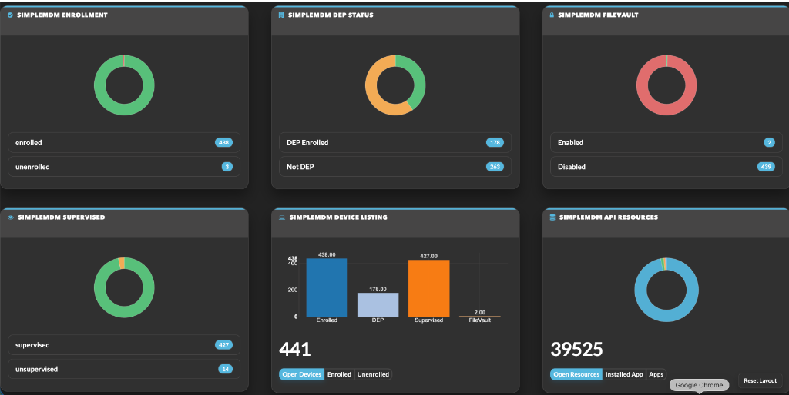
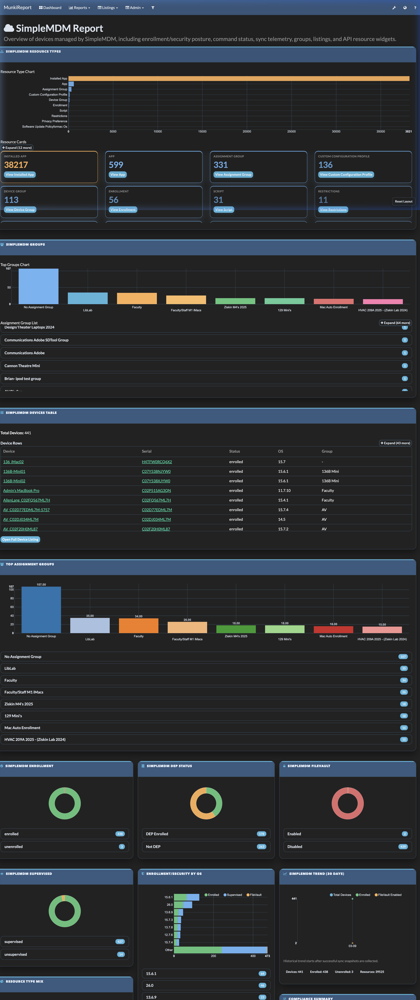
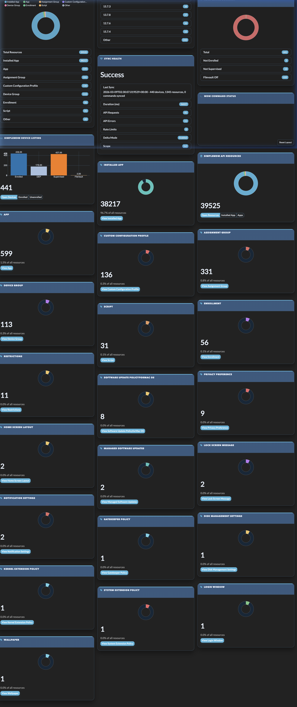
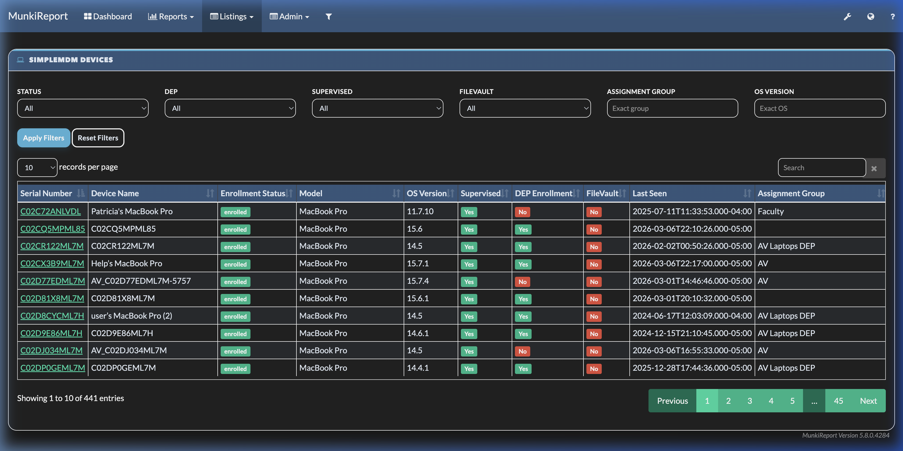
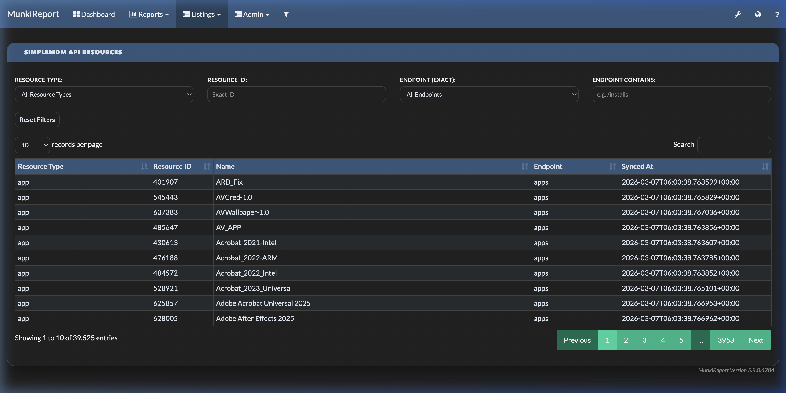

UI modernization scope:
- Module pages now use the same modern theme tokens/components as SimpleMDM widgets:
  - `module/simplemdm/admin`
  - `show/listing/simplemdm/simplemdm`
  - `show/listing/simplemdm/simplemdm_resources`
  - `module/simplemdm/device/{serial}`
  - `#tab_simplemdm-tab`
- Interactive widget grid behavior applies to:
  - Dashboard pages that contain SimpleMDM widgets
  - `show/report/simplemdm/simplemdm`
- Interactive widget grid behavior does not apply to listing/admin/device pages.

## Installation

1. Place module in local modules:

```bash
cp -R simplemdm /path/to/munkireport/local/modules/simplemdm
```

2. Enable module in MunkiReport `.env`:

```env
MODULES="...,simplemdm,..."
```

3. Run migrations:

```bash
php /path/to/munkireport/please migrate
```

## Configuration

1. Open `Admin -> SimpleMDM Settings`.
2. Enter SimpleMDM API key and save.
3. Optional: toggle SimpleMDM widgets on/off in the same admin page (applies on dashboard/report pages where those widgets are present).
4. Optional: in Advanced Sync & Compliance, set:
   - `webhook_secret`
   - `action_api_secret`
   - `compliance_min_os`
   - `enable_scheduled_sync`
   - `sync_interval_minutes`
   - `sync_delta_enabled`
   - `sync_commands_enabled`
   - `sync_device_subresources_enabled`
   - `device_subresource_limit`

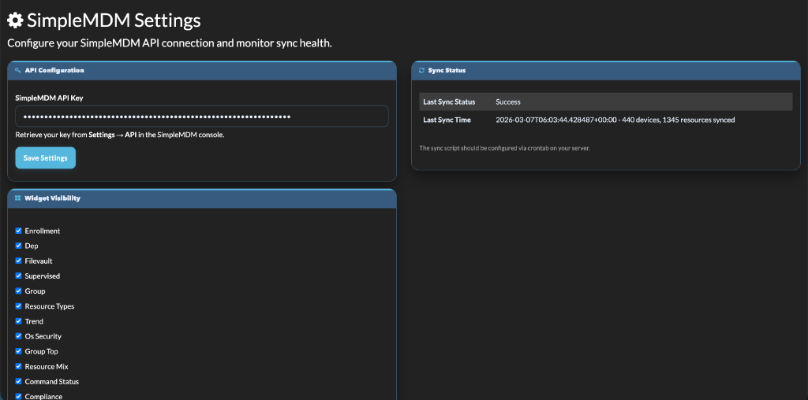
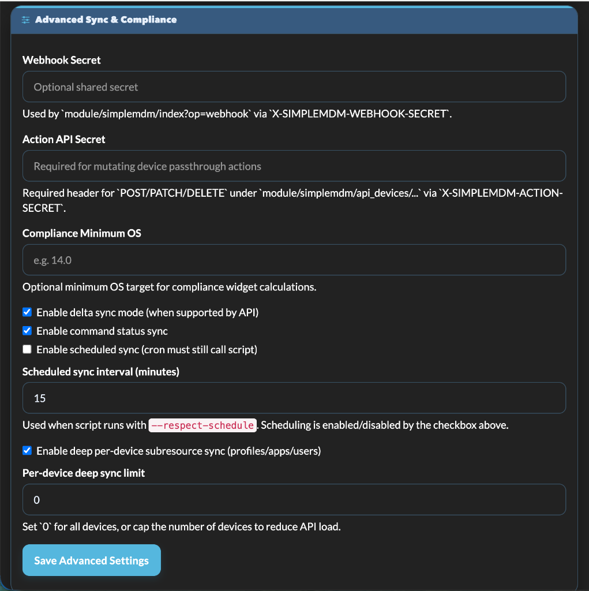

Current admin scope:
- Admin currently manages API/auth, widget visibility, and advanced sync/compliance settings.
- Layout ordering, full-width spans, and expand/collapse behavior are module-driven defaults (not separate admin toggles).
- If the Admin menu item does not appear after module updates, refresh/restart MunkiReport so module `provides.yml` metadata is reloaded.

### Advanced Setting Behavior

- `webhook_secret`
  - Shared secret used by the webhook ingest route.
  - If set, webhook senders should include `X-SIMPLEMDM-WEBHOOK-SECRET: <secret>`.
- `action_api_secret`
  - Shared secret required for mutating device passthrough calls (`POST/PATCH/DELETE/PUT`).
  - Pass via header: `X-SIMPLEMDM-ACTION-SECRET: <secret>`.
- `compliance_min_os`
  - Minimum OS baseline used by compliance calculations.
  - Format should be dotted versions, for example `14.4` or `15.1.2`.
- `enable_scheduled_sync`
  - Master enable/disable for schedule-gated sync runs.
- `sync_interval_minutes`
  - Schedule cadence in minutes (minimum `1`).
- `sync_delta_enabled`
  - Enables cursor/delta attempt in the sync script.
  - If endpoint does not support delta parameters, script falls back to full for that scope.
- `sync_commands_enabled`
  - Enables command status sync during regular sync runs.
  - Can still be overridden manually by running script with `--sync-commands`.
- `sync_device_subresources_enabled`
  - Enables per-device deep subresource sync (`profiles`, `installed_apps`, `users`) during regular sync runs.
- `device_subresource_limit`
  - Caps per-device deep subresource sync scope (`0` means all devices).

Security behavior:
- `api_key` is only returned by `get_config` for global admins.
- Non-global callers receive `api_key_set` only.
- `webhook_secret` is not returned to non-global callers; only `webhook_secret_set` flag is exposed.
- `action_api_secret` is not returned to non-global callers; only `action_api_secret_set` flag is exposed.

## Connect New Features (End-to-End)

### 1) API Sync Connection

1. In SimpleMDM, generate or copy an API key with read access to devices and resources.
2. In MunkiReport `Admin -> SimpleMDM Settings`, save the API key.
3. Run one manual sync:

```bash
python3 /path/to/munkireport/local/modules/simplemdm/scripts/simplemdm_sync.py \
  --api-key 'YOUR_SIMPLEMDM_API_KEY' \
  --munkireport-url 'https://your-munkireport' \
  --verbose
```

4. Verify status in admin page:
   - `last_sync_status` should become `success`.
   - `last_sync_time` should update.
5. Verify data exists:
   - Device listing: `show/listing/simplemdm/simplemdm`
   - Resource listing: `show/listing/simplemdm/simplemdm_resources`

### 2) Webhook Connection

1. Set `webhook_secret` in module advanced settings.
2. In SimpleMDM webhook configuration, set target URL:
   - `https://<your-munkireport>/index.php?/module/simplemdm/index?op=webhook`
3. Configure webhook request header:
   - `X-SIMPLEMDM-WEBHOOK-SECRET: <same secret>`
4. Send a test event from SimpleMDM.
5. Confirm events are being stored (via module data/API checks) and widget data updates after next dashboard refresh.

Fallback auth option:
- Instead of webhook secret, webhook sender may use `X-SIMPLEMDM-API-KEY` matching stored module API key.

#### Webhook Connection (Detailed: how/why/when + examples)

When to use webhook ingestion:
- Use webhooks when you want near-real-time updates between scheduled sync runs.
- Use webhooks for operational responsiveness (recent enrollment/status/command-related events).
- Keep scheduled sync enabled even with webhooks. Webhooks are additive and best-effort, not a complete replacement for full reconciliation.

Why use hybrid mode (recommended):
- Webhook path is event-driven and low-latency.
- Scheduled sync is authoritative and reconciles any missed/partial events.
- Combined model gives both fast updates and data correctness at scale.

How webhook auth works in this module:
- Route: `POST /index.php?/module/simplemdm/index?op=webhook`
- Request is accepted if either condition is true:
  - `X-SIMPLEMDM-WEBHOOK-SECRET` matches `webhook_secret` in module settings, or
  - `X-SIMPLEMDM-API-KEY` matches stored module API key.
- If neither is valid:
  - HTTP `401`
  - body: `{"status":"error","message":"Unauthorized"}`

Payload requirements:
- Body must be valid JSON object.
- If JSON parse fails:
  - HTTP `400`
  - body: `{"status":"error","message":"Invalid JSON data"}`

Event persistence behavior:
- Every accepted webhook is stored in `simplemdm_webhook_event` with:
  - `event_id` (from `id`/`event_id`/`uuid`, or fallback `anonymous:{sha1(payload)}`)
  - `event_type` (from `type`/`event_type`/`event` when present)
  - `status=received`
  - `received_at`, `source_ip`, and raw `payload_json`
- Idempotency behavior:
  - Duplicate webhook events with same event id update existing row via `updateOrCreate`.
  - Events without ID use payload hash fallback identity.

Best-effort upsert behavior:
- Device partial upsert attempts when payload includes `data.attributes` and at least one of:
  - `serial_number`
  - `device_name`
  - `status`
- Command upsert attempts when:
  - event type contains `command` (case-insensitive), or
  - payload includes `command_uuid`
- Webhook endpoint still returns success even if optional parsing/upsert of secondary records fails internally.

What webhook does not guarantee:
- Full resource catalog refresh (`simplemdm_resource`) for all endpoints/types.
- Complete command history backfill by itself.
- Full consistency after long outages or dropped webhook deliveries.
- Use scheduled sync for these guarantees.

Recommended production pattern:
1. Enable and secure webhook (`webhook_secret`).
2. Keep cron runner with `--respect-schedule`.
3. Enable delta sync for regular cadence (`sync_delta_enabled=1`).
4. Optionally enable command/deep subresource sync depending on reporting goals.
5. Periodically run a full reconciliation window (off-hours) for large fleets.

End-to-end examples:

Example A: Test webhook with secret header
```bash
curl -X POST "https://<your-munkireport>/index.php?/module/simplemdm/index?op=webhook" \
  -H "Content-Type: application/json" \
  -H "X-SIMPLEMDM-WEBHOOK-SECRET: <your_webhook_secret>" \
  -d '{
    "id":"evt_test_001",
    "type":"device.updated",
    "data":{
      "id":"121",
      "attributes":{
        "serial_number":"C07YP14PJYW0",
        "device_name":"Design Lab Mini 2018",
        "status":"enrolled",
        "os_version":"15.7.2",
        "is_supervised":true,
        "is_dep_enrollment":true,
        "filevault_enabled":true
      },
      "relationships":{}
    }
  }'
```
Expected result:
- HTTP `200`
- body: `{"status":"success"}`
- Event row appears/updates in `simplemdm_webhook_event`.
- Device row may update if attributes are mappable.

Example B: Test webhook with API key fallback auth
```bash
curl -X POST "https://<your-munkireport>/index.php?/module/simplemdm/index?op=webhook" \
  -H "Content-Type: application/json" \
  -H "X-SIMPLEMDM-API-KEY: <your_simplemdm_api_key>" \
  -d '{
    "event_id":"evt_test_002",
    "event_type":"command.completed",
    "data":{
      "command_uuid":"cmd-12345",
      "device_id":"121",
      "status":"completed",
      "command_type":"restart"
    }
  }'
```
Expected result:
- HTTP `200`
- Command upsert attempted into `simplemdm_command`.

Example C: Invalid auth (expected failure)
```bash
curl -X POST "https://<your-munkireport>/index.php?/module/simplemdm/index?op=webhook" \
  -H "Content-Type: application/json" \
  -d '{"id":"evt_bad_auth","type":"device.updated","data":{}}'
```
Expected result:
- HTTP `401`
- body contains `Unauthorized`.

Example D: Invalid JSON (expected failure)
```bash
curl -X POST "https://<your-munkireport>/index.php?/module/simplemdm/index?op=webhook" \
  -H "Content-Type: application/json" \
  -H "X-SIMPLEMDM-WEBHOOK-SECRET: <your_webhook_secret>" \
  -d 'not-json'
```
Expected result:
- HTTP `400`
- body contains `Invalid JSON data`.

Verification checklist (webhook path):
1. Send test event and confirm HTTP `200`.
2. Confirm row in `simplemdm_webhook_event` for event id (or payload hash id).
3. For device update payloads, confirm `simplemdm` row changes on matching serial/device.
4. For command payloads, confirm `simplemdm_command` records update.
5. Refresh report widgets to confirm visible telemetry changes where applicable.
6. Run scheduled sync afterward to reconcile non-webhook coverage.

### 3) Delta Sync Connection

1. Enable `sync_delta_enabled` in admin advanced settings.
2. Keep regular scheduled sync running.
3. Script reads `last_sync_cursor` from module config, attempts delta, then writes updated cursor.
4. If unsupported by endpoint, script automatically runs full for that scope and records telemetry.

### 4) Command Status Connection

1. Enable `sync_commands_enabled` in admin advanced settings.
2. Run sync or scheduled sync.
3. Optionally cap API load with `--commands-limit`.
4. Add `simplemdm_command_status` widget to dashboard.
5. Command fetch strategy:
   - Primary: `GET /api/v1/commands` (tenant-wide).
   - Fallback: `GET /api/v1/devices/{device_id}/commands` (per-device) when tenant-wide endpoint is unavailable.
6. Validate by opening:
   - `module/simplemdm/get_command_status_stats`

### 5) Compliance + Sync Health Connection

1. Set `compliance_min_os` to your baseline (example: `14.6`).
2. Add these widgets:
   - `simplemdm_compliance`
   - `simplemdm_sync_health`
3. Validate endpoints:
   - `module/simplemdm/get_compliance_stats`
   - `module/simplemdm/get_sync_telemetry`

### 6) Device Action Passthrough Connection

1. In admin advanced settings, set `action_api_secret`.
2. Open a device detail page (`module/simplemdm/device/{serial}`).
3. In `Device Actions`, enter the same secret and run a safe action first (recommended: `refresh`).
4. Confirm success response in action output panel.
5. For API-only usage, send header:
   - `X-SIMPLEMDM-ACTION-SECRET: <action_api_secret>`
   - to `module/simplemdm/api_devices/...` for mutating methods.

## Sync Script

### Run manually

```bash
python3 /path/to/munkireport/local/modules/simplemdm/scripts/simplemdm_sync.py \
  --api-key 'YOUR_SIMPLEMDM_API_KEY' \
  --munkireport-url 'https://your-munkireport'
```

### Useful options

- `--verbose`: debug logging
- `--dry-run`: fetch only, no submit
- `--max-parent-resources N`: limit deep nested sync per parent endpoint (0 = all)
- `--delta`: attempt delta sync with last cursor
- `--last-sync-cursor`: override cursor used for delta sync
- `--sync-commands`: fetch/submit command status records
- `--commands-limit N`: cap command fetch count
- `--sync-device-subresources`: fetch `devices/{id}/profiles`, `devices/{id}/installed_apps`, and `devices/{id}/users`
- `--device-subresource-limit N`: cap deep per-device subresource fetch (0 = all)
- `--respect-schedule`: honor admin schedule controls (`enable_scheduled_sync` + `sync_interval_minutes`)
- `--force-run`: bypass `--respect-schedule` gate and run immediately
- `--sync-interval-minutes N`: override schedule interval for this run (`0` uses admin config value)

### Auto-config behavior

If `--api-key` is omitted, script reads API key from module config (`get_config`) when available.

Sync mode decisions:
- Manual `--delta` enables delta mode even if admin toggle is off.
- If admin toggle `sync_delta_enabled=1`, script uses delta mode for scheduled/default runs.
- Manual `--sync-commands` enables commands even if admin toggle is off.
- If admin toggle `sync_commands_enabled=1`, script includes commands for scheduled/default runs.
- Manual `--sync-device-subresources` enables per-device subresource sync even if admin toggle is off.
- If admin toggle `sync_device_subresources_enabled=1`, script includes per-device subresources for scheduled/default runs.
- If `device_subresource_limit` is set in admin config, script applies it unless CLI overrides it.
- `--respect-schedule` only runs when admin schedule is enabled and due by interval.
- `--force-run` overrides schedule gating.
- Scheduling enable/disable is controlled by `enable_scheduled_sync`; interval controls cadence when enabled.

Telemetry written back on sync status updates:
- API request count
- API error count
- Rate-limit hit count
- Last sync scope (`full` or `delta`)
- Delta cursor used/new cursor
- Whether command sync ran

Example (faster test run):

```bash
python3 .../simplemdm_sync.py --api-key 'KEY' --munkireport-url 'https://mr' --max-parent-resources 25 --verbose
```

Example with delta + commands:

```bash
python3 .../simplemdm_sync.py --api-key 'KEY' --munkireport-url 'https://mr' --delta --sync-commands --commands-limit 250
```

Example with per-device subresources:

```bash
python3 .../simplemdm_sync.py --api-key 'KEY' --munkireport-url 'https://mr' --sync-device-subresources --device-subresource-limit 200
```

### Scheduling

Recommended: run cron every minute with `--respect-schedule`, then control cadence from Admin settings:
- `enable_scheduled_sync`
- `sync_interval_minutes`

Example cron:

```cron
* * * * * /usr/bin/python3 /path/to/.../simplemdm_sync.py --munkireport-url 'https://mr' --respect-schedule --max-parent-resources 25 >> /var/log/simplemdm_sync.log 2>&1
```

Optional production additions:
- Keep the schedule-gated runner above as your default.
- Add explicit off-schedule deep jobs only if you want separate heavy windows (for example command backfill or larger per-device subresource sweeps).

## Widgets

### Core SimpleMDM widgets

- `simplemdm_enrollment`
- `simplemdm_dep`
- `simplemdm_filevault`
- `simplemdm_supervised`
- `simplemdm_group`
- `simplemdm_resource_types`
- `simplemdm_device_listing`
- `simplemdm_devices_table` (dashboard mini-table of devices with links to detail pages)
- `simplemdm_resources_listing`
- `simplemdm_trend` (historical trend line from sync snapshots)
- `simplemdm_os_security` (stacked enrollment/supervision/FileVault by OS)
- `simplemdm_group_top` (top assignment groups bar chart)
- `simplemdm_resource_mix` (resource type donut)
- `simplemdm_command_status` (command state distribution)
- `simplemdm_compliance` (compliant vs noncompliant + reasons)
- `simplemdm_sync_health` (latest sync telemetry + scope/delta/rate-limit stats)

Widget purpose note:
- `simplemdm_group` = full groups widget (top chart + expandable assignment group list + drilldown links)
- `simplemdm_group_top` = compact top-groups summary widget

### Per-resource-type widgets (individually add/remove)

- `simplemdm_rt_installed_app`
- `simplemdm_rt_app`
- `simplemdm_rt_assignment_group`
- `simplemdm_rt_custom_configuration_profile`
- `simplemdm_rt_device_group`
- `simplemdm_rt_enrollment`
- `simplemdm_rt_script`
- `simplemdm_rt_restrictions`
- `simplemdm_rt_privacy_preference`
- `simplemdm_rt_software_update_policyformac_os`
- `simplemdm_rt_home_screen_layout`
- `simplemdm_rt_lock_screen_message`
- `simplemdm_rt_managed_software_updates`
- `simplemdm_rt_notification_settings`
- `simplemdm_rt_disk_management_settings`
- `simplemdm_rt_gatekeeper_policy`
- `simplemdm_rt_kernel_extension_policy`
- `simplemdm_rt_login_window`
- `simplemdm_rt_system_extension_policy`
- `simplemdm_rt_wallpaper`

You can add/remove via Widget Gallery and dashboard layout controls.

### Detailed Widget Breakdown

Widget data conventions:
- Most widget counters/charts are built from module tables (`simplemdm`, `simplemdm_resource`, `simplemdm_command`, `simplemdm_dashboard_snapshot`) populated by sync/webhook ingest.
- Widgets load data via JSON endpoints under `/module/simplemdm/*`.
- Most chart/list widgets provide drill-down links into:
  - device listing: `show/listing/simplemdm/simplemdm`
  - resource listing: `show/listing/simplemdm/simplemdm_resources`
- Empty-state behavior: widgets show `No data`/fallback text when endpoint returns no rows.

Core widget reference:

`simplemdm_enrollment`
- Purpose: enrolled vs unenrolled fleet snapshot.
- Endpoint: `GET /module/simplemdm/get_enrollment_stats`.
- Visual: donut chart + total count + ratio.
- Drill-down: listing filter for enrollment state.

`simplemdm_dep`
- Purpose: DEP-enrolled vs not-DEP distribution.
- Endpoint: `GET /module/simplemdm/get_dep_stats`.
- Visual: donut + total + percentage.
- Drill-down: listing filter by DEP state.

`simplemdm_filevault`
- Purpose: FileVault enabled vs disabled posture.
- Endpoint: `GET /module/simplemdm/get_filevault_stats`.
- Visual: donut + count + share.
- Drill-down: listing filter by FileVault state.

`simplemdm_supervised`
- Purpose: supervised vs unsupervised coverage.
- Endpoint: `GET /module/simplemdm/get_supervised_stats`.
- Visual: donut + count + share.
- Drill-down: listing filter by supervision state.

`simplemdm_group`
- Purpose: full assignment-group insight.
- Endpoint: `GET /module/simplemdm/get_assignment_group_stats`.
- Sections:
  - `Top Groups Chart` (bar chart, top groups by count).
  - `Assignment Group List` (expand/collapse with hidden-row count label).
- Behavior: collapsed list is intentionally scrollable; expanded mode reflows grid.
- Drill-down: each bar/list row links to filtered device listing by group.
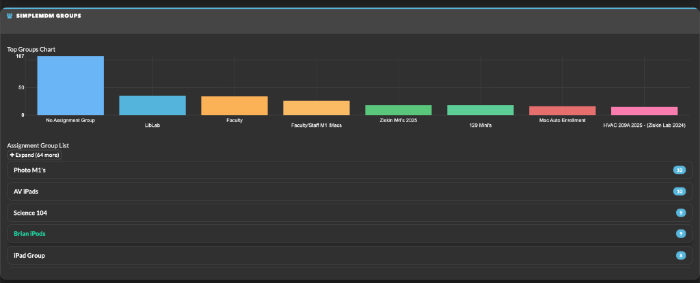

`simplemdm_group_top`
- Purpose: compact top-groups chart variant.
- Endpoint: `GET /module/simplemdm/get_assignment_group_stats`.
- Visual: bar chart only (summary-first footprint).
- Drill-down: click bar to filtered group listing.

`simplemdm_resource_types`
- Purpose: complete resource-type distribution + cards.
- Endpoint: `GET /module/simplemdm/get_resource_type_stats`.
- Sections:
  - `Resource Type Chart` (horizontal bars, top resource types).
  - `Resource Cards` (expand/collapse, row-aligned collapsed height, scroll hint/fade).
- Behavior: color scale is count-aware (log-style interpolation for skewed distributions).
- Drill-down: chart bars and card CTAs route to filtered resource listing.
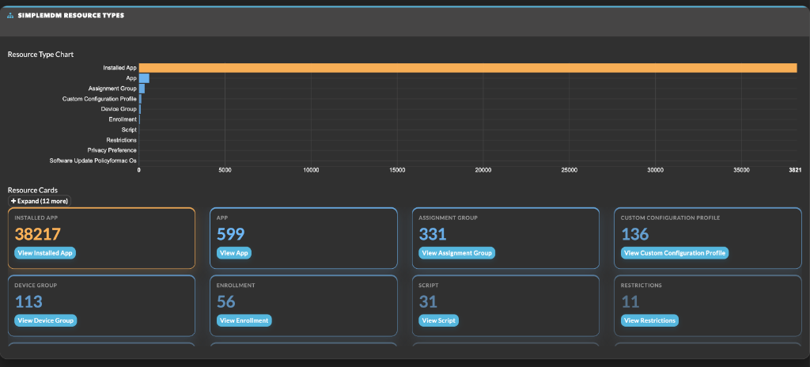

`simplemdm_resource_mix`
- Purpose: compact resource mix overview.
- Endpoint: `GET /module/simplemdm/get_resource_type_stats`.
- Visual: donut by resource type.
- Drill-down: segment click opens filtered resource listing.

`simplemdm_device_listing`
- Purpose: single-card fleet size summary.
- Endpoints:
  - `GET /module/simplemdm/get_enrollment_stats`
  - `GET /module/simplemdm/get_dep_stats`
  - `GET /module/simplemdm/get_supervised_stats`
  - `GET /module/simplemdm/get_filevault_stats`
- Visual: total devices KPI + compact donut legend.
- Drill-down: opens full device listing.

`simplemdm_devices_table`
- Purpose: dashboard/report mini table of device rows.
- Endpoint: `GET /module/simplemdm/get_data`.
- Columns: Device, Serial, Status, OS, Group.
- Behavior:
  - Device row section (`Device Rows`) supports expand/collapse.
  - Collapsed section is scrollable; expanded section grows and triggers grid reflow.
  - Shows up to 50 rows in-widget for quick scan.
- Drill-down: device name/serial links to per-device detail page.

`simplemdm_resources_listing`
- Purpose: top resource-type counters in card form.
- Endpoint: `GET /module/simplemdm/get_resource_type_stats`.
- Visual: condensed cards with count and quick action.
- Drill-down: button opens filtered resource listing by type.

`simplemdm_trend`
- Purpose: time-series trend (default 30 days).
- Endpoint: `GET /module/simplemdm/get_dashboard_trend?days=30`.
- Data source: `simplemdm_dashboard_snapshot`.
- Visual: line chart for key totals across snapshots.
- Note: if no historical snapshots exist yet, endpoint returns current-day fallback row.

`simplemdm_os_security`
- Purpose: enrollment/supervision/FileVault posture split by OS version.
- Endpoint: `GET /module/simplemdm/get_os_security_stats`.
- Visual: stacked bars by OS bucket (top buckets + `Other` rollup).
- Drill-down: quick OS posture analysis; supports filtering strategy decisions.

`simplemdm_command_status`
- Purpose: command execution state distribution telemetry.
- Endpoint: `GET /module/simplemdm/get_command_status_stats`.
- Data source: `simplemdm_command`.
- Dependency: command sync must be enabled/populated (`sync_commands_enabled` or CLI `--sync-commands`).

`simplemdm_compliance`
- Purpose: compliant vs noncompliant fleet summary with reason buckets.
- Endpoint: `GET /module/simplemdm/get_compliance_stats`.
- Compliance logic:
  - enrolled
  - supervised
  - FileVault enabled
  - optional minimum OS from `compliance_min_os`
- Outputs: totals + reason counters (`not_enrolled`, `not_supervised`, `filevault_off`, `os_below_min`).

`simplemdm_sync_health`
- Purpose: latest sync health and telemetry status.
- Endpoint: `GET /module/simplemdm/get_sync_telemetry`.
- Data shown:
  - last sync status/time/cursor
  - duration
  - API request/error/rate-limit counts
  - delta mode flag
  - sync scope
- Use case: operational monitoring for sync stability and API pressure.

Per-resource-type widget family (`simplemdm_rt_*`):
- Shared renderer: `views/simplemdm_resource_type_base_widget.php`.
- Shared endpoints:
  - `GET /module/simplemdm/get_resource_type_count/{type}`
  - `GET /module/simplemdm/get_resource_type_stats` (for share-of-total context)
- Shared behavior:
  - count KPI + percent-of-all-resources indicator
  - one-click drill-down to `show/listing/simplemdm/simplemdm_resources?type={type}`
- Individual widgets map as:
  - `simplemdm_rt_installed_app` -> `installed_app`
  - `simplemdm_rt_app` -> `app`
  - `simplemdm_rt_assignment_group` -> `assignment_group`
  - `simplemdm_rt_custom_configuration_profile` -> `custom_configuration_profile`
  - `simplemdm_rt_device_group` -> `device_group`
  - `simplemdm_rt_enrollment` -> `enrollment`
  - `simplemdm_rt_script` -> `script`
  - `simplemdm_rt_restrictions` -> `restrictions`
  - `simplemdm_rt_privacy_preference` -> `privacy_preference`
  - `simplemdm_rt_software_update_policyformac_os` -> `software_update_policyformac_os`
  - `simplemdm_rt_home_screen_layout` -> `home_screen_layout`
  - `simplemdm_rt_lock_screen_message` -> `lock_screen_message`
  - `simplemdm_rt_managed_software_updates` -> `managed_software_updates`
  - `simplemdm_rt_notification_settings` -> `notification_settings`
  - `simplemdm_rt_disk_management_settings` -> `disk_management_settings`
  - `simplemdm_rt_gatekeeper_policy` -> `gatekeeper_policy`
  - `simplemdm_rt_kernel_extension_policy` -> `kernel_extension_policy`
  - `simplemdm_rt_login_window` -> `login_window`
  - `simplemdm_rt_system_extension_policy` -> `system_extension_policy`
  - `simplemdm_rt_wallpaper` -> `wallpaper`

Non-dashboard SimpleMDM summary widget:

`simplemdm_detail` (client detail widget/tab)
- Purpose: compact SimpleMDM summary inside client context.
- Endpoint: `GET /module/simplemdm/get_simplemdm_data/{serial}`.
- Scope: detail widget/client tab context, not part of dashboard widget gallery.

### Device Detail Page Breakdown

Route and purpose:
- Page: `module/simplemdm/device/{serial}`.
- Goal: single-device operational view combining stored device record, raw attributes/relationships, inferred linked resources, synced per-device subresources, and action runner controls.

Load sequence:
- Base device row + raw payload:
  - `GET /module/simplemdm/get_simplemdm_data/{serial}`
- Connected resource graph:
  - `GET /module/simplemdm/get_device_resources/{serial}`
- Direct per-device subresources:
  - `GET /module/simplemdm/get_device_subresources/{serial}`

Top header and KPI chips:
- Header: device name/title + serial context.
- Badges: enrollment status, assignment group.
- KPI cards: enrollment, DEP, supervision, FileVault quick state.

Main panels:

`Overview`
- High-signal identity and recency fields:
  - device name, model, OS/build
  - enrolled at, last seen at, last seen IP
  - SimpleMDM device ID
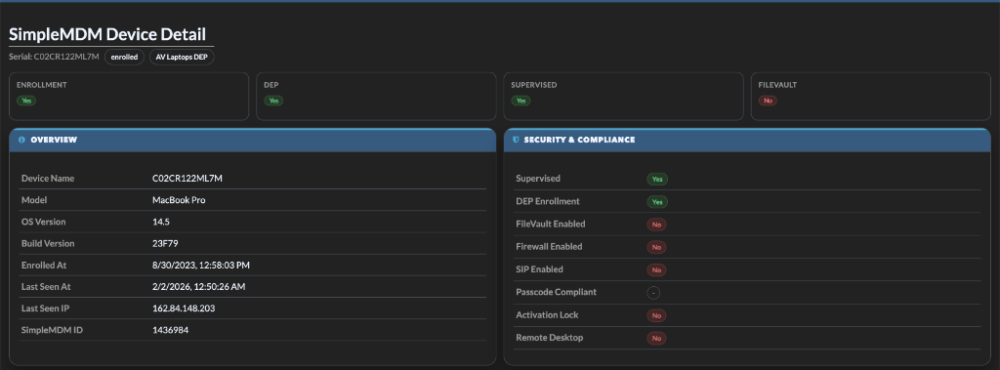

`Security & Compliance`
- Fast-check booleans:
  - supervised
  - DEP enrollment
  - FileVault enabled
  - firewall enabled
  - SIP enabled
  - passcode compliant
  - activation lock
  - remote desktop

`Attributes`
- Dynamic grouped render from `attributes_json` with section toggles:
  - Identity
  - Enrollment
  - OS & Updates
  - Security
  - Hardware & Capacity
  - Network & Cellular
  - Location
  - Other (auto-catchall for unmapped keys)
- Includes nested object rendering (for fields like `firewall` / `os_update`).
- Technical field toggle available for expanded operator diagnostics.
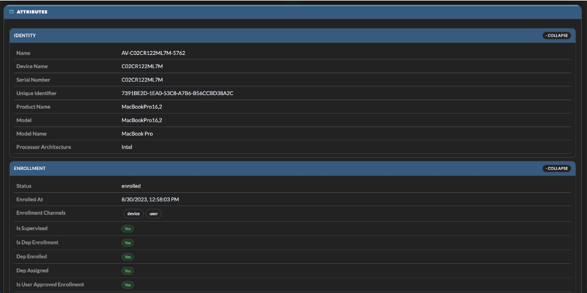
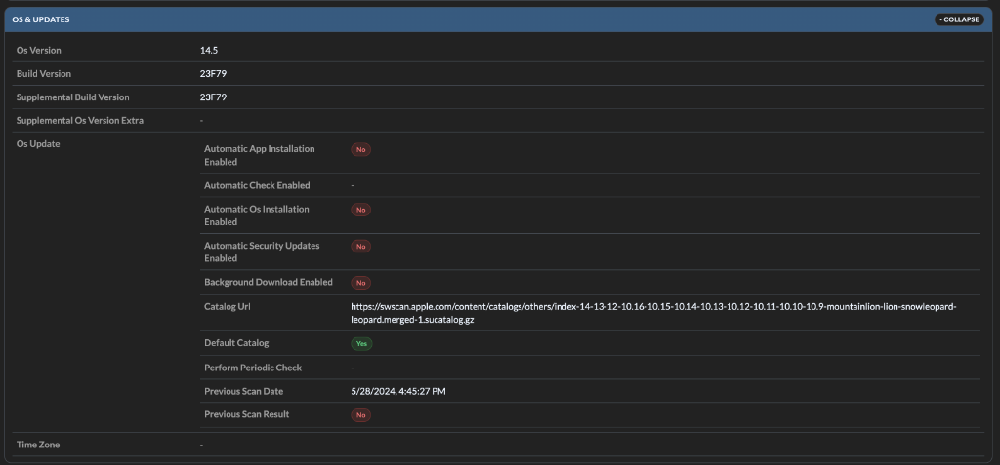
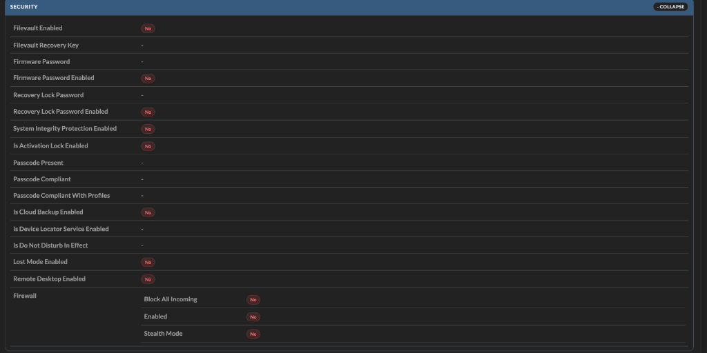
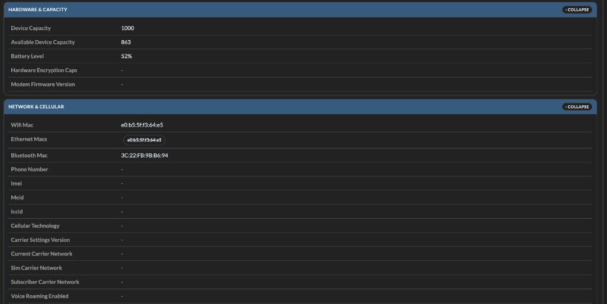

`Relationships`
- Direct render of `relationships_json` payload by key.
- Designed for API-level inspection/troubleshooting, not only human-friendly labels.
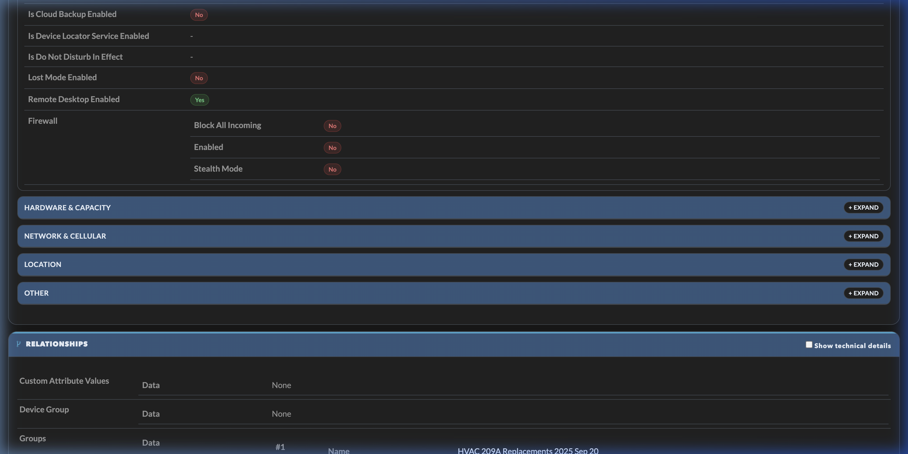

`Connected Resources`
- Normalized relationship graph view from `simplemdm_relationship_edge`.
- Summary chips:
  - total linked resources
  - source badges: `Direct per-device` vs `Derived relationship`
  - per-type totals linking to filtered resource listing
- Per-type expandable tables with columns:
  - Name
  - ID
  - Source
  - Match reason
  - Endpoint

`Synced Device Subresources`
- Populated from direct endpoint sync (`installed_apps`, `users`, `profiles`).
- Summary chips: Installed Apps count, Users count, Profiles count.
- Expandable per-type tables:
  - Installed Apps: Name, Identifier, Version, Managed, Source
  - Users: Username, Full Name, UID, Logged In, Source
  - Profiles: Name, Identifier, Type, Source
- Source label currently shown as `Direct per-device`.

`Device Actions`
- Action runner for supported passthrough actions on selected device.
- UI elements:
  - action selector
  - HTTP method display
  - optional JSON payload input
  - action secret input
  - result/output area
- Guardrails:
  - requires loaded `simplemdmDeviceId`
  - requires non-empty action secret
  - validates JSON payload when provided
  - shows success/error response and HTTP result body
- Supported action set in UI:
  - refresh
  - push_apps
  - restart
  - shutdown
  - lock
  - clear_passcode
  - clear_firmware_password
  - rotate_firmware_password
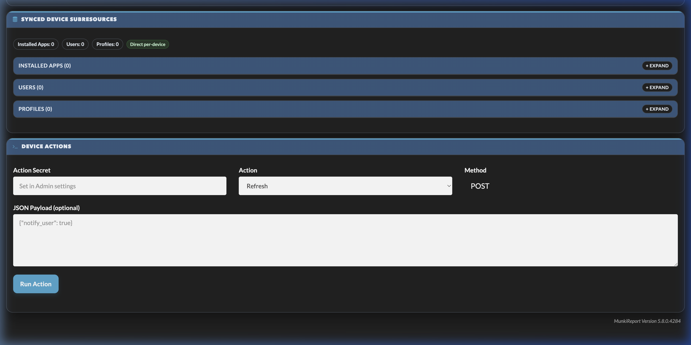
  - clear_recovery_lock_password
  - clear_restrictions_password
  - rotate_recovery_lock_password
  - rotate_filevault_key
  - set_admin_password
  - rotate_admin_password
  - wipe
  - update_os
  - remote_desktop (enable/disable)
  - bluetooth (enable/disable)
  - set_time_zone
  - unenroll
  - delete_device

Security model for device actions:
- All passthrough endpoints require global admin authorization.
- Mutating requests (`POST/PATCH/DELETE/PUT`) additionally require `X-SIMPLEMDM-ACTION-SECRET` matching `action_api_secret` in module settings.
- Secret values are stripped/sanitized before upstream proxy passthrough where applicable.

What this page changes in SimpleMDM:
- Read panels (`Overview`, `Attributes`, `Relationships`, `Connected Resources`, `Synced Device Subresources`) are non-mutating and do not alter SimpleMDM state.
- `Device Actions` are mutating when action endpoints are invoked and can change device/server state in SimpleMDM, depending on chosen command and payload.

### Operator Runbook (Common Tasks)

Use these repeatable flows for daily operations.

1. Find noncompliant devices quickly
- Open `show/report/simplemdm/simplemdm`.
- Check `simplemdm_compliance` for compliant/noncompliant totals and reason buckets.
- Open `simplemdm_os_security` to see which OS buckets carry lower enrolled/supervised/FileVault ratios.
- Open `show/listing/simplemdm/simplemdm` and filter by:
  - `status != enrolled` (or status filter)
  - `supervised = no`
  - `filevault = no`
  - `os` below your baseline target
- Prioritize remediation by largest assignment group from `simplemdm_group` / `simplemdm_group_top`.

2. Investigate a single device end-to-end
- From `simplemdm_devices_table` (dashboard/report) or `show/listing/simplemdm/simplemdm`, click the device name/serial.
- In `module/simplemdm/device/{serial}`:
  - Confirm quick posture in `Overview` + `Security & Compliance`.
  - Expand `Attributes` sections for exact values (OS update object, firewall object, network/cellular metadata, etc.).
  - Review `Connected Resources` to identify linked profiles/apps/groups and relationship source (`Direct per-device` vs `Derived relationship`).
  - Review `Synced Device Subresources` for installed apps/users/profiles inventory.

3. Run a safe action first (recommended)
- In Admin, set/confirm `action_api_secret`.
- On device page (`module/simplemdm/device/{serial}`), go to `Device Actions`.
- Select `Refresh` (safe, non-destructive).
- Enter `Action Secret` and run.
- Confirm:
  - action status shows success
  - response body appears in action output
  - subsequent refresh updates inventory-related fields if device responds

4. Execute higher-risk actions with guardrails
- Before running actions like `wipe`, `lock`, `clear_*`, `rotate_*`, or `set_admin_password`:
  - verify correct device identity (serial + model + assignment group)
  - verify platform prerequisites (for example macOS-only actions)
  - require change approval in your internal process
- Use JSON payload only when required by endpoint (example: lock message/phone/pin, update_os mode).
- Re-check device detail after command submission and after next sync cycle.

5. Verify command telemetry pipeline
- Ensure command sync is enabled:
  - Admin toggle `sync_commands_enabled=1` or script flag `--sync-commands`.
- Run sync.
- Open `simplemdm_command_status` widget and confirm status distribution is populated.
- If empty:
  - verify sync logs for command endpoint availability/fallback behavior
  - verify rows exist in `simplemdm_command`
  - confirm tenant/API supports at least one command history path

6. Verify deep per-device subresource sync
- Enable deep sync:
  - `sync_device_subresources_enabled=1`
  - optional `device_subresource_limit` (`0` = all devices).
- Run sync.
- Open several device detail pages and confirm `Synced Device Subresources` tables populate for:
  - Installed Apps
  - Users
  - Profiles
- If sparse/empty for some devices, confirm device platform support and upstream API returns data.

7. Confirm schedule behavior and “no-run” expectations
- If `enable_scheduled_sync=0`, schedule-gated runs should skip work (`--respect-schedule`).
- If schedule is enabled, `sync_interval_minutes` controls due-window cadence.
- Confirm `simplemdm_sync_health` updates after actual runs (status/time/duration/request counts).

8. Use report layout reset safely
- `Reset Layout` on `show/report/simplemdm/simplemdm` restores report defaults only.
- `Reset Layout` on dashboard pages restores dashboard defaults only.
- Use reset when localStorage layout state becomes stale after widget visibility/order changes.

Theme/Layout-aware styling:
- Widgets automatically switch between `compact` and `comfortable` density modes based on explicit layout mode classes/attributes (if present) or auto-detection from screen/widget width.
- Color tokens switch by mode/theme (surface, border, accent, chart palettes), including explicit variants for:
  - `light + comfortable`
  - `light + compact`
  - `dark + comfortable`
  - `dark + compact`
- You can force mode by setting `data-layout-mode="compact"` or `data-layout-mode="comfortable"` on `<body>`, or using matching body classes such as `layout-compact`.
- You can force theme with `data-theme="dark|light"` (or `data-bs-theme` / `data-color-mode`) and the widgets will live-update chart colors on mode/theme change.
- Bootswatch theme accents (Cerulean, Darkly, Cyborg, Slate, etc.) are detected from active stylesheet and applied to widget accents/charts.
- Runtime attributes set by the module:
  - `data-simplemdm-layout="compact|comfortable"`
  - `data-simplemdm-theme="light|dark"`
  - `data-simplemdm-theme-name="{bootswatch-name|auto}"`
- Widgets re-render on `simplemdm:modechange` to keep chart colors synchronized after theme/layout changes.

Interactive layout behavior (module-wide):
- On supported pages, SimpleMDM widgets are automatically grouped into a module-managed grid container (`#simplemdm-dashboard-grid`).
- Supported pages:
  - Dashboard pages containing SimpleMDM widgets
  - `show/report/simplemdm/simplemdm`
- Grid uses balanced masonry placement (shortest-column algorithm) to reduce empty vertical gaps.
- Widget width honors intended span:
  - Full-width for designated featured widgets.
  - Multi-column for regular widgets.
- Click a widget to select it; selection reveals move/order controls and resize affordances.
- Each widget can be minimized to title-only and expanded again from the header control.
- Selected widgets can be moved by dragging the move handle in the widget header.
- Drop behavior:
  - Drop near center of another widget: swap
  - Drop near edges/empty space: insert/reorder
  - Drop near top edge: force insert at top
- Drag auto-scroll is enabled when dragging near top/bottom viewport edges.
- Dragging to empty dashboard/report space inserts the widget at that visual position (not swap-only).
- Empty-space drops persist both column and vertical position so intentional blank gaps can be kept between widgets.
- Selected widgets can be resized smaller or larger using edge handles:
  - Right edge: width
  - Bottom edge: height
  - Bottom-right corner: width + height
- Featured widgets (such as `simplemdm_group` and `simplemdm_resource_types`) are also resizable.
- Non-featured widgets default to a uniform baseline footprint (single-column span + baseline min-height) while still expanding for larger content.
- Fallback ordering controls are included in each widget header (`top`, `up`, `down`) for precise keyboard/mouse operation.
- Custom dashboard widget order/size is persisted in browser `localStorage` per dashboard URL.
- You can reset custom layout state from browser console with `window.simplemdmResetDashboardLayout()`.
- A floating `Reset Layout` button is available on supported pages.
- `Reset Layout` restores defaults for the current page context only:
  - On `show/report/simplemdm/simplemdm`, it restores the report-specific default layout.
  - On dashboard pages, it restores dashboard defaults.
- Long list-heavy widgets automatically get internal list scrolling for readability and to avoid oversized columns.
- Current featured full-width widgets (within the SimpleMDM widget set) are ordered as:
  - `simplemdm_resource_types`
  - `simplemdm_group`
  - `simplemdm_devices_table`
  - `simplemdm_group_top`
- Report page default ordering keeps the full-width widgets above unchanged and applies a cleaner default sequence for small column widgets below them.

Scope notes:
- This behavior is module-only and applies to all users loading SimpleMDM widgets.
- Non-SimpleMDM widgets are not modified by this layout engine.

Resource/Group expand-collapse behavior:
- `simplemdm_resource_types` has two sections:
  - `Resource Type Chart`
  - `Resource Cards` (`+ Expand` / `- Collapse`)
- `simplemdm_group` has two sections:
  - `Top Groups Chart`
  - `Assignment Group List` (`+ Expand` / `- Collapse`)
- `simplemdm_devices_table` has a `Device Rows` section (`+ Expand` / `- Collapse`)
- In collapsed mode, list/card areas are intentionally scrollable.
- Collapsed section scrolling is handled by the section body (single scroll container) to avoid nested-scroll conflicts.
- Collapsed toggles show hidden-count labels when applicable:
  - `+ Expand (N more)` for Resource Cards
  - `+ Expand (N more)` for Assignment Group List
- Resource Cards collapsed state uses row-aligned height to avoid half-cut cards, plus fade/hint when more content is available.
- In expanded mode, each area grows to full height and triggers dashboard reflow so lower widgets are pushed down.
- Empty assignment group values are labeled as `No Assignment Group` in group stats.

### Dashboard Template (In Module)

For sharing/documentation, a full dashboard layout template is included in-module:

- `local/modules/simplemdm/examples/dashboard.simplemdm.full.yml`

Auto-install behavior:

- On module migration, the template is copied to:
  - `local/dashboards/simplemdm_full.yml`
- It is only copied if missing (existing dashboard files are never overwritten).
- `local/dashboards/default.yml` is not modified by this module.
- This keeps the module portable across MunkiReport instances without forcing dashboard changes.

Manual copy (optional):

```bash
cp local/modules/simplemdm/examples/dashboard.simplemdm.full.yml local/dashboards/simplemdm_full.yml
```

Then open:

- `show/dashboard/simplemdm_full`

If you want SimpleMDM as your main dashboard, update your own dashboard YAML manually (for example `local/dashboards/default.yml`) or select `SimpleMDM Full` in the dashboard switcher.

## Theme/Mode Integration Details

Widgets are theme-aware and layout-aware by design:

- Reads active theme/mode from body/html markers (`data-theme`, `data-bs-theme`, `data-color-mode`, and common dark classes).
- Reads layout density from `data-layout-mode` or layout classes (`layout-compact`, `layout-comfortable`), then falls back to width-based auto detection.
- Applies runtime attributes:
  - `data-simplemdm-theme`
  - `data-simplemdm-theme-name`
  - `data-simplemdm-layout`
- Emits `simplemdm:modechange` when theme/layout changes are detected so charts can rerender with correct axis/text/palette colors.
- Triggers repeated post-render grid reflow on supported pages so async-loaded widget content settles into balanced columns.

Expected behavior:
- Switching Bootswatch theme (for example Cerulean to Darkly) updates widget accent + chart colors.
- Switching layout mode updates spacing/typography/card density.
- Dark themes keep axis labels and legends readable.
- Featured widgets (`resource_types`, `groups`, `devices_table`, `group_top`) render as full-width rows for visibility.

## API/Endpoint Use

### Ingest endpoints (used by sync/webhooks)

- `POST /index.php?/module/simplemdm/index?op=ingest`
  - Device payload batch ingest.
- `POST /index.php?/module/simplemdm/index?op=ingest_resources`
  - API resource payload batch ingest.
- `POST /index.php?/module/simplemdm/index?op=ingest_commands`
  - Command payload batch ingest.
- `POST /index.php?/module/simplemdm/index?op=webhook`
  - Webhook event ingest with secret/API-key auth.
- `POST /index.php?/module/simplemdm/index?op=update_sync_status`
  - Sync status + telemetry updates from sync script.

### Read endpoints (widgets/report/listings)

- `GET /index.php?/module/simplemdm/get_dashboard_trend`
- `GET /index.php?/module/simplemdm/get_os_security_stats`
- `GET /index.php?/module/simplemdm/get_command_status_stats`
- `GET /index.php?/module/simplemdm/get_compliance_stats`
- `GET /index.php?/module/simplemdm/get_sync_telemetry`
- `GET /index.php?/module/simplemdm/get_resource_type_stats`
- `GET /index.php?/module/simplemdm/get_resource_type_count/{type}`
- `GET /index.php?/module/simplemdm/get_device_subresources/{serial_number}`

### Device API passthrough endpoints

The module also exposes authenticated passthrough routes to the SimpleMDM device API so admins can query and invoke device actions from MunkiReport without exposing the SimpleMDM API key to browsers/clients.

Auth requirement:
- Global MunkiReport admin session (`authorized('global')`).
- Mutating methods (`POST/PATCH/DELETE/PUT`) additionally require `X-SIMPLEMDM-ACTION-SECRET` matching `action_api_secret` in module admin settings.

Coverage:
- Device CRUD/list:
  - `GET /index.php?/module/simplemdm/api_devices`
  - `GET /index.php?/module/simplemdm/api_devices/{device_id}`
  - `POST /index.php?/module/simplemdm/api_devices`
  - `PATCH /index.php?/module/simplemdm/api_devices/{device_id}`
  - `DELETE /index.php?/module/simplemdm/api_devices/{device_id}`
- Device related lists:
  - `GET /index.php?/module/simplemdm/api_devices/{device_id}/profiles`
  - `GET /index.php?/module/simplemdm/api_devices/{device_id}/installed_apps`
  - `GET /index.php?/module/simplemdm/api_devices/{device_id}/users`
- Device user action:
  - `DELETE /index.php?/module/simplemdm/api_devices/{device_id}/users/{user_id}`
- Device actions:
  - `POST /index.php?/module/simplemdm/api_devices/{device_id}/push_apps`
  - `POST /index.php?/module/simplemdm/api_devices/{device_id}/refresh`
  - `POST /index.php?/module/simplemdm/api_devices/{device_id}/restart`
  - `POST /index.php?/module/simplemdm/api_devices/{device_id}/shutdown`
  - `POST /index.php?/module/simplemdm/api_devices/{device_id}/lock`
  - `POST /index.php?/module/simplemdm/api_devices/{device_id}/clear_passcode`
  - `POST /index.php?/module/simplemdm/api_devices/{device_id}/clear_firmware_password`
  - `POST /index.php?/module/simplemdm/api_devices/{device_id}/rotate_firmware_password`
  - `POST /index.php?/module/simplemdm/api_devices/{device_id}/clear_recovery_lock_password`
  - `POST /index.php?/module/simplemdm/api_devices/{device_id}/clear_restrictions_password`
  - `POST /index.php?/module/simplemdm/api_devices/{device_id}/rotate_recovery_lock_password`
  - `POST /index.php?/module/simplemdm/api_devices/{device_id}/rotate_filevault_key`
  - `POST /index.php?/module/simplemdm/api_devices/{device_id}/set_admin_password`
  - `POST /index.php?/module/simplemdm/api_devices/{device_id}/rotate_admin_password`
  - `POST /index.php?/module/simplemdm/api_devices/{device_id}/wipe`
  - `POST /index.php?/module/simplemdm/api_devices/{device_id}/update_os`
  - `POST /index.php?/module/simplemdm/api_devices/{device_id}/remote_desktop` (enable)
  - `DELETE /index.php?/module/simplemdm/api_devices/{device_id}/remote_desktop` (disable)
  - `POST /index.php?/module/simplemdm/api_devices/{device_id}/bluetooth` (enable)
  - `DELETE /index.php?/module/simplemdm/api_devices/{device_id}/bluetooth` (disable)
  - `POST /index.php?/module/simplemdm/api_devices/{device_id}/set_time_zone`
  - `POST /index.php?/module/simplemdm/api_devices/{device_id}/unenroll`

Query/body passthrough:
- Query parameters and request body are passed through to SimpleMDM.
- JSON and `application/x-www-form-urlencoded` payloads are supported.
- Security parameter `action_secret` is accepted for validation but stripped before upstream passthrough.

Notes:
- The module continues storing a curated flat subset in `simplemdm` plus full raw device payload in `attributes_json` and `relationships_json`.
- Per-device subresource sync (`devices/{id}/profiles`, `installed_apps`, `users`) can be enabled in sync script to persist these records in `simplemdm_resource`.
- Device detail page includes:
  - Synced per-device subresource tables (installed apps, users, profiles)
  - Action runner UI for supported device action routes (uses action secret header)

## Validation Checklist

After rollout, verify in this order:

1. Migrations applied with no errors.
2. Admin config saved and API key present.
3. Manual sync returns success.
4. Device and resource listings populate.
5. New widgets render data:
   - Trend, OS Security, Group Top, Resource Mix
   - Command Status, Compliance, Sync Health
6. Theme switch (light/dark and different Bootswatch theme) updates widget/chart styling.
7. Webhook test event is accepted and stored.
8. Scheduled cron runs update `last_sync_time` and telemetry counters.

## Data Model Notes

- `simplemdm_resource` uniqueness: `(resource_type, resource_id, source_endpoint)`
  - Prevents deep resource overwrite across different nested endpoints.
- `simplemdm_dashboard_snapshot` stores historical dashboard metrics captured on successful sync status updates (`last_sync_status=success`).
- `simplemdm_device_history` captures one row per device per day (status, OS, group, supervision, DEP, FileVault).
- `simplemdm_relationship_edge` stores normalized graph edges from device/resource relationship payloads.
- `simplemdm_command` stores command status records from sync script and webhook ingestion.
- `simplemdm_webhook_event` stores raw webhook envelope/payload for audit and replay diagnostics.
- Additional indexes exist for listing filters:
  - `resource_id`
  - `(resource_type, resource_id)`

## Troubleshooting

### Listing links open 404 / “Invalid method name: listing”

Use rewrite-safe URLs with `index.php?` in non-rewrite environments.
The module widgets already handle this fallback.

### Admin save hangs or does not complete

Check browser console/network and confirm module route resolves:
`/index.php?/module/simplemdm/save_config`

### Sync says success but no data in UI

- Confirm API key saved.
- Run manual sync with `--verbose`.
- Check `Admin -> SimpleMDM Settings` for `last_sync_status` and `last_sync_time`.
- Confirm `simplemdm` and `simplemdm_resource` rows exist.

### Widget is enabled but not visible

- `Widget Visibility` controls whether a widget may render.
- Dashboard/report pages only show widgets that exist in that page layout.
- Confirm the widget is present in your active dashboard YAML (`local/dashboards/*.yml`) or on the SimpleMDM report page.
- If needed, click `Reset Layout` to clear stale per-page localStorage layout state (report reset does not overwrite dashboard defaults, and dashboard reset does not overwrite report defaults).

### Command status widget is empty

- Enable `sync_commands_enabled` in admin advanced settings, or run script with `--sync-commands`.
- Script now attempts tenant-wide `commands` first, then falls back to per-device `devices/{id}/commands`.
- If both are unavailable in your tenant/API, command status data cannot be collected and widget remains empty.

### Trend widget shows only one day / no history

- Ensure migration for `simplemdm_dashboard_snapshot` has run.
- Ensure sync updates `last_sync_status` to `success` (snapshots are recorded on success status updates).
- Run at least 2 successful sync cycles across different times/days.

### Webhook route returns Unauthorized

- Configure `webhook_secret` in module admin advanced settings.
- Send header `X-SIMPLEMDM-WEBHOOK-SECRET: <secret>`.
- Or use `X-SIMPLEMDM-API-KEY` with stored module API key.

### Device action returns “Invalid or missing action secret”

- Set `action_api_secret` in `Admin -> SimpleMDM Settings -> Advanced Sync & Compliance`.
- For device detail action runner, ensure the same secret is entered in the `Action Secret` field.
- For API calls, send header `X-SIMPLEMDM-ACTION-SECRET`.
- Mutating methods (`POST/PATCH/DELETE/PUT`) require this secret even for global admins.

### Delta sync appears to do full sync

- Some endpoints may not support delta filter parameters.
- Script automatically falls back to full sync for unsupported endpoints and reports scope/telemetry.

### Theme switches but widget colors do not change

- Refresh the dashboard after switching theme/mode.
- If styles still appear stale, clear browser cache and reload.
- Verify dashboard theme actually changed in MunkiReport.
- Inspect `<body>` attributes/classes and confirm `data-simplemdm-theme` / `data-simplemdm-theme-name` update.
- Confirm no custom CSS overrides `--simplemdm-*` variables or NVD3 SVG text styles.

### Sync is too slow

Use `--max-parent-resources` for frequent runs and run full deep sync less often.

### Sync health widget has stale values

- Ensure sync script posts `op=update_sync_status` successfully.
- Confirm latest sync did not run with `--dry-run`.
- Check that scheduled job is using current script path.

### Compliance widget does not match expected baseline

- Confirm `compliance_min_os` is set in module settings.
- Check OS version formatting in source device payloads.
- Re-run a full sync after baseline changes.

### Webhook accepted but no visible UI change

- Webhook may affect command/device state not currently visible in active filters.
- Run an API sync cycle to reconcile full state after webhook events.
- Check command/compliance widgets and device detail page for updates.

## Files Added/Updated by This Module

- Controllers/models/views under `local/modules/simplemdm/`
- Migrations under `local/modules/simplemdm/migrations/`
- No required permanent changes in MunkiReport core files.

## License

MIT
