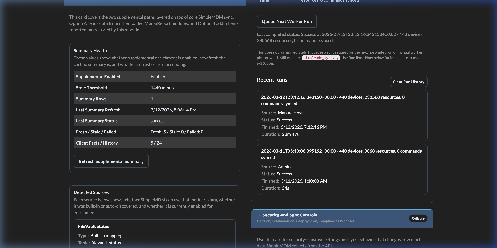

# API Reference

This reference documents module routes, expected auth, and common usage patterns.

For step-by-step client deployment examples, see:
- `docs/CLIENT_REPORTER_DEPLOYMENT.md`
- README section "Connect ReportSimpleMDM" for wiring the ReportSimpleMDM macOS/iOS app to
  this module's token-readable dashboard routes

Base path examples use MunkiReport's default front-controller format:
- `/index.php?/module/simplemdm/...`

If your MunkiReport deployment uses URL rewriting, the same routes may also resolve without `index.php?`, for example:
- `/module/simplemdm/...`

Use whichever form matches your configured MunkiReport `index_page`.

## 1) Auth Summary

Workflow note:
- `simplemdm_sync.py` is the sync worker.
- `Sync Status -> Queue Next Worker Run` is a queue-based trigger path.
- `In-Module Sync And Schedule -> Run Sync Now` is an immediate execution path when module-side execution is available.
- `simplemdm_sync_run` is the source of truth for queued, running, and completed run history.
- `clear_sync_runs` clears run history only when no sync is queued or running.
- recurring schedule still requires cron to launch `simplemdm_sync.py`
- host/manual runners should use an explicit `--api-key` or `SIMPLEMDM_API_KEY`
- `install_cron.sh` and `remove_cron.sh` are helpers for managing that cron entry
- when module-side execution is enabled, the admin UI can call those helpers for global admins
- `Runner MunkiReport URL` prefers configured app URL (`WEBHOST` / `SUBDIRECTORY`) and falls back to the current browser URL for local/placeholder setups
- Command sync uses the tenant-wide `/commands` collection only. If `/commands` is unavailable for the tenant/API version, the worker skips command sync instead of probing per-device command routes.

| Route Group | Auth |
|---|---|
| Report/listing/stats/data routes | Authenticated MunkiReport session |
| Token-readable dashboard routes (see below) | Session OR sync token header |
| Config read (`get_config`) | Global admin session OR sync token header (non-global/sync-auth responses get masked secret flags) |
| Config write (`save_config`) | Global admin session OR sync token header |
| Admin sync queue (`request_sync`) | Global admin session |
| Client reporter ingest (`op=ingest_client_facts`) | Client reporter secret header |
| Ingest routes (`op=ingest*`, `op=update_sync_status`, `op=begin_sync_run`) | Sync token header |
| Webhook (`op=webhook`) | Webhook secret header OR sync token header |
| Device passthrough (`api_devices`) | Global admin session; mutating methods also require action secret |

Token-readable dashboard routes (added 2026-07-07 for headless API clients such as
ReportSimpleMDM): these ten read-only routes accept the sync token header
(`X-SIMPLEMDM-API-KEY`) as an alternative to a session. The token grants exactly these
routes — all write/admin routes still require a session even with a valid token.

- `get_sync_telemetry`
- `get_compliance_stats`
- `get_command_status_stats`
- `get_assignment_group_stats`
- `get_resource_type_stats`
- `get_os_security_stats`
- `get_supplemental_status`
- `get_supplemental_overview_stats`
- `get_supplemental_applecare_stats`
- `get_device_resources/{serial}`

Headers used by module:
- Sync token: `X-SIMPLEMDM-API-KEY`
- Webhook secret: `X-SIMPLEMDM-WEBHOOK-SECRET` (also accepts `X-WEBHOOK-SECRET`)
- Action secret (preferred): `X-SIMPLEMDM-ACTION-SECRET`
- Client reporter secret: `X-SIMPLEMDM-CLIENT-SECRET`
- Optional client reporter hardening:
  - `X-SIMPLEMDM-CLIENT-TIMESTAMP`
  - `X-SIMPLEMDM-CLIENT-NONCE`
  - `X-SIMPLEMDM-CLIENT-SIGNATURE`
  - `X-SIMPLEMDM-CLIENT-TOKEN`

## 2) Ingest and Sync Status Endpoints

All are called via:
- `POST /index.php?/module/simplemdm/index?op=<operation>`

| Operation | Method | Purpose | Auth |
|---|---|---|---|
| `begin_sync_run` | POST | Claim a queued/scheduled sync run and mark it running | Sync token |
| `ingest` | POST | Upsert device rows into `simplemdm` via processor | Sync token |
| `ingest_resources` | POST | Upsert non-device resources into `simplemdm_resource` | Sync token |
| `ingest_commands` | POST | Upsert command status rows into `simplemdm_command` | Sync token |
| `ingest_client_facts` | POST | Upsert allowlisted client-reported facts into `simplemdm_client_fact` | Client reporter secret |
| `update_sync_status` | POST | Update sync status and telemetry fields in `simplemdm_config` | Sync token |
| `webhook` | POST | Store webhook event; best-effort device/command updates | Webhook secret OR sync token |
| `ingest_mcp_findings` | POST | Replace/insert MCP-computed findings into `simplemdm_mcp_finding` (source-scoped replace, 2 MB / 2000-finding caps) | Sync token |

## 3) Config Endpoints

| Route | Method | Purpose | Auth |
|---|---|---|---|
| `/module/simplemdm/get_config` | GET | Read module settings | Global admin session OR sync token header |
| `/module/simplemdm/index?op=get_config` | GET | Worker-friendly config bootstrap route | Global admin session OR sync token header |
| `/module/simplemdm/get_script_catalog` | GET | Read downloadable script metadata and external command templates | Global admin |
| `/module/simplemdm/get_runner_status` | GET | Read module runtime, cron, and runner readiness state | Global admin |
| `/module/simplemdm/get_supplemental_status` | GET | Read supplemental detection, freshness, and summary health | Global admin session OR sync token header |
| `/module/simplemdm/save_config` | POST | Save module settings | Global admin OR sync token |
| `/module/simplemdm/request_sync` | POST | Queue a sync run from the admin UI | Global admin |
| `/module/simplemdm/refresh_supplemental_summary` | POST | Rebuild supplemental summary rows | Global admin |
| `/module/simplemdm/run_script` | POST | Execute an approved module-side script action | Global admin and script runner enabled |
| `/module/simplemdm/download_script/{name}` | GET | Download an individual module script | Global admin |
| `/module/simplemdm/download_module` | GET | Download the module as a zip archive | Global admin |

`save_config` supports keys including:
- `api_key`, `webhook_secret`, `action_api_secret`
- `compliance_min_os`
- `enable_scheduled_sync`
- `sync_interval_minutes`
- `sync_delta_enabled`
- `sync_commands_enabled`
- `sync_device_subresources_enabled`
- `device_subresource_limit`
- `allow_module_script_execution`
- `script_runner_munkireport_url`
- `script_runner_python_bin`
- `script_runner_schedule`
- `script_runner_log_path`
- `script_runner_max_parent_resources`
- `supplemental_enabled`
- `supplemental_disabled_sources_json`
- `supplemental_default_stale_after_minutes`
- `supplemental_registry_json`
- `client_reporter_enabled`
- `client_reporter_secret`
- `client_reporter_history_enabled`
- `client_reporter_max_payload_bytes`
- `client_reporter_allowed_fact_keys_json`
- `event_stale_threshold_hours`
- `event_builtin_settings_json`
- `custom_event_rules_json`
- sync queue keys (`sync_request_state`, `sync_requested_at`, `sync_started_at`, `sync_request_source`)
- telemetry/status keys (`last_sync_status`, `last_sync_time`, `last_sync_cursor`, etc.)
- widget visibility config keys discovered from `provides.yml`

`get_config` returns full secret values only to global admins. Sync-token-auth callers receive masked secret behavior (`api_key_set`, `webhook_secret_set`, `action_api_secret_set`) plus the non-secret runner/schedule settings needed by the worker.

`get_supplemental_status` returns the current supplemental operating picture, including:
- `enabled`
- `client_reporter_enabled`
- `disabled_source_ids`
- `detected_sources`
- `summary_row_count`
- `freshness_counts`
- `source_health`

`request_sync` only queues the request. A host-side or manual `simplemdm_sync.py` run still claims and executes the sync.

`begin_sync_run` is a worker-only claim endpoint used by the sync script. It is not meant to be called from the browser UI.

`run_script` is used by the schedule panel for immediate module-side execution and module-managed cron helper actions.

Event settings notes:
- `event_builtin_settings_json` is a JSON object keyed by built-in event suffix with `1`/`0` enabled values.
- `custom_event_rules_json` is a JSON array of constrained rule objects.
- supported custom rule fields are exposed through `get_config` as `custom_event_field_catalog_json`
- built-in event metadata is exposed through `get_config` as `event_builtin_catalog_json`
- custom rules are evaluated only against supported synced device fields that are present in the incoming update path
- those device fields come from the local `simplemdm` row, populated by full API sync and best-effort webhook device upserts
- `Changed To` rules require an exact stored target value such as `unenrolled`
- `Became Disabled` rules are for boolean-style protections such as FileVault, Firewall, SIP, Activation Lock, ADE/DEP, and Supervision
- `Older Than Hours` rules are for `Last Seen`

Built-in event catalog:
- `simplemdm_action`
  - accepted mutating admin device action
  - custom-event equivalent: not applicable
- `simplemdm_action_failure`
  - failed or rejected mutating admin device action
  - custom-event equivalent: not applicable
- `simplemdm_command`
  - failed command state
  - custom-event equivalent: not applicable
- `simplemdm_recovery_lock`
  - failed recovery-lock command state
  - custom-event equivalent: not applicable
- `simplemdm_enrollment`
  - enrolled -> not enrolled transition
  - if modeled as custom: `Enrollment Status` + `Changed To` + `unenrolled`
- `simplemdm_dep`
  - ADE / DEP enabled -> disabled transition
  - if modeled as custom: `ADE / DEP` + `Became Disabled`
- `simplemdm_filevault`
  - FileVault enabled -> disabled transition
  - if modeled as custom: `FileVault` + `Became Disabled`
- `simplemdm_supervision`
  - supervision enabled -> disabled transition
  - if modeled as custom: `Supervision` + `Became Disabled`
- `simplemdm_firewall`
  - firewall enabled -> disabled transition
  - if modeled as custom: `Firewall` + `Became Disabled`
- `simplemdm_sip`
  - SIP enabled -> disabled transition
  - if modeled as custom: `SIP` + `Became Disabled`
- `simplemdm_passcode`
  - passcode compliant -> non-compliant transition
  - if modeled as custom: `Passcode Compliance` + `Became Disabled`
- `simplemdm_activation_lock`
  - Activation Lock enabled -> disabled transition
  - if modeled as custom: `Activation Lock` + `Became Disabled`
- `simplemdm_stale`
  - `last_seen_at` crosses the configured stale threshold
  - if modeled as custom: `Last Seen` + `Older Than Hours` + `<same threshold>`

Custom event rule object shape:

```json
{
  "enabled": "1",
  "suffix": "custom_unenrolled",
  "label": "Custom Unenrolled",
  "source_field": "status",
  "trigger_type": "changed_to",
  "severity": "warning",
  "message": "SimpleMDM: device became unenrolled",
  "target_value": "unenrolled",
  "threshold_hours": ""
}
```

Field semantics:
- `suffix`
  - required
  - emitted as event module key `simplemdm_<suffix>`
  - admin-defined in the UI; not sourced from the SimpleMDM API or widget configuration
- `label`
  - optional admin-facing label for the settings UI
- `source_field`
  - one of the supported fields exposed in `custom_event_field_catalog_json`
- `trigger_type`
  - must be one of the triggers allowed for the selected `source_field`
- `target_value`
  - used only with `changed_to`
- `threshold_hours`
  - used only with `older_than_hours`
- `severity`
  - MunkiReport event type (`info`, `warning`, `danger`, `success`)
- `message`
  - stored in the host `event.message`

Duplicate rule behavior:
- custom suffixes that conflict with built-in event suffixes are rejected
- duplicate custom suffixes are rejected
- semantic duplicates are allowed
- for example, a custom rule may intentionally watch the same field/trigger combination as a built-in event or another custom rule if it uses a different suffix

Recommended custom-rule layouts that do not simply duplicate built-ins:
- `Enrollment Status` + `Changed To` + `awaiting_enrollment`
  - useful for staging/pre-enrollment visibility
- `Enrollment Status` + `Changed To` + `retired`
  - useful for lifecycle/retirement workflow visibility
- `Last Seen` + `Older Than Hours` + `48`
  - useful for a stricter stale threshold than the built-in module default
- `Last Seen` + `Older Than Hours` + `12`
  - useful for high-priority systems that need a more aggressive stale alert
- `ADE / DEP` + `Became Disabled`
  - useful when you want a separate event module key, severity, or message for operations escalation rather than reusing the built-in event text, even though the underlying condition overlaps the built-in ADE/DEP event

UI behavior note:
- new custom rows auto-suggest a suffix from the selected `source_field` and `trigger_type`
- admins can overwrite that suggestion with any unique valid suffix

`ingest_client_facts` accepts a narrow allowlisted payload shape:

This endpoint stores client-reported facts in the MunkiReport SimpleMDM module. It does not send data into the external SimpleMDM service.

Use this endpoint when the data source is the endpoint itself, not the SimpleMDM API and not another loaded MunkiReport module. If another module already owns the data in its own table, prefer Option A supplemental enrichment instead of posting the same fact again through Option B.

Option A and Option B can run at the same time. They are additive:

- core sync supplies the module's native SimpleMDM data
- Option A supplies read-only enrichment from other loaded MunkiReport modules
- Option B supplies narrow client-reported facts stored in this module

### Admin Configuration

Ingestion behavior is configured in the Admin UI:



Recommended conflict rule:

- do not use Option B to duplicate facts already owned by another loaded module unless you are intentionally comparing device-local reality against another source for drift detection

```json
{
  "serial_number": "C02XXXXXXX",
  "reported_at": "2026-03-11T15:20:00Z",
  "client_version": "1.0.0",
  "source": "client_reporter",
  "facts": {
    "mdm_profile_present": true,
    "console_user": "jdoe",
    "uptime_seconds": 86400,
    "munki_last_run_result": "success",
    "local_filevault_enabled": true
  }
}
```

Rules:
- unknown fact keys are rejected
- payloads larger than `client_reporter_max_payload_bytes` are rejected
- current values upsert into `simplemdm_client_fact`
- history rows append into `simplemdm_client_fact_history` when enabled
- optional hardening can require:
  - HMAC over `timestamp + "\n" + nonce + "\n" + raw_body`
  - per-device token matched to the submitted serial
  - trusted-proxy enforcement
  - IP allowlist match on resolved client IP

Typical Mac-side collection patterns:

- LaunchDaemon that runs a small shell or Python reporter every 15 to 60 minutes
- Munki postflight or preflight hook
- another local management workflow that already has access to the device serial and the local fact being reported

Included example clients:

- `scripts/simplemdm_client_reporter_example.sh`
- `scripts/simplemdm_client_reporter_hardened.py`
- `scripts/com.googlecode.munkireport-simplemdm-client-reporter.plist.example`
- `scripts/postflight_simplemdm_client_reporter_example.sh`

Minimal payload contract from a Mac:

1. collect the Mac serial number locally
2. collect only allowlisted facts
3. post JSON to `index?op=ingest_client_facts`
4. include `X-SIMPLEMDM-CLIENT-SECRET`
5. if enabled in admin, also include:
   - `X-SIMPLEMDM-CLIENT-TIMESTAMP`
   - `X-SIMPLEMDM-CLIENT-NONCE`
   - `X-SIMPLEMDM-CLIENT-SIGNATURE`
   - `X-SIMPLEMDM-CLIENT-TOKEN`

Example:

```bash
SERIAL="$(system_profiler SPHardwareDataType | awk -F': ' '/Serial Number/ {print $2; exit}')"
CONSOLE_USER="$(stat -f %Su /dev/console)"
UPTIME_SECONDS="$(python3 -c 'import subprocess,time; out=subprocess.check_output([\"sysctl\",\"-n\",\"kern.boottime\"], text=True); sec=int(out.split(\"sec = \")[1].split(\",\")[0]); print(int(time.time())-sec)')"

curl -X POST "https://YOUR_MUNKIREPORT/index.php?/module/simplemdm/index?op=ingest_client_facts" \
  -H "Content-Type: application/json" \
  -H "X-SIMPLEMDM-CLIENT-SECRET: YOUR_CLIENT_SECRET" \
  -d "{
    \"serial_number\": \"${SERIAL}\",
    \"source\": \"client_reporter\",
    \"facts\": {
      \"console_user\": \"${CONSOLE_USER}\",
      \"uptime_seconds\": ${UPTIME_SECONDS}
    }
  }"
```

Use Option B for:

- device-local truth
- custom lightweight checks
- facts no other module already owns

Do not use Option B for:

- large inventories already handled by another module
- authoritative SimpleMDM API fields
- duplicating Option A facts without an explicit drift-detection reason

UI note:
- `Schedule Config` is derived from `enable_scheduled_sync`
- `Recurring Sync Ready` depends on both config and cron/runtime state
- `Last Run Source` is derived from `sync_request_source`
It now enforces the saved runner prerequisites server-side as well, so `sync_now` and `install_cron` require a configured runner plus verified module-runtime Python.

## 4) Listing and Data Endpoints

| Route | Method | Purpose |
|---|---|---|
| `/module/simplemdm/get_data` | GET | Device listing data feed |
| `/module/simplemdm/resources` | GET | Resource listing page entry point |
| `/module/simplemdm/get_resources_data` | GET | Resource listing data feed (DataTables server-side JSON) |
| `/module/simplemdm/get_resource_filter_options` | GET | Distinct resource-type and endpoint filter options for the resource listing |
| `/module/simplemdm/get_simplemdm_data/{serial}` | GET | Device row detail data |
| `/module/simplemdm/get_supplemental_data/{serial}` | GET | Per-device supplemental source detail and freshness |
| `/module/simplemdm/get_device_resources/{serial}` | GET | Connected/derived resource mapping for device |
| `/module/simplemdm/get_device_subresources/{serial}` | GET | Synced per-device subresource tables |

Auth: authenticated MunkiReport session, except `get_device_resources/{serial}`, which also
accepts the sync token header (see Auth Summary).

## 5) Stats/Widget Endpoints

| Route | Method | Purpose |
|---|---|---|
| `/module/simplemdm/get_enrollment_stats` | GET | Enrolled vs unenrolled |
| `/module/simplemdm/get_dep_stats` | GET | DEP enrolled breakdown |
| `/module/simplemdm/get_filevault_stats` | GET | FileVault enabled/disabled |
| `/module/simplemdm/get_supervised_stats` | GET | Supervised/unsupervised |
| `/module/simplemdm/get_assignment_group_stats` | GET | Assignment group distribution |
| `/module/simplemdm/get_resource_type_stats` | GET | Resource type breakdown |
| `/module/simplemdm/get_resource_type_count/{type}` | GET | Single resource type count |
| `/module/simplemdm/get_command_status_stats` | GET | Command status distribution |
| `/module/simplemdm/get_compliance_stats` | GET | Compliance breakdown |
| `/module/simplemdm/get_sync_telemetry` | GET | Last sync telemetry |
| `/module/simplemdm/get_dashboard_trend` | GET | Snapshot trend data |
| `/module/simplemdm/get_os_security_stats` | GET | OS/security aggregate stats |
| `/module/simplemdm/get_supplemental_overview_stats` | GET | Summary-backed supplemental fleet overview |
| `/module/simplemdm/get_supplemental_applecare_stats` | GET | Summary-backed AppleCare lifecycle bands |

Auth: authenticated MunkiReport session. The routes listed under "Token-readable dashboard
routes" in the Auth Summary also accept the sync token header.

## 6) UI Page Routes

| Route | Method | Purpose |
|---|---|---|
| `/module/simplemdm/admin` | GET | Admin settings page |
| `/module/simplemdm/device/{serial}` | GET | Standalone device detail page |
| `/show/listing/simplemdm/simplemdm` | GET | Device listing page |
| `/show/listing/simplemdm/simplemdm_resources` | GET | Resource listing page |
| `/show/report/simplemdm/simplemdm` | GET | Module report page |

The admin page now exposes both modes:
- outside the module: copy/download the scripts and run them on the host
- within the module: run approved actions from the UI when `allow_module_script_execution=1`

Sync API scope note:
- the sync script is aligned to documented SimpleMDM GET endpoints only
- undocumented collection probes are intentionally excluded so `sync_last_api_errors` reflects real failures

## 7) Upstream SimpleMDM API Endpoints Used

Base upstream API:
- `https://a.simplemdm.com/api/v1`

The module currently uses these upstream SimpleMDM endpoints directly.

### 7.1 Sync Worker Collection Endpoints

These are fetched by `scripts/simplemdm_sync.py` when available for the tenant/API version:
- `GET /devices`
- `GET /device_groups`
- `GET /assignment_groups`
- `GET /profiles`
- `GET /apps`
- `GET /custom_attributes`
- `GET /scripts`
- `GET /enrollments`
- `GET /commands`

Notes:
- Collection fetches are paginated with `limit=100` and `starting_after=<id>`.
- Delta mode appends the saved cursor when supported by the upstream endpoint.
- If an endpoint returns `404`, the worker treats it as unsupported for that tenant/API version and skips it.
- Device-child `422` responses that are expected for unsupported deep routes are treated as warnings instead of real API failures.
- Command sync uses tenant-wide `GET /commands` only. If it is unavailable, command sync is skipped.

### 7.2 Nested Resource Endpoints

These are probed and fetched opportunistically:
- `GET /apps/{id}/installs`
- `GET /apps/{id}/managed_configs`

### 7.3 Per-Device Deep Sync Endpoints

These are used only when `sync_device_subresources_enabled=1` or `--sync-device-subresources` is set:
- `GET /devices/{id}/profiles`
- `GET /devices/{id}/installed_apps`
- `GET /devices/{id}/users`

Current worker rules:
- `GET /devices/{id}/users` is attempted only for devices that look like macOS and are currently `enrolled`.
- Unenrolled Macs and non-macOS devices are still synced as devices, but their `/users` child route is skipped.
- This keeps device inventory complete while avoiding known upstream `422` responses for unsupported device state/platform combinations.

### 7.4 Upstream Passthrough Endpoints Exposed Via `api_devices`

These routes are proxied by the module controller to upstream `/devices` endpoints.

Collection/device:
- `GET /devices`
- `POST /devices`
- `GET /devices/{id}`
- `PATCH /devices/{id}`
- `DELETE /devices/{id}`

Read-only subresources:
- `GET /devices/{id}/profiles`
- `GET /devices/{id}/installed_apps`
- `GET /devices/{id}/users`

Mutating subresources/actions:
- `DELETE /devices/{id}/users/{user_id}`
- `POST /devices/{id}/push_apps`
- `POST /devices/{id}/refresh`
- `POST /devices/{id}/restart`
- `POST /devices/{id}/shutdown`
- `POST /devices/{id}/lock`
- `POST /devices/{id}/clear_passcode`
- `POST /devices/{id}/clear_firmware_password`
- `POST /devices/{id}/rotate_firmware_password`
- `POST /devices/{id}/clear_recovery_lock_password`
- `POST /devices/{id}/clear_restrictions_password`
- `POST /devices/{id}/rotate_recovery_lock_password`
- `POST /devices/{id}/rotate_filevault_key`
- `POST /devices/{id}/set_admin_password`
- `POST /devices/{id}/rotate_admin_password`
- `POST /devices/{id}/wipe`
- `POST /devices/{id}/update_os`
- `POST /devices/{id}/set_time_zone`
- `POST /devices/{id}/unenroll`
- `POST /devices/{id}/remote_desktop`
- `DELETE /devices/{id}/remote_desktop`
- `POST /devices/{id}/bluetooth`
- `DELETE /devices/{id}/bluetooth`

## 8) Webhook Coverage

Module webhook route:
- `POST /module/simplemdm/index?op=webhook`

Auth:
- `X-SIMPLEMDM-WEBHOOK-SECRET`
- or sync token fallback: `X-SIMPLEMDM-API-KEY`

Accepted top-level event keys:
- `type`
- `event_type`
- `event`

Stored for every accepted webhook:
- raw payload in `simplemdm_webhook_event.payload_json`
- event id from `id` when present, otherwise a hash-derived anonymous id
- event type when present
- source IP and receipt timestamp

Best-effort device upsert is attempted when webhook payload attributes include any of:
- `serial_number`
- `device_name`
- `status`

Best-effort command upsert is attempted when either condition matches:
- event type contains `command` case-insensitively
- payload data includes `command_uuid`

Command webhook fields recognized by the controller:
- `command_uuid`, `uuid`, or `id` for command identity
- `device_id`
- `command_type` or `type`
- `status`
- `resource_id`
- `error`
- `created_at`
- `completed_at`
- `updated_at`

Current webhook behavior boundaries:
- webhook ingestion always acknowledges success after auth and JSON parsing, even if best-effort device/command parsing partially fails
- webhook handling is additive and partial; it does not replace a full sync
- webhook docs here describe what the module currently recognizes, not every webhook event type SimpleMDM may emit upstream

## 9) Widget and Data View API Matrix

This section maps dashboard widgets and data views to the module API commands they call and the synced tables they depend on.

### 9.1 Dashboard Widgets

| Widget ID | Primary API command(s) | Backing data | Upstream dependency |
|---|---|---|---|
| `simplemdm_enrollment` | `GET /module/simplemdm/get_enrollment_stats` | `simplemdm` device rows | `GET /devices` |
| `simplemdm_dep` | `GET /module/simplemdm/get_dep_stats` | `simplemdm.is_dep_enrollment` | `GET /devices` |
| `simplemdm_filevault` | `GET /module/simplemdm/get_filevault_stats` | `simplemdm.filevault_enabled` | `GET /devices` |
| `simplemdm_supervised` | `GET /module/simplemdm/get_supervised_stats` | `simplemdm.is_supervised` | `GET /devices` |
| `simplemdm_group` | `GET /module/simplemdm/get_assignment_group_stats` | `simplemdm.assignment_group` | `GET /devices` and assignment-group data present in synced device payloads |
| `simplemdm_group_top` | `GET /module/simplemdm/get_assignment_group_stats` | `simplemdm.assignment_group` | `GET /devices` and assignment-group data present in synced device payloads |
| `simplemdm_resource_types` | `GET /module/simplemdm/get_resource_type_stats` | `simplemdm_resource` | resource endpoint sync such as `GET /device_groups`, `GET /assignment_groups`, `GET /profiles`, `GET /apps`, `GET /custom_attributes`, `GET /scripts`, `GET /enrollments`, plus nested resources when available |
| `simplemdm_resource_mix` | `GET /module/simplemdm/get_resource_type_stats` | `simplemdm_resource` | same as `simplemdm_resource_types` |
| `simplemdm_trend` | `GET /module/simplemdm/get_dashboard_trend?days=30` | `simplemdm_dashboard_snapshot` | successful sync runs that recorded snapshots |
| `simplemdm_os_security` | `GET /module/simplemdm/get_os_security_stats` | `simplemdm` device rows | `GET /devices` |
| `simplemdm_command_status` | `GET /module/simplemdm/get_command_status_stats` | `simplemdm_command` | `GET /commands` and/or command-related webhook upserts |
| `simplemdm_compliance` | `GET /module/simplemdm/get_compliance_stats` | `simplemdm.os_version` plus `simplemdm_config.compliance_min_os` | `GET /devices` |
| `simplemdm_sync_health` | `GET /module/simplemdm/get_sync_telemetry` | `simplemdm_config` sync telemetry fields and `simplemdm_sync_run` metadata | completed sync runs and `update_sync_status` posts |
| `simplemdm_device_listing` | `GET /module/simplemdm/get_enrollment_stats`, `GET /module/simplemdm/get_dep_stats`, `GET /module/simplemdm/get_supervised_stats`, `GET /module/simplemdm/get_filevault_stats` | `simplemdm` device rows | `GET /devices` |
| `simplemdm_devices_table` | `GET /module/simplemdm/get_data` | `simplemdm` device rows | `GET /devices` |
| `simplemdm_resources_listing` | `GET /module/simplemdm/get_resource_type_stats` | `simplemdm_resource` | resource endpoint sync |

### 9.2 Per-Resource-Type Widget Family

These widgets all share the same API command and differ only by the resource type they highlight:
- `simplemdm_rt_installed_app`
- `simplemdm_rt_app`
- `simplemdm_rt_assignment_group`
- `simplemdm_rt_custom_configuration_profile`
- `simplemdm_rt_device_group`
- `simplemdm_rt_enrollment`
- `simplemdm_rt_script`
- `simplemdm_rt_restrictions`
- `simplemdm_rt_privacy_preference`
- `simplemdm_rt_software_update_policyformac_os`
- `simplemdm_rt_home_screen_layout`
- `simplemdm_rt_lock_screen_message`
- `simplemdm_rt_managed_software_updates`
- `simplemdm_rt_notification_settings`
- `simplemdm_rt_disk_management_settings`
- `simplemdm_rt_gatekeeper_policy`
- `simplemdm_rt_kernel_extension_policy`
- `simplemdm_rt_login_window`
- `simplemdm_rt_system_extension_policy`
- `simplemdm_rt_wallpaper`

Shared API command:
- `GET /module/simplemdm/get_resource_type_stats`

Backing data:
- `simplemdm_resource`

Upstream dependency:
- resource sync endpoints and nested resource sync where the specific resource type is produced

### 9.3 Detail, Tab, and Listing Views

| View | Primary API command(s) | Backing data | Upstream dependency |
|---|---|---|---|
| detail widget `simplemdm_detail` | `GET /module/simplemdm/get_simplemdm_data/{serial}` | `simplemdm` | `GET /devices` |
| client tab `simplemdm-tab` | `GET /module/simplemdm/get_simplemdm_data/{serial}`, `GET /module/simplemdm/get_device_resources/{serial}` | `simplemdm`, `simplemdm_resource`, `simplemdm_relationship_edge` | `GET /devices` plus resource sync |
| standalone device page `/module/simplemdm/device/{serial}` | `GET /module/simplemdm/get_simplemdm_data/{serial}`, `GET /module/simplemdm/get_device_resources/{serial}`, `GET /module/simplemdm/get_device_subresources/{serial}` | `simplemdm`, `simplemdm_resource`, `simplemdm_relationship_edge` | `GET /devices`, resource sync, and optional `GET /devices/{id}/profiles`, `GET /devices/{id}/installed_apps`, `GET /devices/{id}/users` |
| device listing page `/show/listing/simplemdm/simplemdm` | `GET /module/simplemdm/get_data` | `simplemdm` | `GET /devices` |
| resource listing page `/show/listing/simplemdm/simplemdm_resources` | `GET /module/simplemdm/get_resources_data`, `GET /module/simplemdm/get_resource_filter_options` | `simplemdm_resource` | resource endpoint sync |

Notes:
- `get_data` is the main API command for device-table style views and dashboard mini-tables.
- `get_resources_data` is the main API command for resource listing pages.
- `get_resources_data` now returns DataTables server-side payloads: `draw`, `recordsTotal`, `recordsFiltered`, and `data`.
- `get_resource_filter_options` returns distinct `types` and `endpoints` arrays used to populate listing filters without scanning the full resource table in the browser.
- `get_device_resources/{serial}` relies on normalized relationships built during ingest into `simplemdm_relationship_edge`.
- `get_device_subresources/{serial}` only returns meaningful data when per-device deep sync is enabled.

## 10) Device Passthrough API (`api_devices`)

Base:
- `/module/simplemdm/api_devices`

Examples:
- `GET /module/simplemdm/api_devices`
- `GET /module/simplemdm/api_devices/{id}`
- `POST /module/simplemdm/api_devices/{id}/restart`
- `DELETE /module/simplemdm/api_devices/{id}/users/{user_id}`

Rules:
1. Global admin session required for all calls.
2. Method/path must be in controller allowlist.
3. Mutating methods (`POST`, `PATCH`, `PUT`, `DELETE`) require valid action secret.
4. `action_secret` is stripped before forwarding upstream.
5. Successful mutating actions create/update a MunkiReport device event under module key `simplemdm_action` when the target serial number can be resolved locally.
6. Failed mutating actions create/update a MunkiReport device event under module key `simplemdm_action_failure` when the target serial number can be resolved locally.

## 10.1) MunkiReport Device Events Emitted

The module now emits current per-device MunkiReport events for a narrow set of actionable conditions.
These use the host app's `store_event()` model, so they represent current alert state rather than a full history log.

Event module keys:
- `simplemdm_action`
- `simplemdm_action_failure`
- `simplemdm_command`
- `simplemdm_enrollment`
- `simplemdm_dep`
- `simplemdm_filevault`
- `simplemdm_supervision`
- `simplemdm_firewall`
- `simplemdm_sip`
- `simplemdm_passcode`
- `simplemdm_activation_lock`
- `simplemdm_stale`
- `simplemdm_recovery_lock`

Current event triggers:
- successful mutating `api_devices` actions accepted upstream
- failed mutating `api_devices` actions returned by upstream
- command rows transitioning into a failed/error-style state
- recovery lock command rows transitioning into a failed/error-style state
- device status transitioning from `enrolled` to a non-enrolled state
- `is_dep_enrollment` transitioning from `1` to non-`1`
- `filevault_enabled` transitioning from `1` to non-`1`
- `is_supervised` transitioning from `1` to non-`1`
- `firewall_enabled` transitioning from `1` to non-`1`
- `sip_enabled` transitioning from `1` to non-`1`
- `passcode_compliant` transitioning from `1` to non-`1`
- `activation_lock_enabled` transitioning from `1` to non-`1`
- `last_seen_at` transitioning from fresh to stale based on `event_stale_threshold_hours` (default `168`)

Current event clear behavior:
- `simplemdm_command` clears when a later non-failed status is ingested for that command/device
- `simplemdm_recovery_lock` clears when a later non-failed recovery lock command state is ingested
- `simplemdm_enrollment` clears when the device returns to `enrolled`
- `simplemdm_dep` clears when ADE/DEP returns to enabled
- `simplemdm_filevault` clears when FileVault returns to enabled
- `simplemdm_supervision` clears when supervision returns to enabled
- `simplemdm_firewall` clears when firewall returns to enabled
- `simplemdm_sip` clears when SIP returns to enabled
- `simplemdm_passcode` clears when passcode compliance returns to enabled/compliant
- `simplemdm_activation_lock` clears when activation lock returns to enabled
- `simplemdm_stale` clears when `last_seen_at` returns to within threshold
- `simplemdm_action_failure` clears on a later accepted mutating admin action for the same device

Allowed subpaths (high level):
- Read:
  - `profiles`, `installed_apps`, `users` (`GET`)
- User deletion:
  - `users/{id}` (`DELETE`)
- Actions (`POST` unless noted):
  - `push_apps`, `refresh`, `restart`, `shutdown`, `lock`
  - `clear_passcode`, `clear_firmware_password`, `rotate_firmware_password`
  - `clear_recovery_lock_password`, `clear_restrictions_password`
  - `rotate_recovery_lock_password`, `rotate_filevault_key`
  - `set_admin_password`, `rotate_admin_password`, `wipe`, `update_os`, `set_time_zone`, `unenroll`
  - `remote_desktop` (`POST`, `DELETE`)
  - `bluetooth` (`POST`, `DELETE`)

## 11) Request Examples

## ReportSimpleMDM connection test

Configure ReportSimpleMDM with:

- MunkiReport base URL: `https://<mr>`
- Module route prefix: `/module/simplemdm`
- Auth header: `X-SIMPLEMDM-API-KEY`
- Auth value: the SimpleMDM module API key from module admin settings

Then test one token-readable dashboard route:

```bash
curl -H "X-SIMPLEMDM-API-KEY: <api_key>" \
  "https://<mr>/module/simplemdm/get_sync_telemetry"
```

The response should be JSON. The sync token grants only the token-readable dashboard routes in
the Auth Summary; write/admin routes still require a MunkiReport admin session.

## Ingest devices

```bash
curl -X POST "https://<mr>/index.php?/module/simplemdm/index?op=ingest" \
  -H "Content-Type: application/json" \
  -H "X-SIMPLEMDM-API-KEY: <api_key>" \
  -d '[{"serial_number":"C02ABC123","device_name":"MacBook-01"}]'
```

## Webhook

```bash
curl -X POST "https://<mr>/index.php?/module/simplemdm/index?op=webhook" \
  -H "Content-Type: application/json" \
  -H "X-SIMPLEMDM-WEBHOOK-SECRET: <webhook_secret>" \
  -d '{"id":"evt-1","type":"device.updated","data":{"attributes":{"serial_number":"C02ABC123"}}}'
```

## Mutating device action

```bash
curl -X POST "https://<mr>/index.php?/module/simplemdm/api_devices/12345/restart" \
  -H "X-SIMPLEMDM-ACTION-SECRET: <action_secret>"
```

## 12) Error Patterns

Common error payloads:
- `401 Unauthorized`:
  - missing/invalid sync token, webhook secret, or action secret
- `405 Method/path not allowed for device passthrough`:
  - disallowed method/subpath combination
- `400 Invalid JSON data`:
  - malformed payload on ingest/webhook operations
- generic `{"error":"Something failed, turn on DEBUG for more information."}`:
  - indicates a server-side controller/database error; check PHP/app logs and confirm the module is upgraded and migrated cleanly


### Added 2026-07-07

| Route | Method | Purpose | Auth |
|---|---|---|---|
| `get_events[/serial]` | GET | SimpleMDM alert/regression events (`?limit&type`) | Session |
| `get_mcp_findings[/serial]` | GET | MCP-pushed findings with severity totals | Session |
