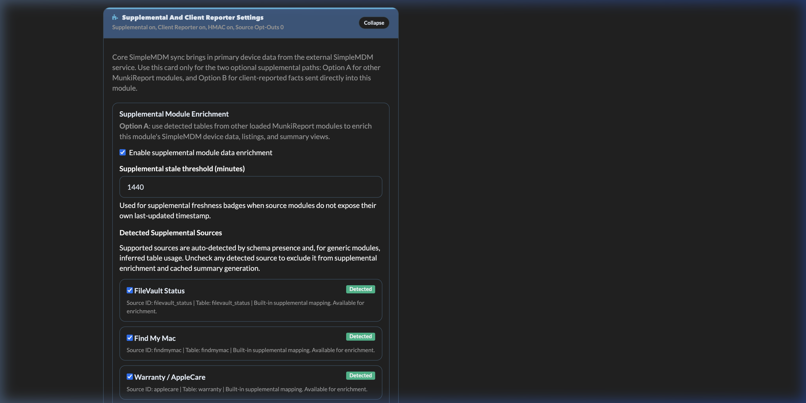
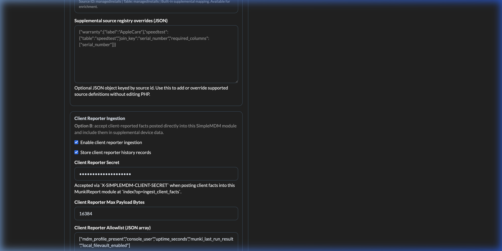

# Supplemental Data Implementation Plan

This document is now a historical design and implementation-planning reference.

Large parts of Option A and Option B described here have since been implemented in the current module.

Use this document for rationale, tradeoffs, and original design intent.

For current behavior, routes, admin settings, and supported data paths, use:

- `README.md`
- `docs/API_REFERENCE.md`
- `docs/TESTING.md`
- `docs/DEVELOPER_GUIDE.md`

Implemented current-state highlights:

- core SimpleMDM sync remains the primary source of native device/resource data
- Option A is implemented with live device lookups plus `simplemdm_supplemental_summary`
- Option A now includes built-in sources and generic auto-discovery of other loaded MunkiReport modules when a usable table and join key are found
- Option B is implemented as `ingest_client_facts` with allowlisted fact storage in `simplemdm_client_fact` and optional history in `simplemdm_client_fact_history`
- the admin page now exposes:
  - source detection and health
  - per-source opt-out controls
  - Option A / Option B settings
  - summary refresh and runtime guidance

## 1) Purpose

The goal is to let `simplemdm` present a richer device view than the SimpleMDM API alone can provide.

This should be done without:

- replacing the existing SimpleMDM API sync
- overwriting authoritative `simplemdm` API fields
- taking ownership of other modules' data
- forcing all supplemental data through one new collector

The long-term idea is to make `simplemdm` capable of showing:

- native SimpleMDM device data
- supplemental data from other MunkiReport modules
- optionally, supplemental data from a future client-side reporter
- optionally, supplemental data from external systems

## 2) Source Of Truth Rules

The design must preserve source-of-truth boundaries.

### 2.1 Native SimpleMDM Data

Source of truth:

- SimpleMDM API sync
- `simplemdm_sync.py`
- current `simplemdm` tables

This remains authoritative for:

- MDM enrollment state
- device attributes synced from SimpleMDM
- resource relationships synced from SimpleMDM
- command data synced from SimpleMDM

### 2.2 Supplemental Module Data

Source of truth:

- the source MunkiReport module's own tables

Examples:

- `filevault_status`
- `findmymac`
- `applecare`
- `profile`
- `managedinstalls`
- `adobe`
- `ms_office`
- `speedtest`

`simplemdm` should read those tables but not replace them.

### 2.3 Future Client-Side Reporter Data

Source of truth:

- the client reporter's own supplemental table

This must remain separate from `simplemdm` API-synced fields.

### 2.4 External System Data

Source of truth:

- the external system or a normalized local cache table for that integration

Examples:

- CrowdStrike
- vulnerability tools
- endpoint protection
- patch/compliance systems

External data should be clearly tagged as externally sourced.

## 3) Recommended Product Strategy

The recommended order is:

1. implement Option A first
2. make Option A the default model
3. add Option B only for gaps Option A cannot cover
4. add external systems only after module-based supplemental data is stable

This keeps the module aligned with the current architecture and avoids unnecessary new collection paths.

## 4) Option A: Cross-Module Supplemental Data

## 4.1 Overview

Option A means `simplemdm` supplements device views using data already collected by other MunkiReport modules.

This is the preferred approach.

It should be implemented as a hybrid model:

- live lookups for deep device detail views
- optional cached supplemental summary/index for listings, filters, widgets, and stale-data visibility

### User Interface Details

The Admin page provides a specific panel for monitoring the health of Option A detection.



**Key Metrics:**
- **Detected Sources**: List of tables found in the database that match SimpleMDM serialization.
- **Summary Rows**: Count of devices currently enriched in the summary table.
- **Stale Threshold**: UI control for determining cache freshness.

## 4.2 Why Option A Is Preferred

Benefits:

- no new client agent
- no new ingest endpoint required for most use cases
- reuses existing module collection logic
- preserves source ownership
- easiest path for filling missing device fields
- best path for rich device detail and cross-module dashboards

## 4.3 Example Supported Modules

Likely first wave:

- `filevault_status`
- `findmymac`
- `applecare`
- `profile`
- `managedinstalls`

Likely second wave:

- `adobe`
- `ms_office`
- `speedtest`

The first wave should prioritize device health, security, and lifecycle relevance.

## 4.4 Detection Model

Supported modules should be detected automatically.

Recommended detection rules:

- check whether expected table exists
- optionally verify key columns such as `serial_number`
- optionally check whether the module has data rows
- cache detection results

Detection should be based on database/schema presence, not folder presence.

Reason:

- folders can exist without a usable install
- tables are a better signal for safe querying

### 4.4.1 Suggested Detection Registry

Create an internal registry in `simplemdm` mapping:

- module id
- expected table name
- required join column
- optional summary fields
- display label

Example registry shape:

```php
[
    'filevault_status' => [
        'table' => 'filevault_status',
        'join_key' => 'serial_number',
        'label' => 'FileVault Status',
    ],
    'findmymac' => [
        'table' => 'findmymac',
        'join_key' => 'serial_number',
        'label' => 'Find My Mac',
    ],
]
```

## 4.5 Join Strategy

The default join key should be:

- `serial_number`

If another reliable identifier is needed later, it should be added explicitly per integration, not assumed globally.

Recommended join priority:

1. `serial_number`
2. a documented per-module alternate key only if needed

## 4.6 Read Model

Option A should support two read paths.

### 4.6.1 Live Per-Device Lookup

Used for:

- standalone device page
- client tab
- rich detail API responses

Behavior:

- load `simplemdm` device
- identify `serial_number`
- query source module tables live
- return structured supplemental sections

This is the best path for deep and accurate device detail.

### 4.6.2 Cached Supplemental Summary/Index

Used for:

- widgets
- listings
- filters
- badges/indicators
- stale-data awareness

Behavior:

- build a lightweight normalized summary keyed by `serial_number`
- store only summary facts, not copied source records
- refresh periodically or by explicit admin action

This avoids expensive live joins on every report/listing render.

## 4.7 Supplemental Summary Table

If Option A grows beyond detail pages, add a dedicated summary table.

Suggested characteristics:

- one row per `serial_number`
- summary fields only
- last refresh timestamp
- source availability indicators
- source module list

Example fields:

- `serial_number`
- `supp_source_modules_json`
- `supp_last_refresh`
- `supp_filevault_present`
- `supp_filevault_enabled`
- `supp_findmymac_present`
- `supp_findmymac_enabled`
- `supp_applecare_present`
- `supp_applecare_coverage_end`
- `supp_profile_count`
- `supp_managedinstalls_present`
- `supp_adobe_present`
- `supp_ms_office_present`
- `supp_speedtest_present`

Important rule:

- do not store raw copied rows from source modules here

Only store:

- normalized indicators
- counts
- timestamps
- compact summary values

### 4.7.1 Proposed Table: `simplemdm_supplemental_summary`

Recommended purpose:

- one fast summary row per device
- support listings, widgets, filters, and badges
- avoid expensive multi-table live joins for broad report views

Recommended columns:

- `id`
  - integer primary key
- `serial_number`
  - string, required
  - unique
- `source_modules_json`
  - JSON/text
  - list of detected source modules contributing summary data
- `last_refresh`
  - datetime
  - last successful summary rebuild for this device
- `last_refresh_status`
  - string
  - values like `success`, `partial`, `failed`
- `source_freshness_json`
  - JSON/text
  - per-source freshness timestamps or summary status

Recommended example summary columns:

- `filevault_present`
  - boolean/integer
- `filevault_enabled`
  - boolean/integer nullable
- `findmymac_present`
  - boolean/integer
- `findmymac_enabled`
  - boolean/integer nullable
- `applecare_present`
  - boolean/integer
- `applecare_coverage_end`
  - datetime/date nullable
- `applecare_coverage_status`
  - string nullable
- `profile_present`
  - boolean/integer
- `profile_count`
  - integer nullable
- `managedinstalls_present`
  - boolean/integer
- `managedinstalls_warning_count`
  - integer nullable
- `managedinstalls_error_count`
  - integer nullable
- `adobe_present`
  - boolean/integer
- `ms_office_present`
  - boolean/integer
- `speedtest_present`
  - boolean/integer
- `speedtest_last_test_at`
  - datetime nullable
- `crowdstrike_present`
  - boolean/integer nullable for future external integrations

Recommended indexes:

- unique index on `serial_number`
- index on `last_refresh`
- index on high-value filter columns such as:
  - `filevault_enabled`
  - `applecare_coverage_end`
  - `profile_count`

Recommended rules:

- values may be nullable when source module is absent or data is stale
- presence columns should distinguish:
  - module absent
  - module present but no record
  - module record present
- do not store full raw source payloads here

### 4.7.2 Optional Detail Cache Table

If live detail lookups later become too expensive, consider an optional detail cache table.

Recommended purpose:

- cache structured detail sections per source module per device
- keep the summary table narrow and query-friendly

Suggested table name:

- `simplemdm_supplemental_cache`

Suggested columns:

- `id`
- `serial_number`
- `source_module`
- `cache_key`
  - for example `detail_section`
- `payload_json`
- `refreshed_at`
- `expires_at`

Recommended uniqueness:

- unique index on (`serial_number`, `source_module`, `cache_key`)

Use only if needed.

The first implementation should prefer:

- live detail lookup
- summary table for broad reporting

## 4.8 Refresh Model For Summary Table

The summary/index refresh should not be part of `simplemdm_sync.py`'s SimpleMDM API sync logic.

Recommended approaches:

- explicit admin-triggered refresh
- periodic background refresh within module runtime if later supported
- refresh on demand with caching

The design should avoid making `simplemdm` the manager of other modules' collection lifecycle.

Recommended rule:

- `simplemdm` may read and summarize other modules
- `simplemdm` should not force other modules to collect data

### 4.8.1 Refresh Trigger Options

Possible refresh triggers:

- admin action: `Refresh Supplemental Summary`
- manual CLI or module-side task later
- periodic refresh by internal scheduler if a safe runtime exists
- lazy refresh on device open if row is stale

Recommended first version:

- manual/admin-triggered refresh
- optional lazy single-device refresh on device detail view when summary row is missing or stale

### 4.8.2 Freshness Rules

Freshness should be explicit.

Recommended stored semantics:

- `last_refresh` for summary row rebuild time
- per-module freshness inside `source_freshness_json`
- optional `stale_after_minutes` config later

UI should be able to show:

- fresh
- stale
- missing
- source module not detected

## 4.9 UI Design For Option A

Supplemental data should appear as additive content.

### 4.9.1 Device Page

Recommended additions to `views/simplemdm_device.php`:

- `Supplemental Data` section
- one subsection per source module
- clear source label on each field or section
- stale/last-updated indicators where practical

Examples:

- AppleCare coverage section
- FileVault section
- Find My Mac section
- Profiles summary section
- Managed Installs summary section

### 4.9.2 Client Tab

Recommended additions to `views/simplemdm_tab.php`:

- compact supplemental cards or summary rows
- links to full source module views if appropriate

### 4.9.3 Listings And Widgets

If summary/indexing is implemented:

- listing badges for supplemental availability
- filters such as `FileVault Off`, `AppleCare Expiring`, `Profile Count > 0`
- widgets combining SimpleMDM and supplemental module data

Examples:

- SimpleMDM + FileVault compliance widget
- SimpleMDM + AppleCare lifecycle widget
- devices missing expected local security signals

## 4.10 Labeling Rules

Supplemental data must never appear to be native SimpleMDM data.

Required design rule:

- every supplemental field or section must be labeled with its source

Recommended patterns:

- section label: `Source: applecare`
- field badge: `filevault_status`
- group label: `Supplemental Data`

## 4.11 Pros And Cons Of Option A

Pros:

- easiest path to additional value
- no new client collector for most cases
- preserves ownership boundaries
- minimal disruption to existing sync
- strongest fit for filling SimpleMDM API gaps
- can scale from detail-only to full dashboard/report use cases

Cons:

- module-specific mapping work
- higher maintenance as integrations grow
- potential schema drift in external modules
- live joins can be expensive
- summary/index approach adds additional complexity
- users may misunderstand freshness if timestamps are not shown

## 5) Option B: Client-Side Reporter

## 5.1 Overview

Option B means adding a new client-side reporter for facts not already available in source modules.

This should be treated as a narrow fallback path, not the default.

### Admin Configuration (Option B)

The Client Reporter behavior is configured through a specific hardened settings panel in the Admin UI.



This panel allows for HMAC secret rotation, allowlist management, and payload limit configuration.

## 5.2 Best Uses For Option B

Use Option B when:

- no existing module already collects the fact
- the fact is local and time-sensitive
- direct device-reality comparison is valuable

Examples:

- local MDM profile presence
- current console user
- uptime
- tightly scoped app/version facts not covered elsewhere

## 5.3 Rules For Option B

- separate supplemental table
- separate ingest endpoint
- explicit authentication
- allowlisted fields only
- never overwrite native SimpleMDM API fields
- clearly label data as client-reported

### 5.3.1 Proposed Table: `simplemdm_client_fact`

Recommended purpose:

- store small allowlisted client-reported facts
- support drift detection against SimpleMDM and other module data
- avoid mixing local facts with API-synced fields

Recommended row model:

- one row per serial number + fact key
- latest value stored as the current fact

Recommended columns:

- `id`
  - integer primary key
- `serial_number`
  - string, required
- `fact_type`
  - string, required
  - examples: `mdm_health`, `security`, `session`, `software`
- `fact_key`
  - string, required
  - examples: `mdm_profile_present`, `console_user`, `uptime_seconds`
- `fact_value_string`
  - string nullable
- `fact_value_int`
  - integer nullable
- `fact_value_bool`
  - boolean/integer nullable
- `fact_value_json`
  - JSON/text nullable
- `reported_at`
  - datetime required
- `source`
  - string required
  - default expected value: `client_reporter`
- `client_version`
  - string nullable
- `raw_json`
  - JSON/text nullable
- `updated_at`
  - datetime

Recommended uniqueness:

- unique index on (`serial_number`, `fact_key`)

Recommended indexes:

- index on `serial_number`
- index on `fact_type`
- index on `reported_at`

Recommended behavior:

- upsert current value by (`serial_number`, `fact_key`)
- preserve raw payload fragment only when useful for troubleshooting
- prefer typed value columns for filtering

### 5.3.2 Optional History Table: `simplemdm_client_fact_history`

If auditability is needed, add a history table rather than bloating the current-value table.

Recommended columns:

- `id`
- `serial_number`
- `fact_type`
- `fact_key`
- `fact_value_string`
- `fact_value_int`
- `fact_value_bool`
- `fact_value_json`
- `reported_at`
- `source`
- `client_version`
- `raw_json`

Recommended indexes:

- index on `serial_number`
- index on (`serial_number`, `fact_key`)
- index on `reported_at`

Recommended rule:

- keep `simplemdm_client_fact` as the current-value table
- keep history optional until there is a real audit/reporting need

### 5.3.3 Example Allowlisted Facts For First Version

Recommended initial facts:

- `mdm_profile_present`
- `console_user`
- `uptime_seconds`
- `munki_last_run_result`
- `local_filevault_enabled`

Keep the first version intentionally narrow.

### 5.3.4 Endpoint Requirements

Suggested endpoint:

- `POST /module/simplemdm/index?op=ingest_client_facts`

Recommended requirements:

- dedicated auth separate from admin browser session
- allowlisted fact keys only
- payload size limit
- reject writes to native `simplemdm` fields
- reject unknown or oversized keys/values
- upsert current table and optionally append history

### 5.3.5 Example Payload Shape

```json
{
  "serial_number": "C02XXXXXXX",
  "reported_at": "2026-03-11T15:20:00Z",
  "client_version": "1.0.0",
  "facts": {
    "mdm_profile_present": true,
    "console_user": "jdoe",
    "uptime_seconds": 86400,
    "munki_last_run_result": "success"
  }
}
```

## 5.4 Pros And Cons Of Option B

Pros:

- fills gaps no existing module covers
- useful for drift detection
- can provide direct local state

Cons:

- new client component to maintain
- new trust boundary
- new ingest endpoint and validation surface
- easy to over-scope
- can duplicate existing module functionality

## 6) Support Both Option A And B

Long-term, supporting both is likely the best outcome.

But they should not be treated as equal defaults.

Recommended product position:

- Option A is primary
- Option B is fallback

This avoids unnecessary complexity while preserving future flexibility.

## 7) External Systems

The same supplemental architecture can later support external systems such as:

- CrowdStrike
- endpoint security tools
- vulnerability management
- compliance systems

## 7.1 Important Difference From MunkiReport Modules

MunkiReport modules are easier because:

- data is local to the same app/database
- device identity conventions are similar
- no remote API calls are needed during render

External systems are harder because:

- API credentials are required
- rate limits apply
- remote failures must be handled
- caching/import pipelines are needed

## 7.2 Recommended External Integration Model

Do not fetch external system APIs live on every device page render.

Preferred design:

- import normalized external findings into a local cache/summary table
- join them to `simplemdm` by `serial_number` or a mapped identifier
- display them as explicitly external supplemental data

Example CrowdStrike summary fields:

- `crowdstrike_present`
- `crowdstrike_host_status`
- `crowdstrike_detection_count`
- `crowdstrike_last_detection_at`
- `crowdstrike_severity`
- `crowdstrike_last_refresh`

## 8) Module Changes Required

## 8.1 Controller Changes

File:

- `simplemdm_controller.php`

Add:

- supported-module registry
- automatic capability detection
- per-device supplemental lookup methods
- merged detail endpoints
- optional summary refresh logic
- optional listing/widget/report endpoints based on supplemental summary

## 8.2 Model And Migration Changes

Potential additions:

- supplemental summary model
- supplemental summary migration
- optional supplemental detail cache model/migration
- client fact current-value model/migration
- optional client fact history model/migration
- optional external-system cache models later

Keep these separate from:

- `simplemdm`
- `simplemdm_resource`
- source module tables

## 8.3 View Changes

Files:

- `views/simplemdm_device.php`
- `views/simplemdm_tab.php`
- optional new widget views
- optional listing updates

Add:

- supplemental sections
- source tags
- refresh/freshness labels
- summary indicators

## 8.4 Admin/UI Configuration Changes

Potential additions:

- toggle supplemental integrations on/off
- view detected supported modules
- refresh supplemental summary
- show summary freshness and last refresh status

## 8.5 Documentation Changes

Update:

- `docs/API_REFERENCE.md`
- `docs/DEVELOPER_GUIDE.md`
- `docs/CLIENT_REPORTER_ADDON.md`

## 9) What Should Not Change

The following should remain true:

- `simplemdm_sync.py` should continue syncing only the SimpleMDM API
- SimpleMDM sync should not start collecting other modules' data directly
- other modules should not need to be modified in the common case
- source ownership should remain explicit
- supplemental data should not silently overwrite native SimpleMDM fields

## 10) Risks

Main risks:

- scope creep
- turning `simplemdm` into a generic aggregation platform too quickly
- unclear freshness semantics
- performance issues from too many live joins
- integration drift as other modules evolve
- user confusion about where fields came from

Mitigations:

- strict source labeling
- normalized summary only, not raw data copies
- narrow first-wave integrations
- explicit freshness timestamps
- keep Option B constrained
- treat external systems as later-phase work

## 10.1 Schema Design Risks

Risks:

- overloading summary table with too many columns too early
- storing copied raw source records instead of summary values
- under-indexing fields needed for listings and filters
- making Option B too generic and turning it into an unbounded data sink

Mitigations:

- keep summary table limited to high-value fields first
- add columns incrementally as integrations prove useful
- use typed value columns for Option B current facts
- keep history optional
- enforce allowlists and size limits

## 11) Phased Rollout

## Phase 1: Foundation

- add supported-module registry
- add automatic module detection
- add per-device live supplemental lookup
- enrich standalone device page

Goal:

- prove source labeling and device-level value

## Phase 2: Client Tab And Rich Detail

- enrich client tab
- add richer per-module sections
- add stale/last-updated indicators

Goal:

- make supplemental data useful in daily device investigation

## Phase 3: Summary/Index Layer

- add supplemental summary table/model/migration
- add refresh logic
- add listing badges and filters
- add summary-backed API endpoints

Goal:

- support performance-friendly dashboard/report usage

## Phase 4: Widgets And Reports

- add cross-module widgets
- add cross-module filtering/reporting
- expose summary data in listings and report cards

Goal:

- make supplemental data operationally useful beyond the device page

## Phase 5: Client Reporter Gap Coverage

- add Option B only for facts not available from source modules
- implement narrow reporter scope
- keep separate source labeling

Goal:

- fill narrow gaps without replacing Option A

## Phase 6: External Systems

- add external-source cache layer
- add normalized external summary fields
- integrate external findings into device views and widgets

Goal:

- evolve from module-only enrichment to unified device context

## 12) First Implementation Recommendation

If work starts later, the recommended first implementation is:

1. auto-detect `filevault_status`, `findmymac`, `applecare`, `profile`, and `managedinstalls`
2. add live supplemental detail sections to the standalone device page
3. label every field with source module
4. defer summary/indexing until device-level enrichment proves useful

After that:

5. add supplemental summary/index
6. add widgets and listing filters
7. consider Option B only for facts still missing

## 13) Final Design Principle

The module should evolve into:

- a SimpleMDM-first view of the device
- enriched by explicitly labeled supplemental data
- without pretending all data came from SimpleMDM
- without breaking source-module ownership

That is the safest and most scalable path for future expansion.

## 14) Supported Source Matrix

This section should guide first-wave implementation.

| Source | Type | Expected Join Key | Expected Table/Store | Suggested Summary Fields | Suggested UI Placement | Notes |
|---|---|---|---|---|---|---|
| `filevault_status` | MunkiReport module | `serial_number` | `filevault_status` | `filevault_present`, `filevault_enabled` | device page, client tab, compliance widget | first-wave priority |
| `findmymac` | MunkiReport module | `serial_number` | `findmymac` | `findmymac_present`, `findmymac_enabled` | device page, client tab | first-wave priority |
| `applecare` | MunkiReport module with external-backed data | `serial_number` | `applecare` | `applecare_present`, `applecare_coverage_end`, `applecare_coverage_status` | device page, lifecycle widget | first-wave priority |
| `profile` | MunkiReport module | `serial_number` | `profile` | `profile_present`, `profile_count` | device page, listing filters | first-wave priority |
| `managedinstalls` | MunkiReport module | `serial_number` | `managedinstalls` | `managedinstalls_present`, `managedinstalls_warning_count`, `managedinstalls_error_count` | device page, health widget | first-wave priority |
| `adobe` | MunkiReport module | `serial_number` expected | module table to verify during implementation | `adobe_present` | device page | second-wave, verify schema first |
| `ms_office` | MunkiReport module | `serial_number` expected | module table to verify during implementation | `ms_office_present` | device page | second-wave |
| `speedtest` | MunkiReport module | `serial_number` expected | module table to verify during implementation | `speedtest_present`, `speedtest_last_test_at` | device page, networking widget | second-wave, lower priority |
| `crowdstrike` | external system | `serial_number` or mapped id | local cache table | `crowdstrike_present`, `crowdstrike_detection_count`, `crowdstrike_severity` | device page, security widget | later-phase external integration |

Recommended rule:

- only promote a source into the supported registry after verifying actual schema in implementation time

## 15) Conflict And Fallback Rules

Some sources may provide overlapping or similar information.

Recommended handling rules:

- never silently merge overlapping values into a single unlabeled field
- prefer explicit source separation over hidden precedence
- if a summary card needs one displayed value, define the displayed source and list alternates underneath

Example conflict cases:

- FileVault state from SimpleMDM vs `filevault_status`
- profile-related presence from SimpleMDM vs `profile`
- software presence from SimpleMDM assigned state vs `managedinstalls`

Recommended precedence model:

1. native SimpleMDM field stays primary for SimpleMDM-owned concepts
2. source-module field appears as supplemental comparison or gap-filler
3. when SimpleMDM has no field, show source-module field as supplemental without pretending it is native

Recommended UI labels:

- `SimpleMDM Reported`
- `Supplemental`
- `Client Reported`
- `External`

## 16) Stale Data Policy

Freshness needs explicit rules or users will over-trust old supplemental data.

### 16.1 Recommended Freshness States

Every supplemental source should be rendered as one of:

- `fresh`
- `stale`
- `missing`
- `module_not_detected`
- `refresh_failed`

### 16.2 Recommended First-Pass Freshness Inputs

Use whichever signals exist:

- source module's own last-seen/report timestamp
- summary refresh timestamp
- client fact `reported_at`
- external cache `last_refresh`

### 16.3 Recommended UI Treatment

- do not hide staleness
- show relative and absolute timestamps
- use small badges or labels rather than large warnings for normal stale states

### 16.4 Suggested Config Later

Potential per-source stale thresholds:

- `supplemental_default_stale_after_minutes`
- `supplemental_source_stale_overrides_json`

## 17) Failure Behavior

Supplemental data failures should degrade gracefully.

### 17.1 Device Page Failures

If one source query fails:

- do not fail the entire device page
- show the failed source section as unavailable
- continue rendering the rest of the page

### 17.2 Summary Refresh Failures

If refresh is partial:

- keep prior summary values if they are still usable
- mark `last_refresh_status` as `partial`
- record source-specific failure info in refresh logs or metadata

If refresh fully fails:

- do not erase existing known-good summary row unless explicitly intended
- mark the refresh as failed

### 17.3 Detection Failures

If schema detection is uncertain:

- treat source as unavailable
- log it
- avoid unsafe guesses

## 18) Security And Access Rules

Supplemental data should follow explicit access rules.

Recommended first version:

- if a user can view the SimpleMDM device page, they can view supplemental sections rendered there

Potential later refinement:

- allow per-source visibility restrictions for sensitive integrations

Examples where stricter access may be needed:

- security findings from external systems
- user/session details from client reporters
- licensed software account data

Recommended rule:

- do not expose raw source payloads broadly
- prefer summarized fields in UI
- keep raw source JSON only in internal/debug tables when justified

## 19) Testing Plan

Implementation should include tests for detection, joins, and stale-state handling.

### 19.1 Detection Tests

- module table exists and has expected join column
- module table missing
- module table exists with unexpected schema

### 19.2 Device Lookup Tests

- supplemental row exists for known serial
- supplemental row missing
- source query fails
- multiple sources available simultaneously

### 19.3 Summary Refresh Tests

- initial summary build
- partial refresh
- stale summary handling
- filters/widgets using summary data

### 19.4 Option B Tests

- allowed fact payload accepted
- unknown fact rejected
- oversized payload rejected
- current-value upsert works
- optional history append works

### 19.5 External Integration Tests

- mapped identifier found
- mapped identifier missing
- cache refresh success
- API failure fallback behavior

## 20) Performance Thresholds And Decision Rules

The implementation should define when live lookups are enough and when summary/indexing becomes necessary.

Recommended decision rules:

- device detail pages: live lookup is acceptable
- listings/widgets over many devices: prefer summary/index
- any view requiring repeated joins across multiple sources: prefer summary/index

Recommended first threshold guidance:

- start without summary/index if only the standalone device page is enriched
- require summary/index before adding heavy dashboard widgets or listing filters across sources

## 21) Retention And Cleanup Policy

Option A summary data and Option B history need lifecycle rules.

### 21.1 Option A Summary

Recommended:

- keep current summary row indefinitely
- update in place
- optionally purge rows for serials no longer present in `simplemdm`

### 21.2 Option A Optional Cache

Recommended:

- use expiration timestamps
- rebuild on demand if expired
- purge expired rows periodically

### 21.3 Option B Current Facts

Recommended:

- keep current-value table only as latest state
- update in place by (`serial_number`, `fact_key`)

### 21.4 Option B History

Recommended later policy:

- configurable retention window
- default retention such as 30-90 days if enabled
- scheduled pruning

## 22) External Identifier Mapping

External systems will not always join cleanly by serial number.

Recommended rules:

- prefer `serial_number` when available and trustworthy
- if external system uses another device id, store a mapping table
- never guess identifiers across systems without a documented rule

Suggested future mapping table:

- `simplemdm_external_identity_map`

Suggested fields:

- `id`
- `serial_number`
- `source_system`
- `external_id`
- `last_verified_at`
- `verification_method`

Recommended uniqueness:

- unique on (`source_system`, `external_id`)
- index on `serial_number`

## 23) Operational Logging And Observability

Supplemental integrations need visibility when they fail or drift.

Recommended logging topics:

- source detection results
- summary refresh start/end
- partial failures per source
- stale-source counts
- Option B ingest rejects
- external cache refresh errors

Recommended admin-visible status later:

- detected modules
- last summary refresh
- refresh result counts
- stale-source counts

## 24) Implementation Boundaries

To prevent uncontrolled scope growth, keep these boundaries explicit:

- `simplemdm_sync.py` remains SimpleMDM-only
- no hidden copying of source-module raw records into main SimpleMDM tables
- Option B stays allowlisted and narrow
- external integrations require explicit cache/import design
- every supplemental field shown in UI must have a named source

## 25) Recommendation If Work Begins

The most defensible first milestone is:

1. implement the supported source registry
2. detect first-wave modules automatically
3. add live supplemental sections to the standalone device page
4. show source labels and freshness indicators
5. defer cross-device summary/indexing until that detail view proves useful

After that:

6. add `simplemdm_supplemental_summary`
7. add listing filters and summary-backed widgets
8. add Option B only for facts still missing
9. add external system support later through cache/import tables
